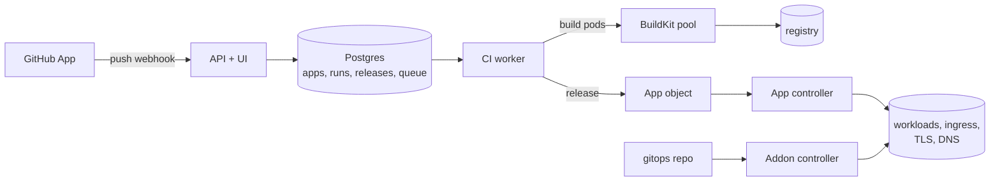

# rendimiento.ai

Connect a GitHub repo, press **Deploy**, get a live HTTPS URL. rendimiento is a CI/CD control plane for your own Kubernetes cluster. It combines CI (what Jenkins did), GitOps delivery (what ArgoCD did) and cluster add-ons (Helm charts and manifests from git) in **one small Go binary** with a React UI.

It runs a six-node Raspberry Pi + Jetson k3s cluster, and deploys every app on it, including its own documentation.



## What it does

- **Onboarding.** It detects Go, Node, Python, Java, static sites and Dockerfiles (including monorepos), then opens a pull request that adds `rendimiento.yaml`.
- **CI.** Clone → test → build, run as pods on a BuildKit pool spread across the workers, with a registry cache. Repos with no Dockerfile are built with **Railpack**.
- **Delivery.** Each release is a set of image digests. The App controller renders Deployments, Services, Ingresses, certificates, volumes, DNS records, GPU workloads and LAN IPs. It prunes, self-heals, and rolls back in one click.
- **`needs:`.** Declare `postgres`, `redis` or another service, and it is provided and wired in.
- **Add-ons.** Helm charts and kustomizations are declared in a gitops repo. You get previews and diffs, adoption of existing releases, safety gates and Helm hooks. It replaced ArgoCD.
- **Renovate** can be turned on per app. The **Services** catalog lists every service with its connection details. The **Environment** page checks what the cluster is missing and explains how to fix it.

## The book

Everything is explained in **[the rendimiento book](docs/content/index.md)**: concepts, the architecture with diagrams, how this cluster is set up, the `rendimiento.yaml` reference, Go for this codebase, recipes for common changes, design patterns, scaling and the roadmap. It deploys itself from this repo (`rendimiento.yaml`, `docs/Dockerfile`) at **http://192.168.50.81** on the home network.

Preview it locally:

```sh
python3 -m venv .venv && . .venv/bin/activate && pip install -r docs/requirements.txt
cd docs && mkdocs serve
```

## `rendimiento.yaml`

This is the only file an app needs:

```yaml
services:
  - name: web
    path: .
    port: 3000
    size: small              # small | medium | large
    replicas: 2
    domain: myapp.joserod.space
    health: { path: /api/health }
    test: { image: node:20-bookworm, command: npm ci && npm test }
    needs: [postgres]        # DATABASE_URL is injected
    secrets: [myapp-env]     # values are set in the UI, never in git
    volume: { size: 5Gi, mount: /data }
```

## Develop

```sh
make test-remote   # generate, vet, all Go tests (unit, envtest, Postgres), UI typecheck, on a worker
make image         # build + push the platform image on the BuildKit pool
make deploy && kubectl -n rendimiento-system rollout restart deploy/rendimiento
```

Start with [Developing it](docs/content/develop/index.md). Don't compile or run tests on the control-plane node.

## Layout

| Path | Role |
|---|---|
| `cmd/rendimiento` | settings and wiring: the composition root |
| `api/v1alpha1` | `App` and `Addon` custom resources |
| `internal/spec`, `detect`, `generate` | `rendimiento.yaml`, stack detection, proposals |
| `internal/platform`, `pipeline`, `store` | webhooks → runs → releases, the CI runner, Postgres |
| `internal/render`, `controller` | spec → Kubernetes objects, and the controllers |
| `internal/addon`, `renovate`, `catalog`, `environment`, `dns`, `events`, `github`, `api` | add-ons, Renovate, Services page, Environment page, DNS, live updates, GitHub App, HTTP API |
| `web/` | React UI (embedded in the binary) |
| `deploy/` | the platform's own manifests |
| `docs/` | the book |
| `hack/` | test-remote, code map, doc-comment checker |

A generated [code map](docs/content/reference/code-map.md) lists every package, type and function.
