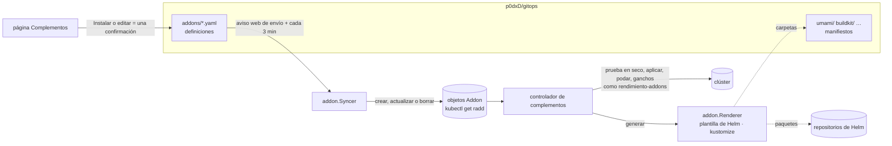
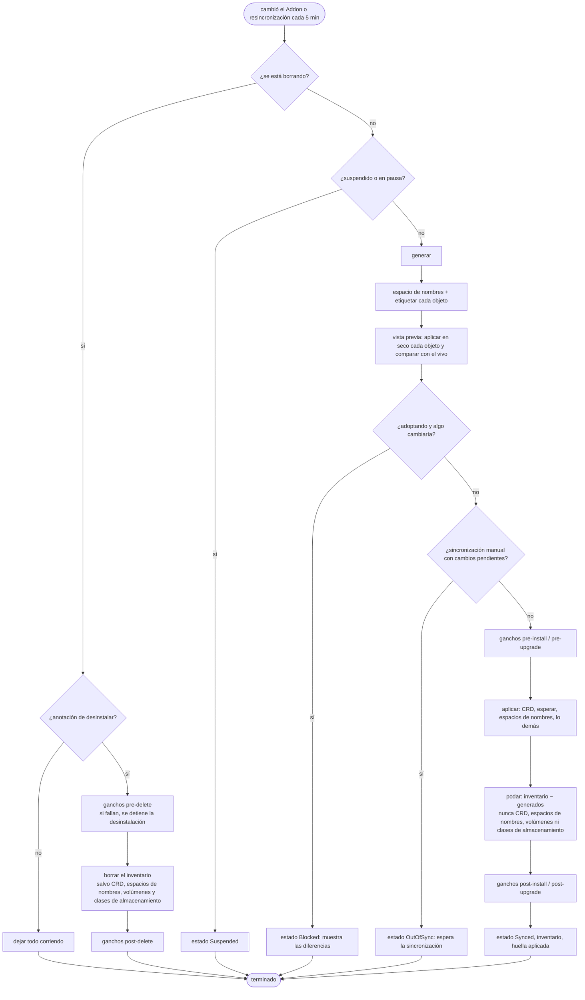

# El motor de complementos

Los complementos son la forma en que rendimiento administra los **programas del clúster**, lo que las aplicaciones necesitan pero no se construye desde sus repositorios: Longhorn, umami, el grupo de BuildKit, un operador de Postgres, un panel. Reemplazó a ArgoCD, y tomó el control de todo lo que ArgoCD administraba sin cambiar ni un solo objeto en ejecución.

Código: `api/v1alpha1/addon_types.go` (el recurso), `internal/addon` (generación, sincronización con git, catálogo), `internal/controller/addon_controller.go` y `addon_hooks.go` (conciliación), `internal/api/installed.go` (API).

## Las piezas {#the-pieces}



## Git es la fuente de verdad {#git-is-the-source-of-truth}

Cada complemento es un archivo en `p0dxD/gitops/addons/`:

```yaml
# addons/longhorn.yaml
name: longhorn
title: Longhorn
category: storage
namespace: longhorn-system
createNamespace: true
helm:
  repo: https://charts.longhorn.io/
  chart: longhorn
  version: v1.10.2
releaseName: longhorn        # conserva el nombre de una instalación migrada
values:
  preUpgradeChecker:
    jobEnabled: false
adopt: true                  # toma el control de lo que corre (solo si nada cambia)
manualSync: true             # los cambios esperan una sincronización tras revisarlos
prune: false
```

Un origen de git, en cambio, apunta a una carpeta (en el repositorio de gitops, de forma predeterminada):

```yaml
name: umami
namespace: umami
git:
  path: umami                # una kustomization, o archivos YAML simples
adopt: true
prune: true
```

El **sincronizador** (`addon.Syncer`) lee `addons/*.yaml` en la punta de la rama principal con cada envío al repositorio de gitops (y cada 3 minutos, por si se perdió un aviso web), y hace que los objetos `Addon` coincidan:

- un archivo nuevo o cambiado crea o actualiza su `Addon`; una carpeta del repositorio de gitops queda fijada a la **confirmación exacta** de la que vino la definición, así las definiciones y los manifiestos cambian juntos;
- un archivo borrado borra su `Addon`, y **el programa sigue corriendo** a menos que el botón *Desinstalar* de la interfaz lo haya marcado antes;
- un archivo inválido se reporta en la página Complementos y se salta, nunca se trata como borrado;
- se conservan los campos que no son configuración (el contador de solicitudes de sincronización manual, la anotación de pausa).

La interfaz nunca escribe objetos `Addon` directamente: *Instalar*, *Editar*, *Suspender* y *Quitar* son **confirmaciones** al repositorio de gitops a través de la aplicación de GitHub, así el repositorio siempre dice la verdad y tiene todo el historial.

## Generar {#rendering}

`addon.Renderer.Render` produce los objetos, como lo harían `helm template` o `kustomize build`:

- **Los paquetes de Helm** se descargan del `index.yaml` del repositorio (guardados en memoria por versión) y se generan con la propia biblioteca de Helm en modo solo cliente, para la versión de Kubernetes y la lista de API de **este clúster** (obtenidas por descubrimiento), así el resultado coincide con lo que producirían `helm install` o ArgoCD. Los ganchos se devuelven aparte. Una **huella** del paquete, la versión, los valores y el nombre de la instalación identifica lo que se generó.
- **Las carpetas de git** se leen a través de la aplicación de GitHub y se construyen en memoria con la biblioteca de kustomize (o, sin un `kustomization.yaml`, cada archivo YAML se toma tal cual).

Antes de migrar Longhorn y Hajimari, sus resultados se compararon con lo que ArgoCD seguía: 41 de 41 y 7 de 7 objetos, idénticos.

## Conciliar un complemento {#reconciling-an-add-on}



### La vista previa {#the-preview}

Por cada objeto, el controlador hace una **aplicación en seco del lado del servidor** (el servidor de la API calcula el resultado sin guardarlo) y lo compara con el objeto vivo, después de quitar lo que siempre difiere (campos administrados, versión del recurso, generación, estado) y su propia etiqueta. La diferencia es un *diff* unificado, que se muestra en la página del complemento. Así se contesta exactamente "¿esto cambiaría algo?", incluidos los valores predeterminados que agrega el servidor de la API.

### Las dos compuertas {#the-two-gates}

- **Compuerta de adopción.** Cuando un complemento toma el control por primera vez de algo que ya corre (`adopt: true`), sigue adelante solo si **nada cambiaría**. Si no, se detiene como *Blocked* y muestra las diferencias; usted corrige los valores o permite los cambios explícitamente (`allowAdoptChanges`).
- **Sincronización manual.** Con `manualSync: true`, cualquier cambio (objetos por crear, actualizar o borrar, o ganchos por correr) espera como *OutOfSync* hasta que usted oprima **Sincronizar** (que incrementa `spec.syncRequest`).

### Ganchos de Helm {#helm-hooks}

Los ganchos corren como los corre Helm ([`addon_hooks.go`](https://github.com/p0dxD/rendimiento.ai/blob/main/internal/controller/addon_hooks.go)):

| Situación (`lifecycle`) | Ganchos |
|---|---|
| primera sincronización de un complemento nuevo | `pre-install`, aplicar, `post-install` |
| cambió el paquete, la versión, los valores o el nombre de la instalación desde la última aplicación (`status.appliedHash`) | `pre-upgrade`, aplicar, `post-upgrade` |
| adoptar lo que ya corre, o una resincronización sin nada nuevo | ninguno |
| desinstalar | `pre-delete` (si falla, se detiene la desinstalación), borrar, `post-delete` |

Los ganchos corren en orden de peso, después de que existen el espacio de nombres y los CRD. Se espera a los Jobs y los Pods (`hookTimeout`, 10 minutos de forma predeterminada); se respetan las políticas de borrado (`before-hook-creation`, la predeterminada, `hook-succeeded`, `hook-failed`). Un gancho previo fallido no aplica nada; un gancho posterior fallido deja los objetos aplicados y se reintenta en la siguiente sincronización.

### Inventario y poda {#inventory-and-pruning}

`status.objects` es el **inventario** del complemento: cada objeto que aplicó. En la siguiente sincronización, los objetos del inventario anterior que ya no se generan se borran (con `prune: true`), salvo los tipos que nunca se deben borrar automáticamente: **CustomResourceDefinitions** (borrar uno borra todos los recursos de ese tipo), **Namespaces**, **PersistentVolumeClaims**, **PersistentVolumes** y **StorageClasses**. Un origen que no genera nada nunca poda todo.

A propósito **no** se usan referencias de dueño: la recolección de basura borraría todo el programa de un complemento en cuanto desapareciera su objeto `Addon`, algo demasiado fácil de provocar por accidente con algo como Longhorn.

## Actuar con una identidad aparte {#acting-as-a-separate-identity}

Instalar programas del clúster necesita permisos de cluster-admin. En lugar de dárselos a toda la plataforma, el controlador de complementos usa un segundo cliente de Kubernetes que **suplanta** a la cuenta de servicio `rendimiento-addons`. La cuenta propia de la plataforma solo puede suplantar a esa cuenta; `rendimiento-addons` está ligada a `cluster-admin`; ningún pod corre con ella. Por eso la bitácora de auditoría muestra cada cambio de complemento bajo ese nombre.

## Pausar para la automatización {#pausing-for-automation}

`spec.suspend` viene de git, así que el sincronizador lo desharía si otra cosa lo pusiera. La automatización (los manuales de tormenta) usa en su lugar la anotación **`rendimiento.ai/paused=true`**: el controlador la respeta, y el sincronizador nunca toca las anotaciones.

## El catálogo {#the-catalog}

`internal/addon/catalog.go` enumera lo que ofrece el formulario *Agregar desde el catálogo*: Longhorn, Hajimari, Uptime Kuma, CloudNativePG, cualquier paquete de Helm y manifiestos de una carpeta de git. Cada entrada tiene un paquete, un espacio de nombres predeterminado y unos cuantos **campos** con tipo (rutas de valores de Helm con puntos, como `persistence.defaultClassReplicaCount`). El formulario arma los valores a partir de los campos y combina encima su YAML (del lado del servidor, así el navegador no necesita una biblioteca de YAML), y luego confirma la definición.

## Dónde cambiar qué {#where-to-change-what}

| Para… | Cambie |
|---|---|
| ofrecer otro complemento en el catálogo | agregue una entrada a `addon.Catalog` ([receta](../develop/recipes.md#add-an-add-on-to-the-catalog)) |
| aceptar registros de paquetes OCI (`oci://`) | `Renderer.chart` (el cliente de registros de Helm) |
| otro tipo de origen (una URL directa, otro servidor de git) | `AddonSource`, `Renderer.Render`, `Definition` |
| cambiar lo que nunca se borra | `neverDelete` en `addon_controller.go` |
