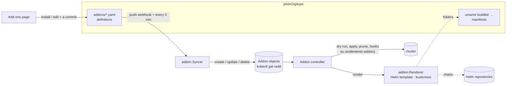
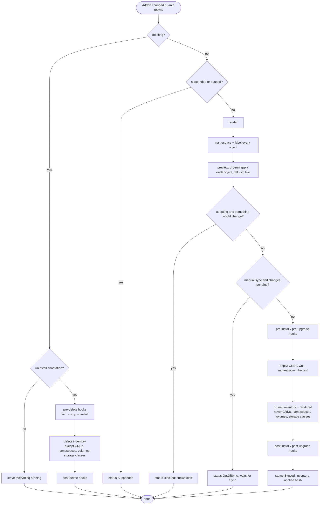

# The add-on engine

Add-ons are how rendimiento manages **cluster software**, the things apps depend on but that are not built from your repositories: Longhorn, umami, the BuildKit pool, a Postgres operator, a dashboard. It replaced ArgoCD, and it took over everything ArgoCD managed without changing a single running object.

Code: `api/v1alpha1/addon_types.go` (the resource), `internal/addon` (rendering, git sync, catalog), `internal/controller/addon_controller.go` and `addon_hooks.go` (reconciling), `internal/api/installed.go` (API).

## The pieces



## Git is the source of truth

Each add-on is one file in `p0dxD/gitops/addons/`:

```yaml
# addons/longhorn.yaml
name: longhorn
title: Longhorn
category: storage
namespace: longhorn-system
createNamespace: true
helm:
  repo: https://charts.longhorn.io/
  chart: longhorn
  version: v1.10.2
releaseName: longhorn        # keep a migrated release's name
values:
  preUpgradeChecker:
    jobEnabled: false
adopt: true                  # take over what is running (only if nothing changes)
manualSync: true             # changes wait for a Sync after review
prune: false
```

A git source instead points at a folder (in the gitops repo by default):

```yaml
name: umami
namespace: umami
git:
  path: umami                # a kustomization, or plain YAML files
adopt: true
prune: true
```

The **syncer** (`addon.Syncer`) reads `addons/*.yaml` at the head of the default branch on every push to the gitops repo (and every 3 minutes, in case a webhook was missed), and makes the `Addon` objects match:

- a new or changed file creates or updates its `Addon`; a folder of the gitops repo is pinned to the **exact commit** the definition came from, so definitions and manifests change together;
- a deleted file deletes its `Addon`, and **the software keeps running** unless the UI's *Uninstall* marked it first;
- an invalid file is reported on the Add-ons page and skipped, never treated as deleted;
- fields that are not configuration (the manual-sync request counter, the pause annotation) are preserved.

The UI never writes `Addon` objects directly: *Install*, *Edit*, *Suspend* and *Remove* are **commits** to the gitops repo through the GitHub App, so the repository always tells the truth and has the full history.

## Rendering

`addon.Renderer.Render` produces the objects, like `helm template` or `kustomize build` would:

- **Helm charts** are downloaded from the repository's `index.yaml` (cached in memory per version) and rendered with Helm's own library in client-only mode, for **this cluster's** Kubernetes version and API list (from discovery), so the result matches what `helm install` or ArgoCD would produce. Hooks are returned separately. A **hash** of chart, version, values and release name identifies what was rendered.
- **Git folders** are read through the GitHub App and built with kustomize's library in memory (or, without a `kustomization.yaml`, every YAML file is taken as is).

Before migrating Longhorn and Hajimari, their renders were compared with what ArgoCD tracked: 41 of 41 and 7 of 7 objects, identical.

## Reconciling an add-on



### The preview

For every object, the controller runs a **server-side dry-run apply** (the API server computes the result without storing it) and compares it with the live object, after removing what always differs (managed fields, resource version, generation, status) and its own label. The difference is a unified diff, shown on the add-on's page. That is how "would this change anything?" is answered exactly, including defaults the API server adds.

### The two gates

- **Adoption gate.** When an add-on first takes over something that is already running (`adopt: true`), it proceeds only if **nothing would change**. Otherwise it stops as *Blocked* and shows the diffs; you fix the values or explicitly allow the changes (`allowAdoptChanges`).
- **Manual sync.** With `manualSync: true`, any change (objects to create, update or delete, or hooks to run) waits as *OutOfSync* until you press **Sync** (which raises `spec.syncRequest`).

### Helm hooks

Hooks run like Helm runs them ([`addon_hooks.go`](https://github.com/p0dxD/rendimiento.ai/blob/main/internal/controller/addon_hooks.go)):

| Situation (`lifecycle`) | Hooks |
|---|---|
| first sync of a new add-on | `pre-install`, apply, `post-install` |
| chart, version, values or release name changed since the last apply (`status.appliedHash`) | `pre-upgrade`, apply, `post-upgrade` |
| adopting what already runs, or a resync with nothing new | none |
| uninstall | `pre-delete` (a failure stops the uninstall), delete, `post-delete` |

Hooks run in weight order, after the namespace and CRDs exist. Jobs and Pods are waited for (`hookTimeout`, 10 minutes by default); delete policies (`before-hook-creation`, the default, `hook-succeeded`, `hook-failed`) are honored. A failed pre hook applies nothing; a failed post hook leaves the objects applied and is retried on the next sync.

### Inventory and pruning

`status.objects` is the add-on's **inventory**: every object it applied. On the next sync, objects in the old inventory that are no longer rendered are deleted (with `prune: true`), except the kinds that must never be deleted automatically: **CustomResourceDefinitions** (deleting one deletes every resource of that kind), **Namespaces**, **PersistentVolumeClaims**, **PersistentVolumes** and **StorageClasses**. A source that renders nothing at all never prunes everything.

Owner references are deliberately **not** used: garbage collection would delete a whole add-on's software the moment its `Addon` object disappeared, which is far too easy to trigger by accident for something like Longhorn.

## Acting as a separate identity

Installing cluster software needs cluster-admin rights. Rather than giving those to the whole platform, the add-on controller uses a second Kubernetes client that **impersonates** the `rendimiento-addons` service account. The platform's own account can only impersonate that one account; `rendimiento-addons` is bound to `cluster-admin`; no pod runs as it. The audit log therefore shows every add-on change under that name.

## Pausing for automation

`spec.suspend` comes from git, so the syncer would undo it if something else set it. Automation (the storm playbooks) uses the annotation **`rendimiento.ai/paused=true`** instead: the controller honors it, and the syncer never touches annotations.

## The catalog

`internal/addon/catalog.go` lists what the *Add from the catalog* form offers: Longhorn, Hajimari, Uptime Kuma, CloudNativePG, any Helm chart, and manifests from a git folder. Each entry has a chart, a default namespace and a few typed **fields** (dotted Helm value paths such as `persistence.defaultClassReplicaCount`). The form builds values from the fields and merges your YAML on top (server side, so the browser needs no YAML library), then commits the definition.

## Where to change what

| To… | Change |
|---|---|
| offer another add-on in the catalog | add an entry to `addon.Catalog` ([recipe](../develop/recipes.md#add-an-add-on-to-the-catalog)) |
| support OCI chart registries (`oci://`) | `Renderer.chart` (Helm's registry client) |
| another source kind (a raw URL, another git host) | `AddonSource`, `Renderer.Render`, `Definition` |
| change what is never deleted | `neverDelete` in `addon_controller.go` |
