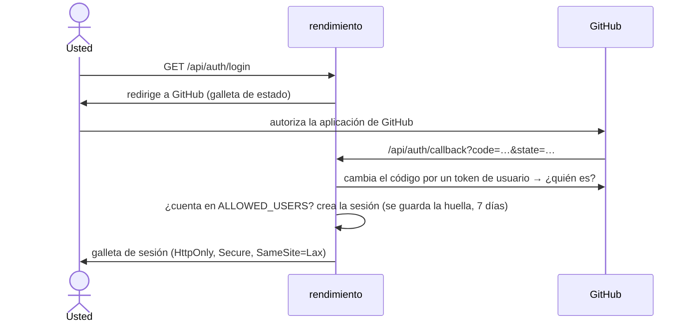
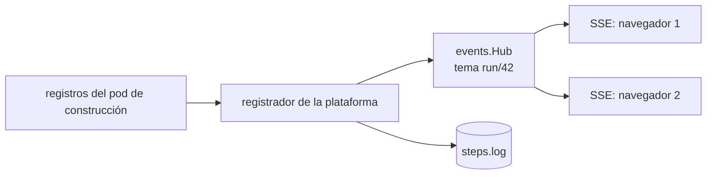

# API, autenticación e interfaz

## El servidor HTTP {#the-http-server}

`internal/api` sirve todo en un solo puerto (8080) con el enrutador estándar de `net/http` de Go, que desde Go 1.22 compara métodos y patrones de ruta (`"GET /api/apps/{app}"`) sin ningún marco de trabajo. `Server.Handler()` registra tres tipos de rutas:

| Tipo | Ejemplos | Protección |
|---|---|---|
| públicas | `/healthz`, `POST /api/webhooks/github`, `/api/auth/*`, `/api/setup/*` | avisos web: firma HMAC; configuración: el token de configuración |
| de sesión | todas las demás rutas `/api/…` | una galleta de sesión válida de una cuenta de GitHub permitida |
| interfaz | todo lo demás | ninguna (archivos estáticos) |

La lista completa está en la [referencia de la API HTTP](../reference/api.md). Los manejadores son delgados: decodifican la petición, llaman a la plataforma, al almacén o al clúster, y escriben JSON con `writeJSON` o `httpError`. La lógica del negocio vive en `internal/platform` y en los controladores, no en los manejadores.

## Iniciar sesión {#signing-in}

Antes de iniciar sesión, las personas ven la **página de bienvenida** (`web/src/pages/Bienvenida.tsx`): qué significa *rendir*, cómo funciona la plataforma, cómo trabaja con agentes de IA (la Ruta) y un enlace al libro (`BOOK_URL`, `BOOK_URL_ES`). Con `PUBLIC_ACTIVITY=true` también muestra *Ahora mismo*: lo que se está construyendo y las versiones más recientes, solo por nombre de aplicación. Todo lo que muestra es público, así que no dice nada de la instalación.

- Las sesiones son tokens aleatorios de 32 bytes; solo se guarda su **SHA-256**, así que una fuga de la base de datos no filtra sesiones.
- `requireSession` comprueba la galleta **y** la lista de permitidos en cada petición, así que quitar a alguien de `ALLOWED_USERS` le cierra el paso de inmediato.
- `guard` agrega encabezados de seguridad (`nosniff`, marcos en `DENY`, referencias del mismo origen) y rechaza las peticiones **de otro origen** que cambian el estado (el encabezado `Origin` debe coincidir), además de las galletas `SameSite=Lax`.

## Avisos web {#webhooks}

`POST /api/webhooks/github` verifica la firma HMAC `X-Hub-Signature-256` con el secreto de avisos web de la aplicación (comparada en tiempo constante) y luego maneja los eventos de **envío**: al repositorio de una aplicación (ejecuciones) y al repositorio de gitops (sincronización de complementos). Los eventos de solicitudes de incorporación no necesitan manejo: el envío de la rama ya la construyó, y su comprobación aparece en la solicitud. **Las solicitudes desde bifurcaciones nunca se construyen**, porque su código correría con el token de la instalación.

## Actualizaciones en vivo: eventos enviados por el servidor {#live-updates-server-sent-events}

Las páginas de ejecuciones y de aplicaciones se actualizan en vivo. El navegador abre `GET /api/runs/{id}/events` (o `/api/apps/{app}/events`), una respuesta de larga duración con `Content-Type: text/event-stream`; el servidor escribe líneas `event:` y `data:` conforme pasan las cosas, y un comentario cada 20 segundos para que los intermediarios no la cierren.

`events.Hub` es un mapa de publicación y suscripción dentro del proceso, de cada tema a los canales de sus suscriptores. Publicar nunca bloquea: un suscriptor que se queda atrás pierde eventos y vuelve a pedir el estado cuando se reconecta. Es lo más sencillo que funciona con una réplica; con varias réplicas necesita un bus compartido ([Escalar](../future/scaling.md#live-updates-across-replicas)). La entrada de la plataforma desactiva el búfer del intermediario y permite lecturas de una hora, así que los eventos fluyen al instante.

## La interfaz {#the-ui}

Una aplicación de una sola página en `web/`: **React 18**, **TypeScript**, **Vite**, **react-router**, sin marco de interfaz, y una sola hoja de estilos con variables de CSS para los temas de día y de noche.

| Archivo | Papel |
|---|---|
| `src/main.tsx` | Las rutas, la barra superior y la puerta de inicio de sesión |
| `src/api.ts` | Cada llamada a la API y cada tipo de respuesta, en un solo lugar |
| `src/components/ui.tsx` | Piezas compartidas: insignias, `usePoll` (cargar y refrescar), `Switch`, el árbol de recursos |
| `src/pages/*.tsx` | Un archivo por página: Dashboard, NewApp, AppPage, RunPage, Services, Addons, Installed (lista de complementos, catálogo y detalle), Environment, Setup |
| `src/styles.css` | Los valores del tema y los componentes |

Patrones que se usan en todas partes:

- **`usePoll(load, deps, intervalMs)`** obtiene los datos y los refresca cada cierto tiempo; las páginas lo combinan con eventos enviados por el servidor cuando las actualizaciones deben ser instantáneas (los registros).
- **Los tipos reflejan el JSON de Go.** `api.ts` declara interfaces que coinciden con las etiquetas JSON de las estructuras de Go; mantenerlas al día es manual por ahora ([reestructuración](../develop/refactoring.md#share-types-between-go-and-typescript)).
- **Sin biblioteca de estado global.** Cada página es dueña de sus datos; hay poco estado compartido como para justificar una.

### Cómo se entrega la interfaz {#how-the-ui-ships}

`npm run build` compila `web/src` en `web/dist`. `web/embed.go` incrusta esa carpeta en el programa de Go (`//go:embed all:dist`), y `Server.ui()` la sirve: los archivos estáticos con una caché de un año (sus nombres contienen una huella de su contenido), e `index.html` para cualquier otra ruta, para que las rutas del lado del cliente funcionen al recargar. La construcción de Docker compila la interfaz en su propia etapa ([construcciones](builds.md#rendimientos-own-dockerfile)).

Para trabajar en la interfaz, `npm run dev` en `web/` arranca el servidor de desarrollo de Vite con recarga en caliente, que pasa `/api` a un rendimiento en `localhost:8080` ([preparación](../develop/setup.md#working-on-the-ui)).
