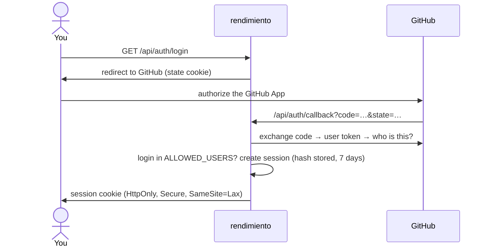
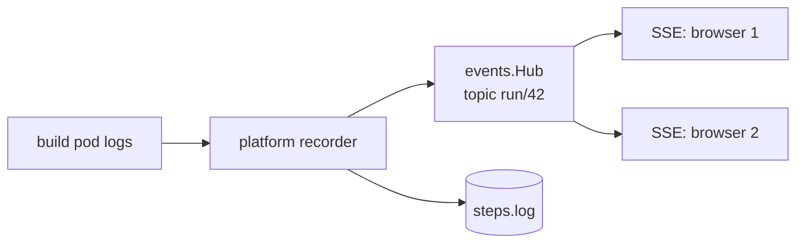

# API, auth and the UI

## The HTTP server

`internal/api` serves everything on one port (8080) with Go's standard `net/http` router, which since Go 1.22 matches methods and path patterns (`"GET /api/apps/{app}"`) with no framework. `Server.Handler()` registers three kinds of routes:

| Kind | Examples | Protection |
|---|---|---|
| public | `/healthz`, `POST /api/webhooks/github`, `/api/auth/*`, `/api/setup/*` | webhooks: HMAC signature; setup: the setup token |
| session | every other `/api/…` route | a valid session cookie for an allowed GitHub login |
| UI | everything else | none (static files) |

The whole list is in the [HTTP API reference](../reference/api.md). Handlers are thin: they decode the request, call the platform, store or cluster, and write JSON with `writeJSON`/`httpError`. Business logic lives in `internal/platform` and the controllers, not in handlers.

## Signing in

- Sessions are random 32-byte tokens; only their **SHA-256** is stored, so a database leak does not leak sessions.
- `requireSession` checks the cookie **and** the allowlist on every request, so removing someone from `ALLOWED_USERS` locks them out immediately.
- `guard` adds security headers (`nosniff`, `DENY` framing, same-origin referrer) and refuses **cross-origin** state-changing requests (the `Origin` header must match), on top of `SameSite=Lax` cookies.

## Webhooks

`POST /api/webhooks/github` verifies the `X-Hub-Signature-256` HMAC with the App's webhook secret (constant-time comparison), then handles **push** events: to an app's repository (runs) and to the gitops repository (add-on sync). Pull-request events need no handling: the branch's push already built it, and its check run shows on the PR. **Pull requests from forks are never built**, since their code would run with the installation's token.

## Live updates: Server-Sent Events

Run pages and app pages update live. The browser opens `GET /api/runs/{id}/events` (or `/api/apps/{app}/events`), a long-lived response with `Content-Type: text/event-stream`; the server writes `event:`/`data:` lines as things happen, and a comment every 20 seconds to keep proxies from closing it.

`events.Hub` is an in-process publish/subscribe map from topic to subscriber channels. Publishing never blocks: a subscriber that falls behind misses events and refetches state when it reconnects. It is the simplest thing that works with one replica; with several replicas it needs a shared bus ([Scaling](../future/scaling.md#live-updates-across-replicas)). The ingress for the platform disables proxy buffering and allows hour-long reads, so events flow immediately.

## The UI

A single-page app in `web/`: **React 18**, **TypeScript**, **Vite**, **react-router**, no UI framework, and one stylesheet with CSS variables for light and dark themes.

| File | Role |
|---|---|
| `src/main.tsx` | Routes, top bar, sign-in gate |
| `src/api.ts` | Every API call and response type, in one place |
| `src/components/ui.tsx` | Shared pieces: badges, `usePoll` (load and refresh), `Switch`, the resource tree |
| `src/pages/*.tsx` | One file per page: Dashboard, NewApp, AppPage, RunPage, Services, Addons, Installed (add-on list, catalog, detail), Environment, Setup |
| `src/styles.css` | Theme tokens and components |

Patterns used throughout:

- **`usePoll(load, deps, intervalMs)`** fetches data and refreshes it on an interval; pages combine it with SSE where updates must be instant (logs).
- **Types mirror the Go JSON.** `api.ts` declares interfaces matching the Go structs' JSON tags; keeping them in sync is manual today ([refactoring](../develop/refactoring.md#share-types-between-go-and-typescript)).
- **No global state library.** Each page owns its data; there is little shared state to justify one.

### How the UI ships

`npm run build` compiles `web/src` into `web/dist`. `web/embed.go` embeds that folder into the Go binary (`//go:embed all:dist`), and `Server.ui()` serves it: static assets with a year-long cache (their names contain a content hash), and `index.html` for any other path so client-side routes work on reload. The Docker build compiles the UI in its own stage ([builds](builds.md#rendimientos-own-dockerfile)).

For UI work, `npm run dev` in `web/` starts Vite's dev server with hot reload, proxying `/api` to a rendimiento on `localhost:8080` ([setup](../develop/setup.md#working-on-the-ui)).
