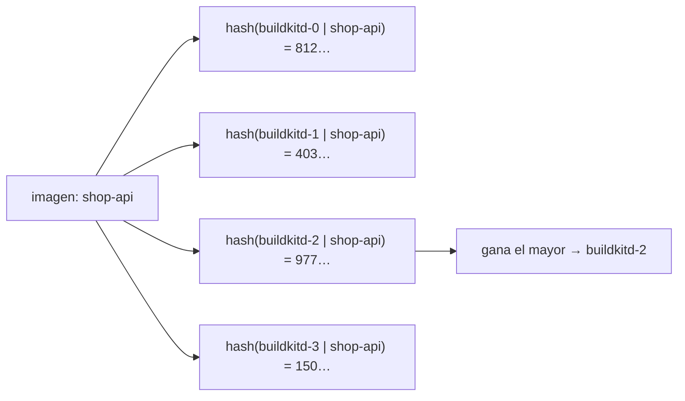

# Construir imágenes con BuildKit

Cada imagen que despliega rendimiento, incluidos el propio rendimiento y este libro, la construye **BuildKit**. Este capítulo explica qué significa eso desde cero.

## Las imágenes en dos minutos {#images-in-two-minutes}

Una **imagen de contenedor** es una pila de **capas** (archivos tar con archivos dentro) más una pequeña **configuración** en JSON (el comando a ejecutar, el entorno, el usuario, los puertos expuestos) y un **manifiesto** que las enumera. Todo se nombra por su contenido: cada pieza se llama por el SHA-256 de sus bytes, y la imagen completa por el SHA-256 de su manifiesto: la **huella**, como `sha256:5fa9dd15…`.

- Una **etiqueta** (`:1.2.3`, `:latest`) es un letrero que se puede mover; mañana puede apuntar a otra imagen.
- Una **huella** nunca cambia de significado: la misma huella siempre son los mismos bytes.

Por eso cada versión de rendimiento fija las imágenes **por huella** (`registry.example.lan:5000/shop-api@sha256:…`): lo que se ejecuta es exactamente lo que se construyó y se probó, y una reversión trae de vuelta exactamente lo que corría antes.

## Qué es BuildKit {#what-buildkit-is}

BuildKit es el motor de construcción detrás de `docker build`, disponible por separado. Tiene dos partes:

- **`buildkitd`**, un demonio que hace el trabajo: ejecuta los pasos de construcción en contenedores aislados, guarda una caché nombrada por contenido y envía los resultados a un registro. Necesita privilegios (crea contenedores), así que corre en sus propios pods dedicados;
- **`buildctl`**, un cliente delgado que le manda una construcción y devuelve el progreso. Los pods de construcción solo corren este cliente, **sin privilegios**.

Por dentro, BuildKit no ejecuta un Dockerfile línea por línea. Primero una **interfaz de entrada** (*frontend*) traduce la definición de la construcción a **LLB**, un grafo de operaciones de bajo nivel (traer una imagen, correr un comando, copiar archivos). Luego BuildKit:

- ejecuta **en paralelo** las partes independientes del grafo (por ejemplo, dos etapas que no dependen una de la otra);
- **se salta** cualquier operación cuyas entradas no cambiaron (la llave de la caché es la huella de la operación y sus entradas);
- descarga solo lo que necesita.

Aquí se usan dos interfaces de entrada:

| Interfaz de entrada | Entrada | Se usa para |
|---|---|---|
| `dockerfile.v0` (integrada) | un `Dockerfile` | los servicios con Dockerfile |
| `gateway.v0` + `ghcr.io/railwayapp/railpack-frontend` | un plan de construcción de Railpack (JSON) | los servicios sin Dockerfile ([Railpack](#railpack-no-dockerfile-needed)) |

No hay un demonio de Docker en ninguna parte del clúster; nada lo necesita.

## Dockerfiles en varias etapas {#multi-stage-dockerfiles}

Un Dockerfile en varias etapas tiene varias líneas `FROM`. Cada una empieza una **etapa** con su propia imagen base; las etapas posteriores copian de las anteriores solo lo que necesitan con `COPY --from=<etapa>`. Solo la **última etapa** se vuelve la imagen. Los compiladores, las cachés de paquetes y el código fuente se quedan en las etapas de construcción y se tiran, así que la imagen final es chica y tiene menos que atacar.

### El Dockerfile del propio rendimiento {#rendimientos-own-dockerfile}

```dockerfile
--8<-- "Dockerfile"
```

| Etapa | Base | Hace | Queda en la imagen |
|---|---|---|---|
| `ui` | `node:20-alpine` | `npm ci`, luego `npm run build` (Vite) → `web/dist` | nada directamente |
| `build` | `golang:1.27` | `go mod download`, copia el código fuente y la interfaz ya construida, compila | nada directamente |
| final | `distroless/static-debian12:nonroot` | — | un archivo: el programa `/rendimiento` (con la interfaz incrustada) |

Detalles que vale la pena saber:

- **El orden, por la caché.** `go.mod`/`go.sum` (y `package.json`/`package-lock.json`) se copian y sus dependencias se descargan *antes* que el código fuente. Así un cambio de código reutiliza la capa de dependencias; solo un cambio de dependencias vuelve a descargar.
- **`CGO_ENABLED=0`** construye un programa de Go puro y **enlazado estáticamente**: no necesita una biblioteca de C, así que corre en `distroless/static`, una imagen sin intérprete de comandos, sin gestor de paquetes, nada más que los certificados de las autoridades y un usuario sin privilegios.
- **`-trimpath -ldflags="-s -w"`** quita las rutas locales y los símbolos de depuración (un programa más chico).
- La interfaz se compila en su propia etapa y se copia, y el `//go:embed` de Go la mete dentro del programa.
- El resultado pesa unos **55 MB** y corre como un usuario sin privilegios, con el sistema de archivos raíz de solo lectura (vea `deploy/rendimiento.yaml`).

### El Dockerfile de este libro {#this-books-dockerfile}

```dockerfile
--8<-- "docs/Dockerfile"
```

Tres etapas con tres juegos de herramientas distintos (Go, Python, nginx). BuildKit corre `codemap` y el `pip install` de `site` **en paralelo**, porque ninguno depende del otro hasta el `COPY --from=codemap` final.

### Las plantillas para las aplicaciones detectadas {#the-templates-for-detected-apps}

Cuando un repositorio no tiene Dockerfile y usted decide agregar uno, rendimiento lo genera desde `templates/dockerfiles/`. Por ejemplo, Next.js con `output: 'standalone'`:

```dockerfile
--8<-- "templates/dockerfiles/node-next-standalone.tmpl"
```

## Cómo corre una construcción aquí {#how-a-build-runs-here}

El contenedor `step` del pod de construcción corre `buildctl` contra un demonio de BuildKit ([los guiones](pipeline.md#running-a-step-the-build-pod)):

```bash
buildctl --addr tcp://buildkitd-2.buildkitd-pool.devops-tools.svc.cluster.local:1234 build \
  --frontend dockerfile.v0 --local context=/workspace/src/api --local dockerfile=/workspace/src/api \
  --opt filename=Dockerfile --opt build-arg:GIT_SHA=… \
  --output type=image,name=registry.example.lan:5000/shop-api:4f2a9c1e0b7d,push=true,registry.insecure=true \
  --import-cache type=registry,ref=registry.example.lan:5000/shop-api:buildcache,registry.insecure=true \
  --export-cache type=registry,ref=registry.example.lan:5000/shop-api:buildcache,mode=max,registry.insecure=true \
  --metadata-file /tmp/metadata.json
```

- `--local context=…` manda la carpeta clonada al demonio.
- `--output type=image,…,push=true` envía el resultado, etiquetado con el SHA corto de la confirmación; la huella regresa en `metadata.json`.
- El registro usa HTTP simple (`registry.insecure=true`); los demonios lo conocen por su configuración (`buildkitd.toml`).

## La caché, dos veces {#caching-twice}

1. **La caché local de cada demonio**, en un volumen local del nodo (`local-path`, hasta unos 15 GB, con recolección de basura). La más rápida, pero solo en ese nodo.

    !!! warning "Cuide las unidades en `buildkitd.toml`"
        Desde BuildKit 0.17, un número sin unidad en los ajustes de recolección son **bytes**. El grupo primero tenía `gckeepstorage = 15000`, pensado como 15 GB, que BuildKit leyó como 15 kB. Cada demonio tiraba su caché después de cada construcción, y cada construcción volvía a descargar sus imágenes base y sus capas: una aplicación chiquita de Go pasó de 85 s a más de 7 minutos. La configuración en `p0dxD/gitops/buildkit/config.yaml` ahora usa unidades explícitas: `reservedSpace = "5GB"`, `maxUsedSpace = "15GB"`, `minFreeSpace = "15%"`. Para revisar lo que un demonio aplica de verdad: `kubectl -n devops-tools exec buildkitd-0 -- buildctl --addr unix:///run/buildkit/buildkitd.sock debug workers --verbose`.
2. **Una caché en el registro por imagen**: `--export-cache …:buildcache,mode=max` guarda *cada* capa intermedia (modo `max`, no solo las finales) bajo la etiqueta `buildcache` de la imagen; `--import-cache` la lee. Cualquier demonio la puede usar, así que un servicio que se mueve a otro demonio sigue razonablemente caliente.

## El grupo de BuildKit {#the-buildkit-pool}

Un demonio no puede usar los procesadores de más de un nodo. El grupo corre **un demonio por nodo trabajador** (no en el plano de control, ni en los nodos excluidos de las construcciones, como un nodo con GPU) como un StatefulSet con antiafinidad de pods. Es un [complemento](addons.md) definido en `p0dxD/gitops/buildkit/`.

La plataforma encuentra los demonios por un **Service sin IP propia** (*headless*, `buildkitd-pool`): sus registros DNS SRV enumeran solo los demonios que están *listos*. Para cada construcción, `KubeExecutor.buildkitFor` elige uno con **hash de encuentro** (*rendezvous hashing*) sobre el nombre de la imagen:



Cada imagen tiene un **favorito estable**, así que siempre encuentra ahí su caché caliente, mientras que imágenes distintas se reparten por el grupo y se construyen en paralelo. Si un demonio desaparece, solo se mueven las imágenes que lo preferían; todo lo demás se queda donde estaba. Si ningún demonio está listo, las construcciones usan `BUILDKIT_ADDR`. El registro de la construcción dice qué demonio construyó cada imagen.

```go
--8<-- "internal/pipeline/kube.go:buildkitFor"
```

## Railpack: sin necesidad de Dockerfile {#railpack-no-dockerfile-needed}

Para un servicio sin Dockerfile, el contenedor **plan** del pod de construcción corre la herramienta de Railpack (`railpack prepare`). Detecta el lenguaje (Node, Python, Go, Java, sitios estáticos…), elige las versiones y escribe un **plan de construcción**: qué paquetes instalar (con `mise`), qué comandos correr y con qué debe arrancar la imagen. El contenedor `step` le pasa ese plan a la interfaz de entrada `gateway.v0` de BuildKit con la imagen de la interfaz de entrada de Railpack, que lo convierte en LLB.

| | Dockerfile | Railpack |
|---|---|---|
| Usted escribe | un Dockerfile | nada (`build.start` para cambiar el comando de arranque) |
| Control | total | con `railpack.json` o argumentos de construcción |
| Tamaño de la imagen | chica con varias etapas (p. ej. 4 MB para una aplicación de Go en distroless) | más grande (unos 40 MB para la misma aplicación de Go: una base de ejecución general) |
| Corre como | quien usted elija | root, de forma predeterminada |

Use Railpack para empezar rápido; agregue un Dockerfile cuando importen el tamaño, el endurecimiento o los paquetes del sistema. Un servicio con Dockerfile siempre lo usa; `build.builder` puede forzar cualquiera de los dos.

## Construir el propio rendimiento: `make image` {#building-rendimiento-itself-make-image}

```makefile
--8<-- "Makefile:image"
```

`make image` redirige un puerto al Service `buildkitd` y corre el cliente `buildctl` en un contenedor desechable con el repositorio montado en solo lectura. El trabajo ocurre en un demonio del grupo, no en `main`.

## Arquitecturas {#architectures}

Cada nodo es **arm64**, así que cada imagen se construye para `linux/arm64`. Un destino en la nube con x86 (`linux/amd64`) necesitaría una de dos:

- **construcciones multiplataforma**: `--opt platform=linux/amd64,linux/arm64` produce un índice de imágenes con las dos; un demonio arm64 construye la mitad amd64 bajo emulación con QEMU, que es lenta; o
- **constructores nativos** para cada arquitectura: un demonio amd64 en el grupo, y el ejecutor elige por plataforma (la llave de encuentro podría incluirla).

Vea [Escalar](../future/scaling.md#builds) y [código abierto](../future/open-source.md#releases-and-multi-arch-images).
