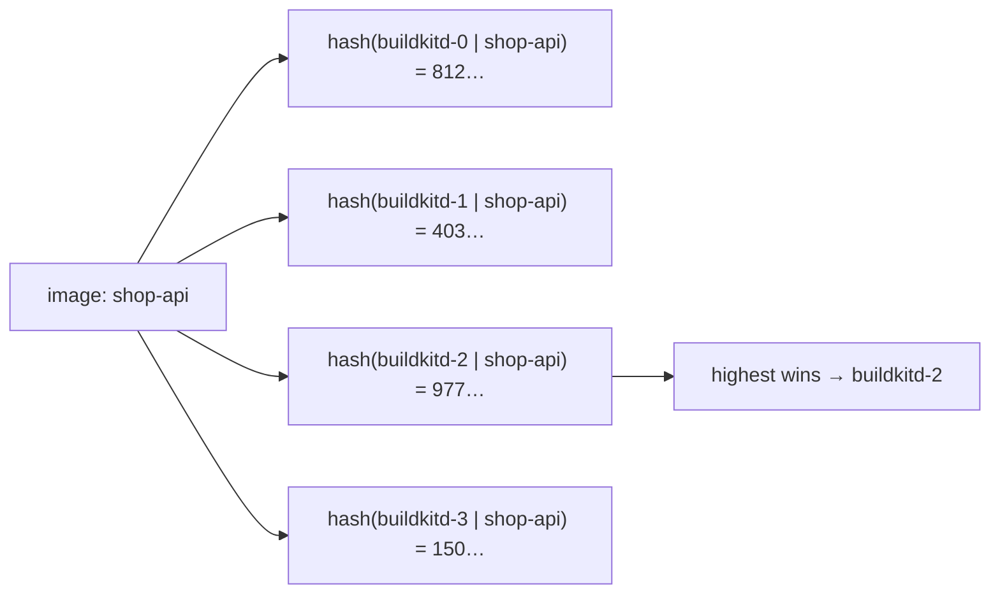

# Building images with BuildKit

Every image rendimiento deploys, including rendimiento itself and this book, is built by **BuildKit**. This chapter explains what that means from the ground up.

## Images in two minutes

A **container image** is a stack of **layers** (tar archives of files) plus a small JSON **config** (the command to run, environment, user, exposed ports) and a **manifest** listing them. Everything is content-addressed: each piece is named by the SHA-256 of its bytes, and the image as a whole by the SHA-256 of its manifest: the **digest**, like `sha256:5fa9dd15…`.

- A **tag** (`:1.2.3`, `:latest`) is a movable label; it can point at a different image tomorrow.
- A **digest** can never change meaning: the same digest is always the same bytes.

That is why every rendimiento release pins images **by digest** (`registry.example.lan:5000/shop-api@sha256:…`): what runs is exactly what was built and tested, and a rollback brings back exactly what ran before.

## What BuildKit is

BuildKit is the build engine behind `docker build`, available on its own. It has two parts:

- **`buildkitd`**, a daemon that does the work: runs build steps in isolated containers, keeps a content-addressed cache, pushes results to a registry. It needs privileges (it creates containers), so it runs in its own dedicated pods;
- **`buildctl`**, a thin client that sends it a build and streams the progress back. Build pods run only this client, **unprivileged**.

Inside, BuildKit does not run a Dockerfile line by line. A **frontend** first translates the build definition into **LLB**, a graph of low-level operations (fetch an image, run a command, copy files). BuildKit then:

- runs independent parts of the graph **in parallel** (for example two stages that do not depend on each other);
- **skips** any operation whose inputs have not changed (the cache key is the hash of the operation and its inputs);
- pulls only what it needs.

Two frontends are used here:

| Frontend | Input | Used for |
|---|---|---|
| `dockerfile.v0` (built in) | a `Dockerfile` | services with a Dockerfile |
| `gateway.v0` + `ghcr.io/railwayapp/railpack-frontend` | a Railpack build plan (JSON) | services without one ([Railpack](#railpack-no-dockerfile-needed)) |

There is no Docker daemon anywhere in the cluster; nothing needs one.

## Multi-stage Dockerfiles

A multi-stage Dockerfile has several `FROM` lines. Each starts a **stage** with its own base image; later stages copy only what they need from earlier ones with `COPY --from=<stage>`. Only the **last stage** becomes the image. Compilers, package caches and sources stay in the build stages and are thrown away, so the final image is small and has less to attack.

### rendimiento's own Dockerfile

```dockerfile
--8<-- "Dockerfile"
```

| Stage | Base | Does | Kept in the image |
|---|---|---|---|
| `ui` | `node:20-alpine` | `npm ci`, then `npm run build` (Vite) → `web/dist` | nothing directly |
| `build` | `golang:1.27` | `go mod download`, copies the sources and the built UI, compiles | nothing directly |
| final | `distroless/static-debian12:nonroot` | — | one file: the `/rendimiento` binary (with the UI embedded) |

Details worth knowing:

- **Order for caching.** `go.mod`/`go.sum` (and `package.json`/`package-lock.json`) are copied and their dependencies downloaded *before* the sources. A code change then reuses the dependency layer; only a dependency change downloads again.
- **`CGO_ENABLED=0`** builds a pure-Go, **statically linked** binary: no C library needed, so it runs on `distroless/static`, an image with no shell, no package manager, nothing but CA certificates and a non-root user.
- **`-trimpath -ldflags="-s -w"`** removes local paths and debug symbols (a smaller binary).
- The UI is compiled in its own stage and copied in, and Go's `//go:embed` puts it inside the binary.
- The result is about **55 MB** and runs as a non-root user, with a read-only root filesystem (see `deploy/rendimiento.yaml`).

### This book's Dockerfile

```dockerfile
--8<-- "docs/Dockerfile"
```

Three stages with three different toolchains (Go, Python, nginx). BuildKit runs `codemap` and the `pip install` of `site` **in parallel**, since neither depends on the other until the final `COPY --from=codemap`.

### The templates for detected apps

When a repository has no Dockerfile and you choose to add one, rendimiento generates it from `templates/dockerfiles/`. For example, Next.js with `output: 'standalone'`:

```dockerfile
--8<-- "templates/dockerfiles/node-next-standalone.tmpl"
```

## How a build runs here

The build pod's `step` container runs `buildctl` against a BuildKit daemon ([the scripts](pipeline.md#running-a-step-the-build-pod)):

```bash
buildctl --addr tcp://buildkitd-2.buildkitd-pool.devops-tools.svc.cluster.local:1234 build \
  --frontend dockerfile.v0 --local context=/workspace/src/api --local dockerfile=/workspace/src/api \
  --opt filename=Dockerfile --opt build-arg:GIT_SHA=… \
  --output type=image,name=registry.example.lan:5000/shop-api:4f2a9c1e0b7d,push=true,registry.insecure=true \
  --import-cache type=registry,ref=registry.example.lan:5000/shop-api:buildcache,registry.insecure=true \
  --export-cache type=registry,ref=registry.example.lan:5000/shop-api:buildcache,mode=max,registry.insecure=true \
  --metadata-file /tmp/metadata.json
```

- `--local context=…` sends the cloned folder to the daemon.
- `--output type=image,…,push=true` pushes the result, tagged with the commit's short SHA; the digest comes back in `metadata.json`.
- The registry is plain HTTP (`registry.insecure=true`); the daemons know it from their config (`buildkitd.toml`).

## Caching, twice

1. **Each daemon's local cache**, on a node-local volume (`local-path`, up to about 15 GB, garbage-collected). Fastest, but only on that node.

    !!! warning "Mind the units in `buildkitd.toml`"
        Since BuildKit 0.17, a bare number in the GC settings is **bytes**. The pool first had `gckeepstorage = 15000`, meant as 15 GB, which BuildKit read as 15 kB. Every daemon threw its cache away after each build, and every build re-downloaded its base images and cached layers: a tiny Go app went from 85 s to over 7 minutes. The config in `p0dxD/gitops/buildkit/config.yaml` now uses explicit units: `reservedSpace = "5GB"`, `maxUsedSpace = "15GB"`, `minFreeSpace = "15%"`. To check what a daemon really applies: `kubectl -n devops-tools exec buildkitd-0 -- buildctl --addr unix:///run/buildkit/buildkitd.sock debug workers --verbose`.
2. **A registry cache per image**: `--export-cache …:buildcache,mode=max` stores *every* intermediate layer (mode `max`, not just the final ones) under the image's `buildcache` tag; `--import-cache` reads it. Any daemon can use it, so a service moved to another daemon is still reasonably warm.

## The BuildKit pool

One daemon cannot use more than one node's CPUs. The pool runs **one daemon per worker node** (not on the control plane, nor on nodes excluded from builds such as a GPU node) as a StatefulSet with pod anti-affinity. It is an [add-on](addons.md) defined in `p0dxD/gitops/buildkit/`.

The platform finds the daemons through a **headless Service** (`buildkitd-pool`): its DNS SRV records list only daemons that are *ready*. For each build, `KubeExecutor.buildkitFor` chooses one by **rendezvous hashing** on the image name:



Each image has a **stable favourite**, so it always finds its warm cache there, while different images spread across the pool and build in parallel. If a daemon disappears, only the images that favoured it move; everything else stays put. If no daemon is ready, builds fall back to `BUILDKIT_ADDR`. The build log says which daemon built each image.

```go
--8<-- "internal/pipeline/kube.go:buildkitFor"
```

## Railpack: no Dockerfile needed

For a service without a Dockerfile, the build pod's **plan** container runs the Railpack CLI (`railpack prepare`). It detects the language (Node, Python, Go, Java, static sites…), picks versions, and writes a **build plan**: which packages to install (through `mise`), which commands to run, and what the image should start. The `step` container hands that plan to BuildKit's `gateway.v0` frontend with Railpack's frontend image, which turns it into LLB.

| | Dockerfile | Railpack |
|---|---|---|
| You write | a Dockerfile | nothing (`build.start` to override the start command) |
| Control | total | through `railpack.json` or build args |
| Image size | small with multi-stage (e.g. 4 MB for a Go app on distroless) | larger (about 40 MB for the same Go app: a general runtime base) |
| Runs as | whatever you choose | root by default |

Use Railpack to get started quickly; add a Dockerfile when size, hardening or system packages matter. A service with a Dockerfile always uses it; `build.builder` can force either.

## Building rendimiento itself: `make image`

```makefile
--8<-- "Makefile:image"
```

`make image` port-forwards to the `buildkitd` Service and runs the `buildctl` client in a throwaway container with the repository mounted read-only. The work happens on a pool daemon, not on `main`.

## Architectures

Every node is **arm64**, so every image is built for `linux/arm64`. A cloud target on x86 (`linux/amd64`) would need either:

- **multi-platform builds**: `--opt platform=linux/amd64,linux/arm64` produces one image index containing both; an arm64 daemon builds the amd64 half under QEMU emulation, which is slow; or
- **native builders** for each architecture: an amd64 daemon in the pool, with the executor choosing by platform (the rendezvous key could include it).

See [Scaling](../future/scaling.md#builds) and [open source](../future/open-source.md#releases-and-multi-arch-images).
