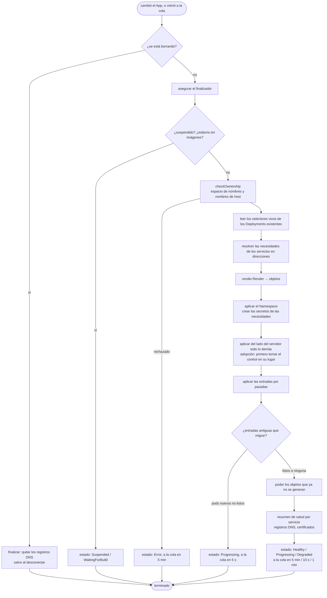

# El controlador de aplicaciones

El controlador de aplicaciones (`internal/controller/app_controller.go`) es la mitad GitOps de rendimiento: convierte cada objeto `App` en cargas de trabajo en ejecución, y las mantiene así.

## Los controladores en una página {#controllers-in-one-page}

Kubernetes está hecho de **controladores**: ciclos que vigilan objetos y actúan para que la realidad coincida con lo que dicen los objetos. Los controladores de rendimiento están hechos con **controller-runtime**, la misma biblioteca que usan casi todos los operadores de Kubernetes:

- un **administrador** guarda una caché de los objetos vigilados y una cola de trabajo;
- cuando cambia un objeto vigilado, su llave (aquí, el nombre del App) entra a la cola;
- se llama al **`Reconcile(ctx, request)`** del controlador con esa llave. Lee el estado actual, hace lo que haga falta y devuelve: terminado, *volver a la cola en N segundos*, o un error (que se reintenta con espera creciente).

La conciliación debe ser **idempotente**: llamarla diez veces seguidas debe tener el mismo efecto que una. Nunca supone que sabe lo que pasó antes; mira, y corrige. Eso hace al sistema resistente a caídas, reinicios y personas que editan cosas a mano.

```go
--8<-- "internal/controller/app_controller.go:reconcile"
```

El controlador de aplicaciones también es **dueño** de los objetos que crea (espacios de nombres, Deployments, Services, Ingresses, CronJobs): controller-runtime los vigila también, y un cambio en cualquiera de ellos devuelve su App a la cola. Borre un Deployment a mano y regresa unos segundos después: eso es la **autorreparación**, y no necesita código adicional.

## Qué hace una conciliación {#what-one-reconcile-does}



## Generar: de la especificación a los objetos {#rendering-from-spec-to-objects}

`internal/render` es **puro**: recibe un `Input` (nombre de la aplicación, especificación, imágenes publicadas, selectores vivos, direcciones de los servicios) y las `Options` del clúster (clase de entrada, emisor, clase de almacenamiento, perfil de GPU), y devuelve objetos. No hace entrada ni salida, así que se prueba con archivos de referencia (`testdata/*.golden.yaml`) que muestran exactamente en qué se convierte una especificación.

Por cada servicio produce:

| Objeto | Notas |
|---|---|
| **Deployment** | La imagen por huella; `PORT` y el entorno del servicio; los secretos como `envFrom` (opcionales, así un secreto que falta no detiene al pod); `secretEnv` desde llaves de secretos; recursos según el tamaño elegido o lo que se indique; una sonda de disponibilidad (la comprobación de salud del servicio, o una comprobación TCP a su puerto) y una sonda de vida solo cuando se declara una comprobación de salud; `allowPrivilegeEscalation: false` y el perfil seccomp predeterminado; una espera `preStop` de 5 segundos para que ingress-nginx deje de mandar tráfico antes de que el pod se detenga; **RollingUpdate**, o **Recreate** si hay un volumen (un volumen de Longhorn se conecta a un pod a la vez) o una GPU (un pod la ocupa). |
| **Service** | El puerto 80 *y* el puerto propio de la aplicación, los dos apuntando al **número** de puerto (no a un nombre), así los pods creados antes de una toma de control siguen recibiendo tráfico. |
| **Ingress** | Uno por servicio con dominio o rutas: TLS con cert-manager, anotaciones `nginx.ingress.kubernetes.io/*` adicionales (los fragmentos de código se rechazan), ajustes de transmisión continua, alias en el mismo certificado, **rutas** por camino en el host de otro servicio. |
| **PersistentVolumeClaim** | Para `volume:` sin `existingClaim`. |
| **Service de balanceador de carga** | Para `lan:`, con la anotación de dirección de MetalLB. |
| **CronJob** | Por cada tarea programada. |

`needs: [postgres]` y `needs: [redis]` se convierten en dos servicios más (`postgres`, `redis`) **antes** de generar, así reciben exactamente el mismo trato, y cada consumidor recibe sus variables. Vea [Necesidades](../guide/needs.md).

Cada objeto lleva etiquetas: `app.kubernetes.io/managed-by: rendimiento`, `rendimiento.ai/app: <app>`, `rendimiento.ai/service: <service>`. La poda, el catálogo de Servicios y las comprobaciones de propiedad dependen de ellas.

## Aplicación del lado del servidor {#server-side-apply}

Los objetos se escriben con la **aplicación del lado del servidor** (*server-side apply*): rendimiento manda el objeto *como lo quiere*, bajo el administrador de campos `rendimiento`, y el servidor de la API lo combina, recordando qué administrador es dueño de qué campo. Las consecuencias:

- los campos que rendimiento no define (un número de réplicas que cambió un escalador automático, los valores predeterminados) se dejan en paz;
- un campo que rendimiento deja de definir se quita, porque era suyo;
- `ForceOwnership` les quita los campos a otros administradores cuando los dos los definen.

## Comprobaciones de propiedad {#ownership-checks}

Antes de tocar nada, `checkOwnership` se niega a pisotear lo que es de alguien más:

- se rechaza un **espacio de nombres** que existe pero no tiene la etiqueta de esta aplicación (elija otro nombre, o **adóptelo**);
- con **`sharedNamespace`**, el espacio de nombres ya debe existir, y rendimiento nunca lo crea, lo etiqueta, se adueña de él ni lo borra;
- se rechaza un **nombre de host** que ya sirve un Ingress en otro lado.

## Adopción: tomar el control de lo que ya está corriendo {#adoption-taking-over-what-is-already-running}

Con `adopt: true` (la opción *migrar* del asistente), rendimiento toma el control **en su lugar** de una aplicación desplegada con ArgoCD o con `kubectl`:

- **Los objetos con el mismo nombre** (Deployment, Service, Ingress, CronJob) se reemplazan una vez con `takeover`: el objeto se actualiza exactamente al contenido deseado, conservando lo que no puede cambiar (el selector de un Deployment, la IP de clúster de un Service). Luego la propiedad de los campos de rendimiento se convierte en el **único** dueño de aplicación, para que la propiedad de la herramienta anterior no se quede ahí estorbando cambios futuros.
- **Los selectores se heredan.** El selector de un Deployment no se puede cambiar, así que el Deployment nuevo y su Service conservan el vivo, y los pods viejos y nuevos reciben tráfico durante la actualización.
- **Las entradas antiguas** (una entrada con otro nombre que sirve el dominio de la aplicación): las cargas de trabajo nuevas arrancan junto a las viejas, y solo cuando están listas (`migrate`) se quitan la entrada, los Services y los Deployments viejos. El tráfico nunca se queda sin a dónde ir.

Cada migración real se vigiló segundo a segundo; la mayoría no tuvo ni una petición fallida.

## Poda {#pruning}

Después de aplicar, `prune` borra los Deployments, Services, Ingresses y CronJobs que llevan las etiquetas de la aplicación pero que ya no se generan, por ejemplo un servicio que se quitó de `rendimiento.yaml`. **Los volúmenes nunca se podan**, ni los secretos de las necesidades: los datos sobreviven a un error en `rendimiento.yaml`.

## Salud {#health}

Un servicio está sano solo cuando su **actualización terminó**: cada réplica actualizada a la versión nueva y disponible, y ningún pod viejo sirviendo todavía. La aplicación está **Degraded** cuando una actualización pasó su plazo de avance o un pod se reinicia en ciclo, no puede descargar su imagen o le falta configuración (el mensaje nombra al pod). Mientras tanto, las actualizaciones graduales mantienen a los pods viejos sirviendo.

## DNS y certificados {#dns-and-certificates}

Por cada dominio, el controlador le pide al proveedor de DNS que asegure (`Ensure`) un registro para la aplicación:

- **Cloudflare** (`internal/dns`) crea o actualiza un registro A (o CNAME), marcado con el comentario `managed-by=rendimiento app=<name>`, y se niega a tocar registros que creó otra aplicación o una persona;
- con `DNS_TARGET=auto`, un ciclo (`dns/ddns.go`) revisa la IP pública de la red cada 5 minutos y vuelve a apuntar cada registro que administra rendimiento (más cualquier registro cuyo comentario contenga `rendimiento-ddns`) cuando cambia;
- **los certificados** vienen de cert-manager (la anotación `cert-manager.io/cluster-issuer` de la entrada); el controlador informa si cada Certificate está listo.

## Borrar y desconectar {#deleting-and-disconnecting}

El espacio de nombres de la aplicación **pertenece** al objeto App, así que borrar el App deja que el recolector de basura de Kubernetes borre el espacio de nombres y todo lo que contiene. El **finalizador** primero quita los registros DNS de la aplicación.

**Desconectar** (`platform.DisconnectApp`), en cambio: suspende el App, quita de todo las referencias de dueño y las etiquetas de rendimiento, marca el App para que el finalizador conserve los registros DNS, y luego borra el objeto App y las filas de la aplicación en la base de datos. Todo sigue corriendo, sin administrar.

## Dónde cambiar qué {#where-to-change-what}

| Para… | Cambie |
|---|---|
| agregar a `rendimiento.yaml` un campo que cambia objetos | `internal/spec` (tipo, valor predeterminado, validación), `internal/render` (salida), la prueba de referencia, `make generate` ([receta](../develop/recipes.md#add-a-field-to-rendimientoyaml)) |
| cambiar las reglas de salud | el ciclo al final de `sync` |
| aceptar otro proveedor de DNS | implemente `dns.Provider` ([receta](../develop/recipes.md#add-a-dns-provider)) |
| administrar un tipo nuevo de objeto | génerelo, agréguelo a `Objects.List`, declárelo con `Owns()` en `SetupWithManager`, pódelo y dé los permisos de RBAC |
