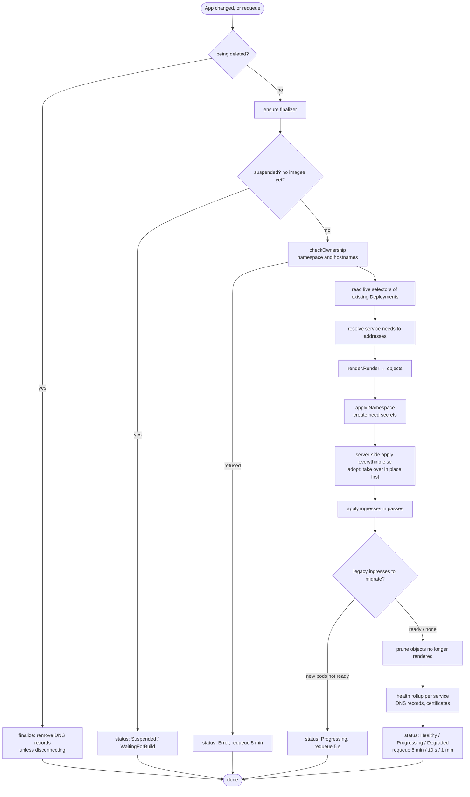

# The app controller

The app controller (`internal/controller/app_controller.go`) is the GitOps half of rendimiento: it turns each `App` object into running workloads, and keeps them that way.

## Controllers in one page

Kubernetes is built on **controllers**: loops that watch objects and act to make reality match what the objects say. rendimiento's controllers are built with **controller-runtime**, the same library as most Kubernetes operators:

- a **manager** holds a cache of watched objects and a work queue;
- when a watched object changes, its key (here, the App's name) goes on the queue;
- the controller's **`Reconcile(ctx, request)`** is called with that key. It reads the current state, does whatever is needed, and returns: done, *requeue after N seconds*, or an error (retried with backoff).

Reconcile must be **idempotent**: calling it ten times in a row must have the same effect as once. It never assumes it knows what happened before; it looks, and fixes. That makes the system robust to crashes, restarts and people editing things by hand.

```go
--8<-- "internal/controller/app_controller.go:reconcile"
```

The App controller also **owns** the objects it creates (namespaces, Deployments, Services, Ingresses, CronJobs): controller-runtime watches them too, and a change to any of them requeues their App. Delete a Deployment by hand and it comes back seconds later: that is **self-healing**, and it needs no extra code.

## What one reconcile does



## Rendering: from spec to objects

`internal/render` is **pure**: it takes an `Input` (app name, spec, released images, live selectors, service addresses) and cluster `Options` (ingress class, issuer, storage class, GPU profile), and returns objects. It does no I/O, so it is tested with golden files (`testdata/*.golden.yaml`) that show exactly what a spec becomes.

For each service it produces:

| Object | Notes |
|---|---|
| **Deployment** | Image by digest; `PORT` and the service's env; secrets as `envFrom` (optional, so a missing secret does not block the pod); `secretEnv` from secret keys; resources from the size preset or overrides; a readiness probe (the service's health check, or a TCP check on its port) and a liveness probe only when a health check is declared; `allowPrivilegeEscalation: false` and the default seccomp profile; a 5-second `preStop` sleep so ingress-nginx stops sending traffic before the pod stops; **RollingUpdate**, or **Recreate** for a volume (a Longhorn volume attaches to one pod at a time) or a GPU (one pod holds it). |
| **Service** | Port 80 *and* the app's own port, both targeting the port **number** (not a name), so pods created before a takeover still receive traffic. |
| **Ingress** | One per service with a domain or routes: TLS with cert-manager, extra `nginx.ingress.kubernetes.io/*` annotations (snippets are refused), streaming settings, aliases on the same certificate, path **routes** on another service's host. |
| **PersistentVolumeClaim** | For `volume:` without `existingClaim`. |
| **LoadBalancer Service** | For `lan:`, with MetalLB's address annotation. |
| **CronJob** | For each job. |

`needs: [postgres]` and `needs: [redis]` expand into two more services (`postgres`, `redis`) **before** rendering, so they get exactly the same treatment, and each consumer gets its variables. See [Needs](../guide/needs.md).

Every object carries labels: `app.kubernetes.io/managed-by: rendimiento`, `rendimiento.ai/app: <app>`, `rendimiento.ai/service: <service>`. Pruning, the Services catalog and ownership checks all rely on them.

## Server-side apply

Objects are written with **server-side apply** (SSA): rendimiento sends the object *as it wants it*, under the field manager `rendimiento`, and the API server merges it, remembering which manager owns which field. Consequences:

- fields rendimiento does not set (a replica count changed by an autoscaler, defaults) are left alone;
- a field rendimiento stops setting is removed, because it owned it;
- `ForceOwnership` takes fields over from other managers when both set them.

## Ownership checks

Before touching anything, `checkOwnership` refuses to trample what belongs to someone else:

- a **namespace** that exists but is not labelled for this app is refused (pick another name, or **adopt**);
- with **`sharedNamespace`**, the namespace must already exist, and rendimiento never creates, labels, owns or deletes it;
- a **hostname** already served by an Ingress elsewhere is refused.

## Adoption: taking over what is already running

With `adopt: true` (the wizard's *migrate* option), rendimiento takes over an app deployed by ArgoCD or `kubectl` **in place**:

- **Same-named objects** (Deployment, Service, Ingress, CronJob) are replaced once by `takeover`: the object is updated to exactly the desired content, keeping what cannot change (a Deployment's selector, a Service's cluster IP). Then rendimiento's field ownership is converted into the **only** apply owner, so the previous tool's ownership does not linger and block later changes.
- **Selectors are inherited.** A Deployment's selector is immutable, so the new Deployment and its Service keep the live one, and old and new pods both receive traffic during the rollout.
- **Legacy ingresses** (a differently named ingress serving the app's domain): the new workloads start next to the old ones, and only when they are ready (`migrate`) are the old ingress, Services and Deployments removed. Traffic never has nowhere to go.

Every real migration was watched second by second; most had zero failed requests.

## Pruning

After applying, `prune` deletes Deployments, Services, Ingresses and CronJobs that carry the app's labels but are no longer rendered, for example a service removed from `rendimiento.yaml`. **Volumes are never pruned**, and neither are need secrets: data survives a mistake in `rendimiento.yaml`.

## Health

A service is healthy only when its **rollout is complete**: every replica updated to the new version and available, and no old pod left serving. The app is **Degraded** when a rollout exceeded its progress deadline or a pod is crash-looping, failing to pull its image or missing configuration (the message names the pod). Rolling updates keep the old pods serving meanwhile.

## DNS and certificates

For each domain, the controller asks the DNS provider to `Ensure` a record for the app:

- **Cloudflare** (`internal/dns`) creates or updates an A (or CNAME) record, marked with a comment `managed-by=rendimiento app=<name>`, and refuses to touch records created by another app or a person;
- with `DNS_TARGET=auto`, a loop (`dns/ddns.go`) checks the network's public IP every 5 minutes and repoints every rendimiento-managed record (plus any record whose comment contains `rendimiento-ddns`) when it changes;
- **certificates** come from cert-manager (the ingress's `cert-manager.io/cluster-issuer` annotation); the controller reports whether each Certificate is ready.

## Deleting and disconnecting

The App's namespace is **owned** by the App object, so deleting the App lets Kubernetes' garbage collector delete the namespace and everything in it. The **finalizer** first removes the app's DNS records.

**Disconnect** (`platform.DisconnectApp`) instead: suspends the App, removes owner references and rendimiento's labels from everything, marks the App so the finalizer keeps DNS records, then deletes the App object and the app's database rows. Everything keeps running, unmanaged.

## Where to change what

| To… | Change |
|---|---|
| add a field to `rendimiento.yaml` that changes objects | `internal/spec` (type, default, validation), `internal/render` (output), golden test, `make generate` ([recipe](../develop/recipes.md#add-a-field-to-rendimientoyaml)) |
| change health rules | the loop at the end of `sync` |
| support another DNS provider | implement `dns.Provider` ([recipe](../develop/recipes.md#add-a-dns-provider)) |
| manage a new kind of object | render it, add it to `Objects.List`, `Owns()` it in `SetupWithManager`, prune it, grant RBAC |
