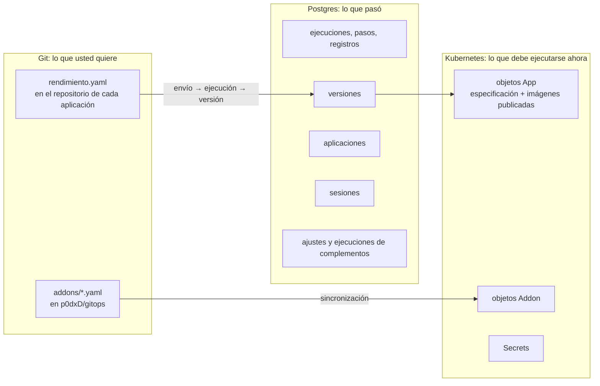
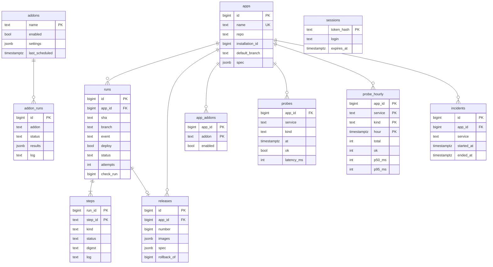
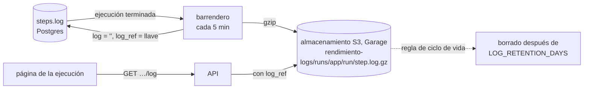

# Datos y estado

rendimiento guarda el estado en tres lugares, a propósito. Saber cuál es cuál contesta casi todas las preguntas de "¿de dónde sale X?".



| Pregunta | La respuesta vive en | Por qué |
|---|---|---|
| ¿Cómo se construye y se ejecuta esta aplicación? | `rendimiento.yaml` (git) | Se revisa en solicitudes de incorporación, tiene versiones y se despliega al integrarse. |
| ¿Qué imágenes se están ejecutando ahorita? | el objeto `App` (`spec.images`, `spec.release`) | El controlador lo necesita; `kubectl get apps.rendimiento.ai` lo muestra; el clúster sigue funcionando si la base de datos se cae. |
| ¿Qué programas del clúster están instalados, y cómo? | `addons/*.yaml` (git) → objetos `Addon` | Las mismas razones. |
| ¿Qué pasó (ejecuciones, registros, versiones, quién inició sesión)? | Postgres | Historial relacional, que casi solo crece y se puede consultar. |
| Contraseñas y tokens | Secrets de Kubernetes | Nunca en git en texto plano, nunca en Postgres. |

Las consecuencias son útiles: perder la base de datos pierde el historial pero no lo que se está ejecutando; borrar un objeto `App` se recupera con la siguiente versión; git siempre dice lo que se quería.

## La base de datos {#the-database}

Postgres 17, una sola instancia (`rendimiento-db`), a la que se llega con **pgx** (el controlador estándar de alto rendimiento para Go) a través de `internal/store`. No hay mapeador de objetos: las consultas son SQL simple junto al código que las usa, lo que las mantiene legibles y explícitas.

### Esquema {#schema}



Los nombres de las tablas y las columnas se quedan en inglés porque son los del código.

### Migraciones {#migrations}

Las migraciones son archivos de SQL simple en `internal/store/migrations/`, **incrustados** en el programa y aplicados en el orden de sus nombres al arrancar (`Store.Migrate`), cada uno una sola vez, anotados en `schema_migrations`, con la tabla bloqueada para que dos procesos nunca apliquen la misma. Para cambiar el esquema, agregue el siguiente archivo numerado; nunca edite uno que ya se ejecutó.

```sql
--8<-- "internal/store/migrations/0004_addons.sql"
```

### La cola de ejecuciones {#the-run-queue}

Las ejecuciones de integración continua son una **cola en Postgres**, sin necesidad de un intermediario de mensajes:

```go
--8<-- "internal/store/store.go:claim"
```

`FOR UPDATE SKIP LOCKED` deja que cualquier número de trabajadores tome de la cola al mismo tiempo: cada uno aparta una fila distinta y ninguno espera a otro. Es el patrón estándar para colas de trabajo en Postgres.

### Datos de disponibilidad {#uptime-data}

Las [comprobaciones de disponibilidad](../guide/reliability.md) escriben una fila por comprobación en `probes` (insertadas en bloque con `COPY`), que se guardan **7 días**. Cada 5 minutos, `RollupProbes` vuelve a calcular las últimas 3 horas de **resúmenes por hora** en `probe_hourly` (total, exitosas, tiempo de respuesta p50 y p95), que se guardan **400 días**. La gráfica de 24 horas lee las comprobaciones sueltas; las de 7 y 30 días leen los resúmenes. Cada servicio comprobado una vez por minuto son 1,440 filas al día, así que una docena de aplicaciones se queda muy por debajo de un millón de filas sueltas.

### Registros {#logs}

Mientras una ejecución está en curso, el registro de cada paso es una columna de texto que crece por pedazos (`right(log || chunk, 1 MiB)`). Pasando 1 MiB se tira el principio y se conserva el final, donde están los errores. Los registros de las ejecuciones de complementos se guardan igual, recortados por en medio pasando 512 KiB.

### El archivo de registros {#the-log-archive}

Cuando una ejecución lleva 2 minutos terminada, los registros de sus pasos **se mudan al almacenamiento de objetos**. El barrendero `logarchive.Archive` corre cada 5 minutos en el líder:



- **Comprimidos:** los registros se comprimen con gzip al nivel más alto; los registros de construcción se encogen unas 10 a 20 veces.
- **Seguros:** la columna se vacía solo después de que la subida tuvo éxito, y solo si el registro no cambió mientras tanto. Un barrido que falla (almacenamiento caído) se reintenta en el siguiente, y no se pierde nada.
- **Transparentes:** la interfaz le pide el registro a la API como antes. La API lo lee del almacenamiento de objetos cuando hay `log_ref`, y lo dice claramente cuando el registro ya caducó o no se puede llegar al archivo.
- **Con rotación:** al arrancar, la plataforma pone una **regla de ciclo de vida** en la cubeta, *borrar los objetos bajo `runs/` después de `LOG_RETENTION_DAYS`* (365). El almacenamiento es quien borra, así que el espacio se mantiene acotado sin ninguna tarea que correr.
- **Privilegio mínimo:** la plataforma usa su propia llave, `rendimiento-logs`, que solo puede usar esta cubeta.

La comprobación *Archivo de registros* de la página Entorno muestra cuántos registros están archivados, su tamaño, cuántos esperan y la retención.

## Objetos de Kubernetes {#kubernetes-objects}

Dos recursos personalizados, definidos en Go en `api/v1alpha1` y convertidos en CRD por `controller-gen` ([referencia](../reference/crds.md)):

- **`App`** (`apps.rendimiento.ai`, de alcance de clúster): `spec` son los servicios y las tareas programadas de la aplicación (los mismos tipos de Go que `rendimiento.yaml`), `images`, `release`, `suspend`, `adopt`, `sharedNamespace` y los ajustes de las necesidades; `status` es la fase, un mensaje y la salud de cada servicio.
- **`Addon`** (`addons.rendimiento.ai`, de alcance de clúster, nombre corto `radd`): el origen, los valores, las compuertas y los interruptores en `spec`; la fase, la vista previa, el inventario, los ganchos y la huella en `status`.

Los dos son **de alcance de clúster** porque una aplicación es dueña de su espacio de nombres y un complemento abarca varios espacios de nombres.

!!! warning "Vuelva a generar los CRD cuando cambie los tipos"
    El servidor de la API tira sin avisar los campos que no están en el esquema del CRD. Después de cambiar `api/v1alpha1` o `internal/spec`, ejecute `make generate` (los objetivos de pruebas lo hacen por usted) y aplique el CRD nuevo.
