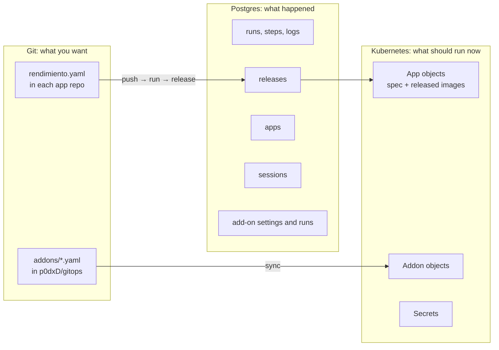
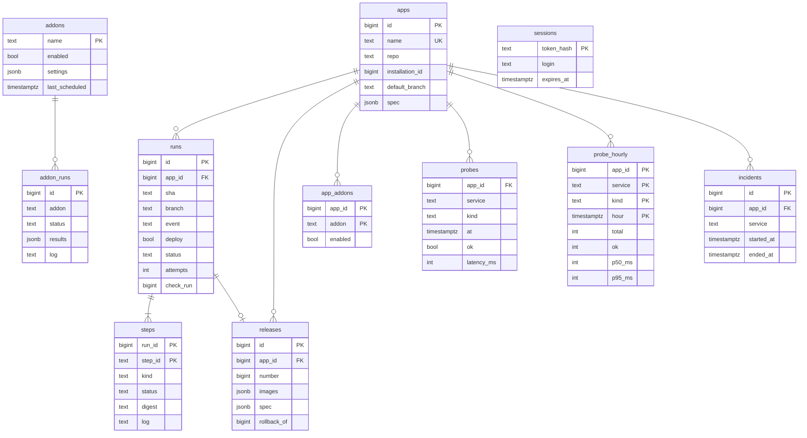
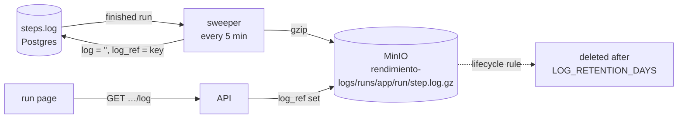

# Data and state

rendimiento keeps state in three places on purpose. Knowing which is which answers most "where does X come from?" questions.



| Question | Answer lives in | Why |
|---|---|---|
| How should this app be built and run? | `rendimiento.yaml` (git) | Reviewed in PRs, versioned, deploys on merge. |
| Which images are running right now? | the `App` object (`spec.images`, `spec.release`) | The controller needs it; `kubectl get apps.rendimiento.ai` shows it; the cluster keeps working if the database is down. |
| What cluster software is installed, and how? | `addons/*.yaml` (git) → `Addon` objects | Same reasons. |
| What happened (runs, logs, releases, who logged in)? | Postgres | Relational, append-heavy, queryable history. |
| Passwords and tokens | Kubernetes Secrets | Never in git in plain text, never in Postgres. |

The consequences are useful: losing the database loses history but not what is running; deleting an `App` object is recovered by the next release; git always tells you what was intended.

## The database

Postgres 17, one instance (`rendimiento-db`), accessed with **pgx** (the standard high-performance Go driver) through `internal/store`. There is no ORM: queries are plain SQL next to the code that uses them, which keeps them readable and explicit.

### Schema



### Migrations

Migrations are plain SQL files in `internal/store/migrations/`, **embedded** into the binary and applied in filename order at startup (`Store.Migrate`), each once, recorded in `schema_migrations`, under a table lock so two processes never apply the same one. To change the schema, add the next numbered file; never edit one that has already run.

```sql
--8<-- "internal/store/migrations/0004_addons.sql"
```

### The run queue

CI runs are a **queue in Postgres**, no message broker needed:

```go
--8<-- "internal/store/store.go:claim"
```

`FOR UPDATE SKIP LOCKED` lets any number of workers pull from the queue at the same time: each claims a different row, and none waits for another. This is the standard pattern for job queues on Postgres.

### Uptime data

The [uptime checks](../guide/reliability.md) write one row per check to `probes` (bulk-inserted with `COPY`), kept **7 days**. Every 5 minutes, `RollupProbes` recomputes the last 3 hours of **hourly summaries** in `probe_hourly` (total, successful, p50 and p95 response time), kept **400 days**. The 24-hour chart reads raw checks; the 7- and 30-day charts read the summaries. Each service checked once a minute is 1,440 rows a day, so a dozen apps stay well under a million raw rows.

### Logs

While a run is going, each step's log is a text column, appended in chunks (`right(log || chunk, 1 MiB)`). Past 1 MiB the head is dropped and the tail, where errors are, is kept. Add-on run logs are stored the same way, truncated in the middle past 512 KiB.

### The log archive

Once a run has been finished for 2 minutes, its step logs **move to object storage**. The `logarchive.Archive` sweeper runs every 5 minutes on the leader:



- **Compressed:** logs are gzip'd at the highest level; build logs shrink about 10–20×.
- **Safe:** the column is emptied only after the upload succeeded, and only if the log didn't change meanwhile. A sweep that fails (MinIO down) is retried on the next one, and nothing is lost.
- **Transparent:** the UI asks the API for a log as before. The API reads it from MinIO when `log_ref` is set, and says so plainly when the log has expired or the archive can't be reached.
- **Rotated:** at startup the platform sets a **lifecycle rule** on the bucket, *delete objects under `runs/` after `LOG_RETENTION_DAYS`* (365). MinIO does the deleting, so storage stays bounded with no job to run.
- **Least privilege:** the platform uses its own MinIO user, `rendimiento-logs`, whose policy allows only this bucket.

The Environment page's *Log archive* check shows how many logs are archived, their size, how many are waiting, and the retention.

## Kubernetes objects

Two custom resources, defined in Go in `api/v1alpha1` and turned into CRDs by `controller-gen` ([reference](../reference/crds.md)):

- **`App`** (`apps.rendimiento.ai`, cluster-scoped): `spec` is the app's services and jobs (the same Go types as `rendimiento.yaml`), `images`, `release`, `suspend`, `adopt`, `sharedNamespace`, and the need settings; `status` is the phase, a message and per-service health.
- **`Addon`** (`addons.rendimiento.ai`, cluster-scoped, short name `radd`): source, values, gates and switches in `spec`; phase, preview, inventory, hooks and hash in `status`.

Both are **cluster-scoped** because an app owns its namespace and an add-on spans namespaces.

!!! warning "Regenerate the CRDs when you change the types"
    The API server silently drops fields that are not in the CRD's schema. After changing `api/v1alpha1` or `internal/spec`, run `make generate` (the test targets do it for you) and apply the new CRD.
