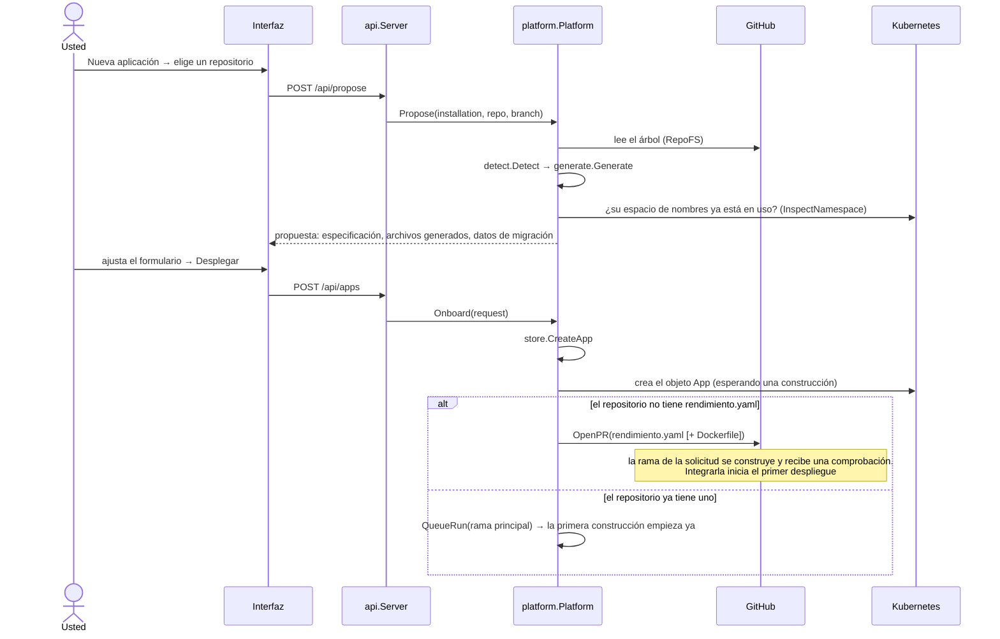
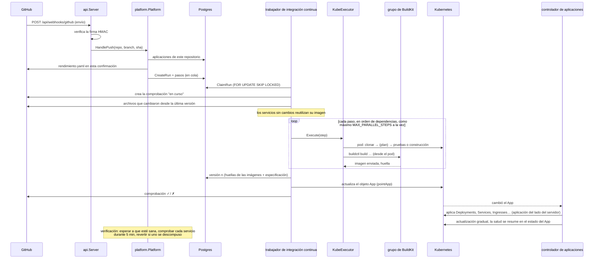
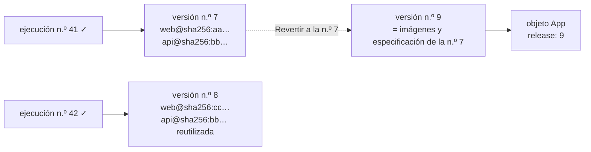
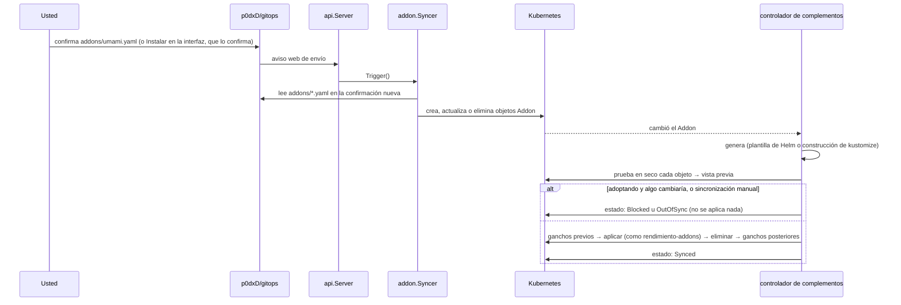
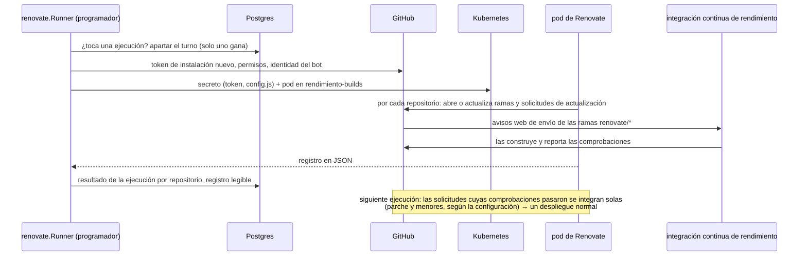
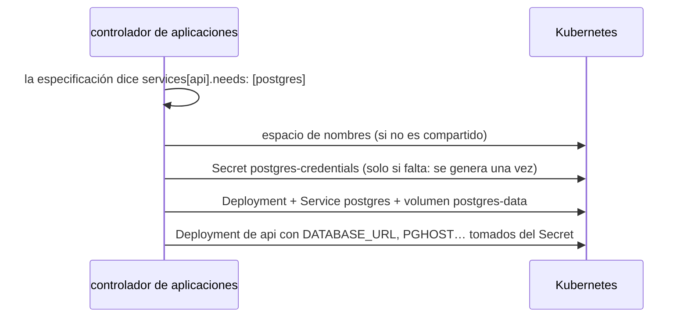

# Flujos, paso a paso

Los mismos pocos caminos por el sistema, dibujados como secuencias. Los nombres de las funciones son reales, así que puede seguir cada flecha hasta el código.

## Incorporar un repositorio {#onboarding-a-repository}

- **La detección** (`internal/detect`) revisa cada carpeta: `go.mod`, `package.json` (Next.js, Vite…), `pyproject.toml` o `requirements.txt` (FastAPI, Flask, Django), `pom.xml` o `build.gradle`, un `index.html`, un `Dockerfile` existente y las bibliotecas cliente de Postgres y Redis. Devuelve el lenguaje, el puerto, el comando de pruebas y las necesidades, con sus motivos.
- **La generación** (`internal/generate`) convierte eso en servicios, en un dominio bajo su zona predeterminada y en un Dockerfile de `templates/dockerfiles/` para las carpetas que no tienen uno.
- **La migración**: si en el espacio de nombres que usaría la aplicación ya hay algo en ejecución (desplegado con ArgoCD o `kubectl`), la propuesta lo describe y ofrece **adoptarlo** (vea [la adopción](controller.md#adoption-taking-over-what-is-already-running)).

## Un envío: de la confirmación al código en ejecución {#a-push-from-commit-to-running-code}

- Los envíos a **otras ramas** se detienen después de las construcciones: no se publica nada; la comprobación aparece en la confirmación y en cualquier solicitud de incorporación.
- **Las ejecuciones manuales** (el botón *Construir ahora*) primero resuelven la rama a su confirmación actual, así la imagen, la comprobación y la detección de cambios se refieren a una confirmación real.
- Si la plataforma se reinicia a media ejecución, `RequeueOrphans` vuelve a poner la ejecución en cola al arrancar (hasta dos intentos) y se borran los pods de construcción viejos.

## Versiones y reversión {#releases-and-rollback}

Una versión fija cada servicio a la **huella** de una imagen, así lo que se ejecuta es exactamente lo que se construyó y se probó. Revertir nunca vuelve a construir: crea una versión nueva con las imágenes y la especificación anteriores, y apunta el objeto `App` a ella.

## Un cambio de complemento en git {#an-add-on-change-in-git}

La sincronización también corre cada 3 minutos por si se perdió un aviso web, y el controlador vuelve a sincronizar cada complemento cada 5 minutos, lo que además corrige las desviaciones.

## Una ejecución de Renovate {#a-renovate-run}

## Necesidades: una base de datos para una aplicación {#needs-a-database-for-an-app}

