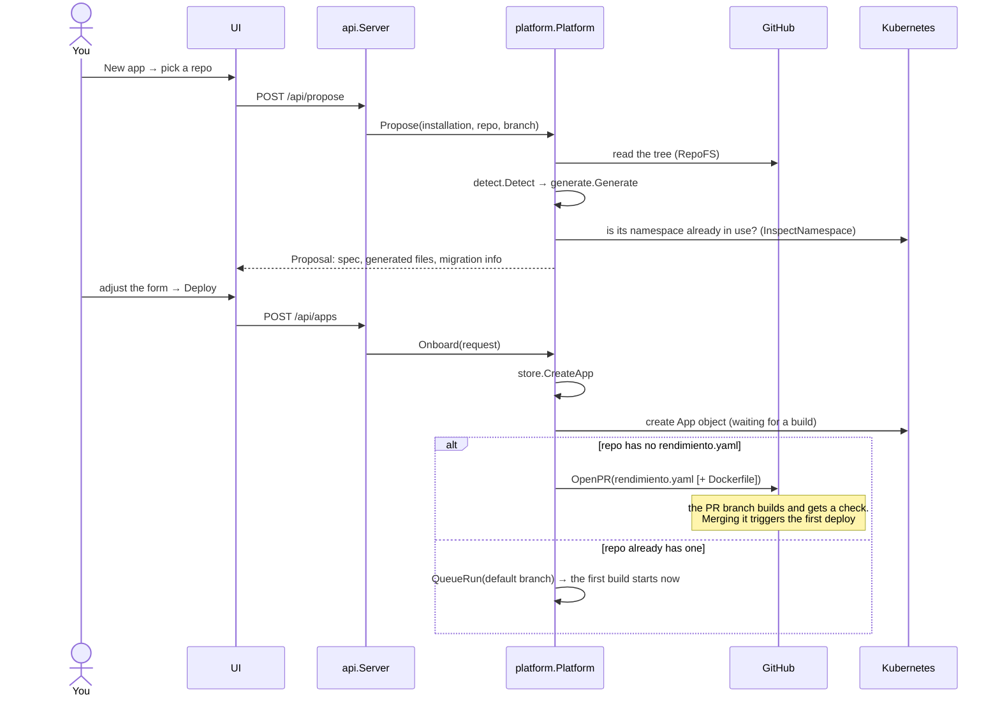
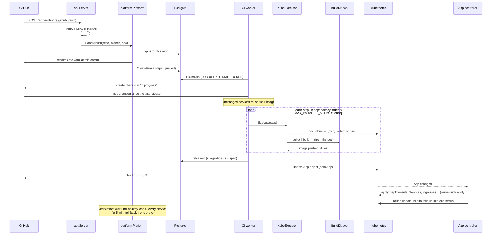
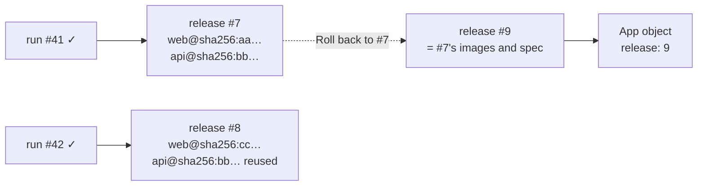
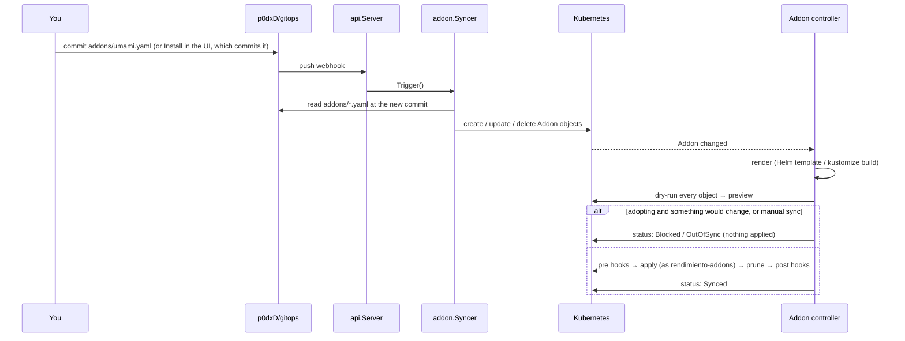
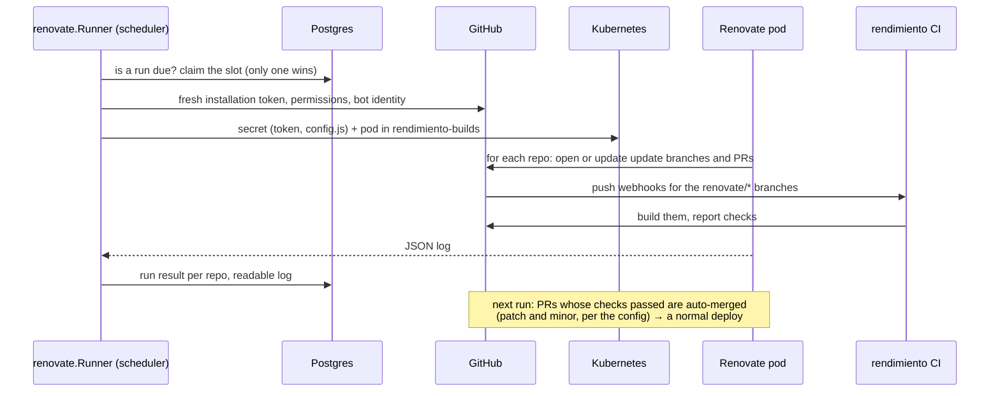
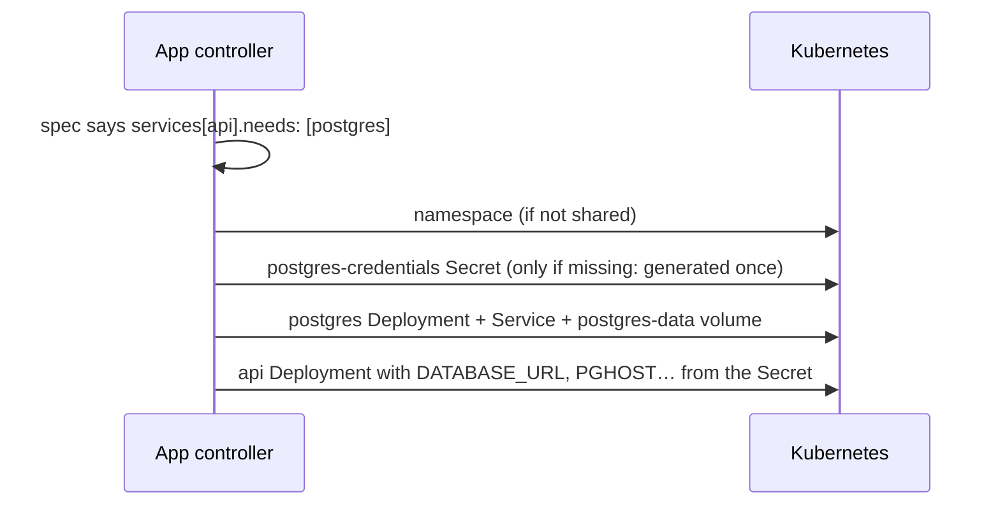

# Flows, step by step

The same few paths through the system, drawn as sequences. Function names are real, so you can follow each arrow into the code.

## Onboarding a repository

- **Detection** (`internal/detect`) looks at each folder: `go.mod`, `package.json` (Next.js, Vite…), `pyproject.toml`/`requirements.txt` (FastAPI, Flask, Django), `pom.xml`/`build.gradle`, an `index.html`, an existing `Dockerfile`, and client libraries for Postgres and Redis. It returns the language, port, test command and needs, with the reasons.
- **Generation** (`internal/generate`) turns that into services, a domain under your default zone, and a Dockerfile from `templates/dockerfiles/` for folders without one.
- **Migration**: if the namespace the app would use already has something running (deployed by ArgoCD or `kubectl`), the proposal describes it and offers to **adopt** it (see [adoption](controller.md#adoption-taking-over-what-is-already-running)).

## A push: from commit to running code

- Pushes to **other branches** stop after the builds: nothing is released; the check run shows on the commit and on any pull request.
- **Manual runs** (the *Run* button) resolve the branch to its current commit first, so the image, check and change detection all refer to a real commit.
- If the platform restarts mid-run, `RequeueOrphans` queues the run again on startup (up to two attempts) and old build pods are deleted.

## Releases and rollback

A release pins every service to an image **digest**, so what runs is exactly what was built and tested. Rolling back never rebuilds: it creates a new release with the old images and spec and points the `App` object at it.

## An add-on change in git

The sync also runs every 3 minutes in case a webhook was missed, and the controller resyncs every add-on every 5 minutes, which also repairs drift.

## A Renovate run

## Needs: a database for an app

