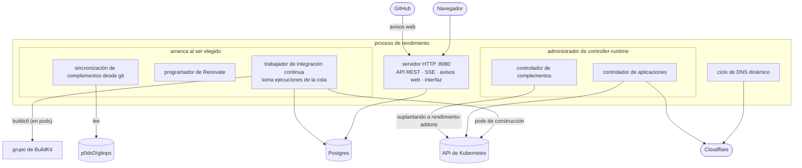
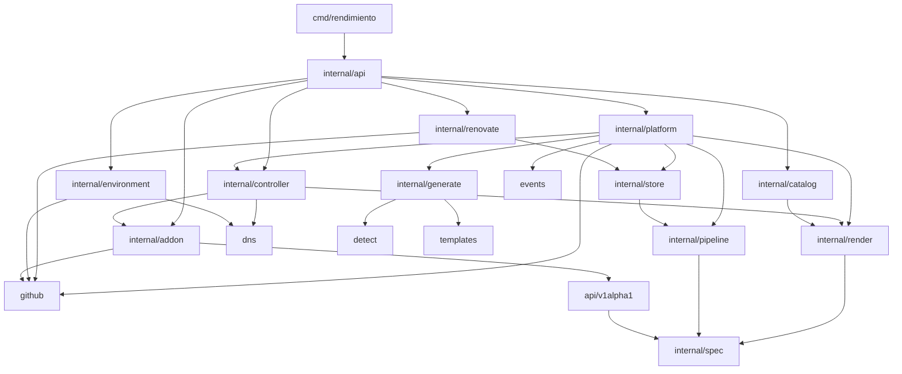

# Panorama general

## Un solo programa, varios trabajos {#one-binary-several-jobs}

rendimiento es un solo programa en Go (`cmd/rendimiento`) que hace cuatro trabajos a la vez. Cada trabajo es un conjunto de gorrutinas dentro del mismo proceso:



| Trabajo | Paquete | Qué hace |
|---|---|---|
| **API e interfaz** | `internal/api` | Sirve la interfaz de React (incrustada en el programa), la API JSON, las actualizaciones en vivo con eventos enviados por el servidor, los avisos web de GitHub, el inicio de sesión y la configuración de la aplicación de GitHub. |
| **Orquestación** | `internal/platform` | Convierte los avisos web en ejecuciones de integración continua, las ejecuciones en versiones y las versiones en objetos `App`. Aquí viven la incorporación, la reversión, la eliminación y la desconexión. |
| **Integración continua** | `internal/pipeline` | Planea una ejecución como un grafo de pasos y ejecuta cada paso como un pod; las construcciones van al grupo de BuildKit. |
| **Controlador de aplicaciones** | `internal/controller` | Concilia cada `App` en espacios de nombres, Deployments, Services, Ingresses, volúmenes, CronJobs, registros DNS y estado. |
| **Controlador y sincronización de complementos** | `internal/controller`, `internal/addon` | Mantiene los objetos `Addon` al día con `p0dxD/gitops/addons/*.yaml` y concilia cada uno en los objetos que describen su paquete de Helm o sus manifiestos. |
| **Complementos integrados** | `internal/renovate` | Renovate se ejecuta según una programación. |
| **Vistas** | `internal/catalog`, `internal/environment` | La página Servicios y la página Entorno. |

### ¿Por qué "arranca al ser elegido"? {#why-started-once-elected}

Algunos trabajos deben ocurrir exactamente una vez en el clúster: tomar ejecuciones de integración continua, programar Renovate, sincronizar complementos. La *elección de líder* de controller-runtime garantiza que solo una réplica los haga. Hoy hay **una sola réplica** con la elección de líder desactivada (en un plano de control de Raspberry Pi ocupado, las renovaciones del arrendamiento vencían y mataban el proceso a media construcción), así que `mgr.Elected()` se dispara de inmediato. La estructura ya está lista para más réplicas; vea [Escalar](../future/scaling.md).

## Cómo los conecta `main.go` {#how-maingo-wires-it-together}

`cmd/rendimiento/main.go` es la **raíz de composición**: el único lugar que lee la configuración y crea las implementaciones concretas. Todo lo demás recibe lo que necesita como campos de estructura o como interfaces. En orden:

1. lee los ajustes del entorno ([todos](../reference/config.md));
2. abre Postgres, ejecuta las migraciones y vuelve a poner en cola las ejecuciones que interrumpió el último reinicio;
3. crea el **administrador** de controller-runtime (cliente de Kubernetes, caché, métricas en `:9090`);
4. elige el **proveedor de DNS**: Cloudflare si hay un token (y arranca el DNS dinámico con `DNS_TARGET=auto`), si no, `dns.Noop`;
5. arma las **opciones** de generación (clase de entrada, emisor, clase de almacenamiento, perfil de GPU) y registra el **controlador de aplicaciones**;
6. carga las credenciales de la **aplicación de GitHub** en un `github.Holder` (vacío hasta la configuración);
7. crea el cliente con la identidad de los **complementos** (que suplanta a `rendimiento-addons`), el generador y el sincronizador, y registra el **controlador de complementos**;
8. crea la **plataforma**, el **ejecutor de Kubernetes** (espacio de nombres de construcción, grupo de BuildKit, Railpack, nodos excluidos), el **ejecutor de integración continua** y el **ejecutor de Renovate**;
9. crea el **servidor de la API** con todo lo anterior;
10. arranca el administrador, los ciclos exclusivos del líder y el servidor HTTP, y espera una señal o un error.

```go
--8<-- "cmd/rendimiento/main.go:startup"
```

## Los paquetes, en capas {#the-packages-in-layers}

Las flechas significan "importa". Las capas de abajo nunca importan a las de arriba, lo que permite probar cada paquete por separado.



- **Hasta abajo**, `internal/spec` (los tipos de `rendimiento.yaml`) y paquetes hoja pequeños (`dns`, `detect`, `events`, `github`) no dependen de nada nuestro.
- **`api/v1alpha1`** define los recursos personalizados (`App`, `Addon`), reutilizando los tipos de la especificación para que un `App` lleve exactamente lo que dice `rendimiento.yaml`.
- **`render`** es puro: entran la especificación y las imágenes, salen objetos de Kubernetes. Sin entrada ni salida, lo que lo hace fácil de probar con archivos de referencia.
- **`controller`** y **`pipeline`** hacen la entrada y salida contra Kubernetes.
- **`platform`** une la integración continua, el almacén y GitHub.
- **`api`** es la capa más externa.

Todo lo que está bajo `internal/` es privado de este módulo (una regla de Go): otros proyectos no lo pueden importar. Eso nos deja libres de cambiarlo. Si algún día unas partes deben volverse una biblioteca pública, saldrían de `internal/`.

## Dónde vive el estado {#where-state-lives}

| Qué | Dónde | Por qué ahí |
|---|---|---|
| Lo que debe ejecutarse por aplicación (servicios, tareas programadas, imágenes publicadas) | Objetos `App` en Kubernetes | Los controladores los vigilan; `kubectl` puede verlos y corregirlos; el clúster funciona sin la base de datos. |
| La configuración de cada aplicación | `rendimiento.yaml` en cada repositorio | GitOps: revisada, versionada, y los cambios se despliegan al integrarlos. |
| Las definiciones de los complementos | `p0dxD/gitops/addons/*.yaml` → objetos `Addon` | Las mismas razones, para los programas del clúster. |
| Ejecuciones, pasos, registros, versiones, sesiones, ajustes y ejecuciones de complementos | Postgres | Historial relacional, una cola de trabajo, texto grande (los registros). |
| Secretos | Secrets de Kubernetes (secretos sellados en git para las aplicaciones que los usan) | Nunca en git en texto plano, nunca en Postgres. |

Más en [Datos y estado](data.md).

## La interfaz {#the-ui}

Una aplicación de una sola página en React + TypeScript (`web/`), construida con Vite en `web/dist` e **incrustada en el programa de Go** con `//go:embed`. No hay un servidor web aparte: el programa sirve los archivos y responde con `index.html` a las rutas del lado del cliente. Vea [API, autenticación e interfaz](api-ui.md).
