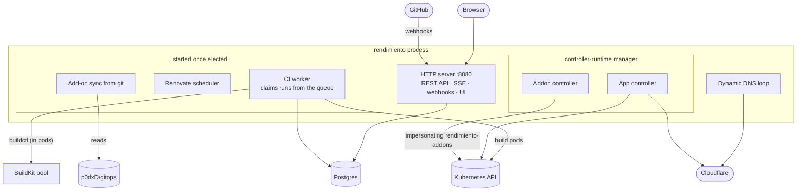
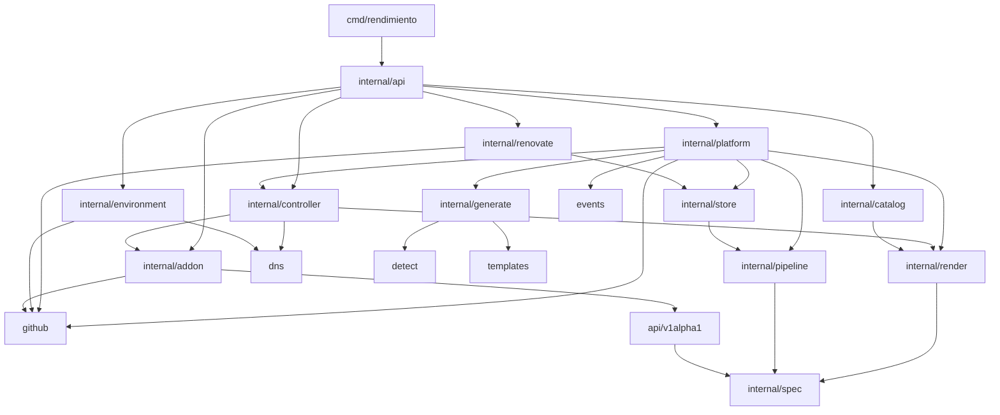

# Big picture

## One binary, several jobs

rendimiento is a single Go program (`cmd/rendimiento`) that does four jobs at once. Each job is a set of goroutines inside the same process:



| Job | Package | What it does |
|---|---|---|
| **API and UI** | `internal/api` | Serves the React UI (embedded in the binary), the JSON API, live updates over Server-Sent Events, GitHub webhooks, login and the GitHub App setup. |
| **Orchestration** | `internal/platform` | Turns webhooks into CI runs, runs into releases, releases into `App` objects. Onboarding, rollback, delete and disconnect live here. |
| **CI** | `internal/pipeline` | Plans a run as a graph of steps and runs each step as a pod; builds go to the BuildKit pool. |
| **App controller** | `internal/controller` | Reconciles each `App` into namespaces, Deployments, Services, Ingresses, volumes, CronJobs, DNS records and status. |
| **Add-on controller and sync** | `internal/controller`, `internal/addon` | Keeps `Addon` objects in line with `p0dxD/gitops/addons/*.yaml` and reconciles each into the objects its Helm chart or manifests describe. |
| **Built-in add-ons** | `internal/renovate` | Renovate runs on a schedule. |
| **Views** | `internal/catalog`, `internal/environment` | The Services page and the Environment page. |

### Why "started once elected"?

Some work must happen exactly once in the cluster: claiming CI runs, scheduling Renovate, syncing add-ons. controller-runtime's *leader election* guarantees that only one replica does it. Today there is **one replica** with leader election off (on a busy Raspberry Pi control plane, lease renewals timed out and killed the process mid-build), so `mgr.Elected()` fires immediately. The structure is already in place for more replicas; see [Scaling](../future/scaling.md).

## How `main.go` wires it together

`cmd/rendimiento/main.go` is the **composition root**: the only place that reads configuration and creates concrete implementations. Everything else receives what it needs as struct fields or interfaces. In order, it:

1. reads settings from the environment ([all of them](../reference/config.md));
2. opens Postgres, runs migrations, requeues runs interrupted by the last restart;
3. creates the controller-runtime **manager** (Kubernetes client, cache, metrics on `:9090`);
4. picks the **DNS provider**: Cloudflare if a token is set (and starts dynamic DNS for `DNS_TARGET=auto`), otherwise `dns.Noop`;
5. builds render **options** (ingress class, issuer, storage class, the GPU profile) and registers the **App controller**;
6. loads the **GitHub App** credentials into a `github.Holder` (empty until setup);
7. creates the **add-on** identity client (impersonating `rendimiento-addons`), the renderer and syncer, and registers the **Addon controller**;
8. creates the **platform**, the **Kubernetes executor** (build namespace, BuildKit pool, Railpack, node exclusions) and the **CI runner**, and the **Renovate runner**;
9. creates the **API server** with all of the above;
10. starts the manager, the leader-only loops and the HTTP server, and waits for a signal or an error.

```go
--8<-- "cmd/rendimiento/main.go:startup"
```

## The packages, in layers

Arrows mean "imports". Lower layers never import higher ones, which keeps each package testable on its own.



- **At the bottom**, `internal/spec` (the `rendimiento.yaml` types) and small leaf packages (`dns`, `detect`, `events`, `github`) depend on nothing of ours.
- **`api/v1alpha1`** defines the custom resources (`App`, `Addon`), reusing the spec types so an `App` carries exactly what `rendimiento.yaml` says.
- **`render`** is pure: spec plus images in, Kubernetes objects out. No I/O, which makes it easy to test with golden files.
- **`controller`** and **`pipeline`** do the I/O against Kubernetes.
- **`platform`** ties CI, the store and GitHub together.
- **`api`** is the outermost layer.

Everything under `internal/` is private to this module (a Go rule): other projects cannot import it. That keeps us free to change it. If parts should become a public library one day, they would move out of `internal/`.

## Where state lives

| What | Where | Why there |
|---|---|---|
| What should run for each app (services, jobs, released images) | `App` objects in Kubernetes | Controllers watch them; `kubectl` can see and fix them; the cluster works without the database. |
| App configuration | `rendimiento.yaml` in each repo | GitOps: reviewed, versioned, and changes deploy on merge. |
| Add-on definitions | `p0dxD/gitops/addons/*.yaml` → `Addon` objects | Same reasons, for cluster software. |
| CI runs, steps, logs, releases, sessions, add-on settings and runs | Postgres | Relational history, a work queue, large text (logs). |
| Secrets | Kubernetes Secrets (sealed secrets in git for apps that use them) | Never in git in plain text, never in Postgres. |

More in [Data and state](data.md).

## The UI

A React + TypeScript single-page app (`web/`), built with Vite into `web/dist` and **embedded into the Go binary** with `//go:embed`. There is no separate web server: the binary serves the files and falls back to `index.html` for client-side routes. See [API, auth and the UI](api-ui.md).
