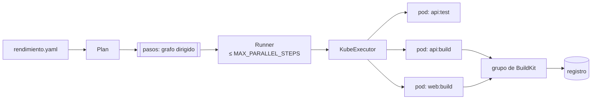
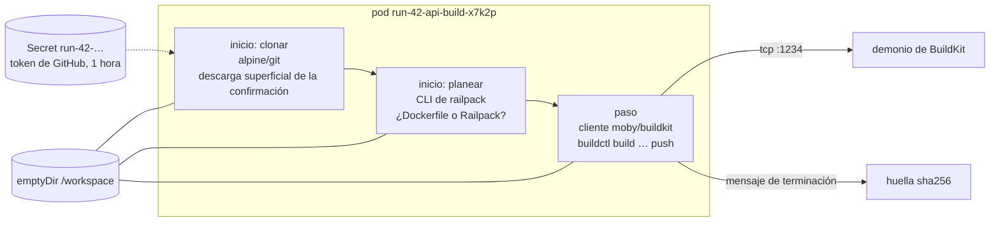

# El motor de integración continua

El motor de integración continua (`internal/pipeline`, dirigido por `internal/platform`) convierte una confirmación en imágenes probadas. Tiene tres partes: un **planeador** que convierte una especificación en un grafo de pasos, un **corredor** que ejecuta el grafo con un límite de pasos simultáneos, y un **ejecutor** que corre cada paso como un pod de Kubernetes.



## Planear: `Plan` {#planning-plan}

`pipeline.Plan(app, registry, spec)` devuelve los pasos de una ejecución:

- por cada servicio **construido desde el repositorio** (no una `image:` ya hecha): un paso `build`, y junto a él un paso `test` si el servicio tiene `test:`. Corren **al mismo tiempo**: una versión necesita que todos los pasos tengan éxito, así que nunca se publica una imagen sin probar, y la construcción no espera a las pruebas;
- por cada **tarea programada** con su propio `path`: un paso de construcción (`job-<name>:build`);
- por cada **tarea**: un paso `task` (`<name>:task`) que depende de las construcciones (y sus pruebas) y tareas de su `after:` ([Tareas](../guide/tasks.md));
- los pasos de servicios distintos son independientes, así que corren en paralelo.

Cada `Step` lleva lo que su pod necesita: la carpeta, la imagen y el comando de pruebas, o el nombre de la imagen a enviar (`registry/<app>-<service>`), el Dockerfile, el constructor elegido (`dockerfile`, `railpack` o automático), el comando de arranque de Railpack y los argumentos de construcción.

## Ejecutar el grafo: `Runner` {#running-the-graph-runner}

`Runner.Run` arranca **una gorrutina por paso**. Cada una espera a los pasos de los que depende (un canal cerrado por paso avisa "terminado"), luego toma un lugar de un **semáforo**, un canal con búfer de tamaño `MAX_PARALLEL_STEPS` (4) compartido por *todas* las ejecuciones, así el clúster nunca corre más pasos que esos a la vez. Si una dependencia no tuvo éxito, el paso se marca como **omitido** sin ejecutarse. Un paso obligatorio que **falla detiene la ejecución**: los pasos que esperan se omiten y los que corren se cancelan (se borran sus pods), todos marcados *detenido: falló &lt;paso&gt;*, para que una prueba fallida no deje una construcción deteniendo la siguiente ejecución de la aplicación. El mensaje de la ejecución nombra el paso que falló.

```go
--8<-- "internal/pipeline/run.go:runner"
```

El corredor no sabe nada de Kubernetes ni de Postgres: habla con un `Executor` (ejecuta un paso) y un `Recorder` (guarda el estado y los registros). En producción son el `KubeExecutor` y la plataforma; en las pruebas son imitaciones que anotan el orden de ejecución. Eso permite que `run_test.go` compruebe los límites de simultaneidad y las omisiones en milisegundos.

## Ejecutar un paso: el pod de construcción {#running-a-step-the-build-pod}

`KubeExecutor.Execute` corre cada paso como un pod en `rendimiento-builds`:



1. Se crea para el pod un **Secret** con un token de instalación nuevo (válido una hora); el contenedor de clonado lo lee.
2. **clone** (contenedor de inicio): `git fetch --depth 1` de exactamente la confirmación en `/workspace/src`.
3. **plan** (contenedor de inicio, solo en pasos de construcción): decide el constructor y, para Railpack, escribe su plan de construcción.
4. **step**: en unas pruebas, la imagen de pruebas del servicio corre el comando de pruebas en la carpeta del servicio; en una tarea, la imagen de la tarea corre su comando con su entorno y sus secretos (copiados al secreto propio del pod y ocultos en el registro); en una construcción, `buildctl` manda la construcción a BuildKit, que envía la imagen. La **huella** de la imagen se escribe en `/dev/termination-log` y el ejecutor la lee del estado del pod: sin analizar registros.
5. Los registros de cada contenedor se van pasando al registro del paso conforme ocurren.
6. El pod y el secreto se borran, pase lo que pase.

Los guiones, tal como se ejecutan:

```bash
--8<-- "internal/pipeline/kube.go:scripts"
```

### Barandales de los pods de construcción {#guard-rails-on-build-pods}

- **Sin credenciales de Kubernetes** (`automountServiceAccountToken: false`).
- **Aislamiento de red** (NetworkPolicy `isolate-builds`): solo DNS, BuildKit en el puerto 1234 e internet público; ni otras aplicaciones, ni bases de datos, ni la API de Kubernetes, ni la red doméstica. El código de un repositorio (unas pruebas, una línea `RUN`) no puede alcanzar nada más.
- **Exclusión de nodos** (`BUILD_EXCLUDE_NODES`): aquí se enumeran los nodos que no pueden aplicar políticas de red o que están reservados para otro trabajo. El plano de control queda excluido por su marca (*taint*).
- **Un plazo** (`STEP_TIMEOUT`, 45 minutos) en cada pod.
- **Reintentos de errores pasajeros de la API** (`transientRetry`): crear el secreto o el pod se reintenta ante "database is locked", errores 5xx y tiempos agotados, que ocurren cuando el plano de control está ocupado.
- **Sufijos aleatorios en los nombres de los pods**, así una ejecución reintentada nunca choca con los pods que dejó su antecesora interrumpida.

## Detección de cambios: construir solo lo que cambió {#change-detection-building-only-what-changed}

En un envío a la rama principal, `Platform.changes` compara la confirmación nueva con la confirmación de la última versión (la API de comparación de GitHub). Con esa lista de archivos, `reusable` conserva la imagen de cada servicio cuya carpeta (y rutas de `watch:`) no cambió; sus pasos muestran **reutilizada**. `skippedTasks` omite tareas de la misma manera, y además omite las tareas `when: deploy` en otras ramas. Cualquier duda significa una construcción completa:

- ejecuciones manuales y construcciones de otras ramas;
- no hay versión anterior, o no fue de una confirmación completa;
- una diferencia truncada (GitHub enumera como máximo 300 archivos);
- un cambio al propio `rendimiento.yaml`;
- un servicio en la raíz del repositorio (cualquier cambio lo toca).

## Alrededor de una ejecución {#around-a-run}

- **Comprobaciones**: `startCheck` crea una comprobación de GitHub "en curso" en la confirmación, con una liga a la ejecución; `finishCheck` la completa con éxito, fallo o cancelación.
- **Registros y actualizaciones en vivo**: el registrador de la plataforma (`platform/recorder.go`) acumula la salida de cada paso, la agrega a la fila del paso en Postgres (conservando el último 1 MB, donde están los errores) y la publica en el concentrador de eventos, que la pasa a los navegadores abiertos con eventos enviados por el servidor.
- **Cancelar**: `Platform.Cancel` cancela el contexto de la ejecución; los pods en marcha se borran y los pasos en espera quedan omitidos.
- **Reinicios**: las ejecuciones que un proceso muerto dejó en `running` vuelven a la cola al arrancar (`RequeueOrphans`, como máximo dos veces), y se borran los pods sobrantes (`KubeExecutor.Cleanup`).
- **Versiones**: cuando cada paso obligatorio de una ejecución de despliegue tuvo éxito (una tarea `optional` fallida no cuenta), `platform.release` registra las imágenes por huella (las nuevas, las reutilizadas y los servicios con `image:` ya hecha, tal como vienen) y actualiza el objeto `App`. Ahí pasa la estafeta al [controlador](controller.md).

## Dónde cambiar qué {#where-to-change-what}

| Para… | Cambie |
|---|---|
| agregar un tipo nuevo de paso | `Kind` y `Plan` en `plan.go`, el contenedor en `KubeExecutor.pod`, el campo de la especificación en `internal/spec`; los pasos `task` (`task.go`) son el ejemplo más reciente |
| correr más pasos a la vez | `MAX_PARALLEL_STEPS` (cuide la memoria de las Pi) |
| cambiar lo que puede alcanzar un pod de construcción | `deploy/networkpolicy.yaml` |
| aceptar un registro o una autenticación nuevos | las opciones `--output` y de caché en `buildScript`, y las credenciales como un secreto montado en el contenedor del paso |
