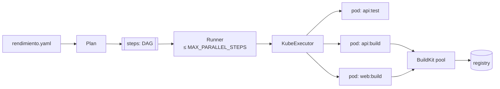
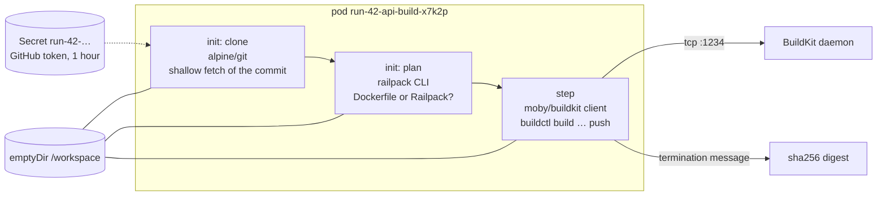

# The CI engine

The CI engine (`internal/pipeline`, driven by `internal/platform`) turns a commit into tested images. It has three parts: a **planner** that turns a spec into a graph of steps, a **runner** that executes the graph with a concurrency limit, and an **executor** that runs each step as a Kubernetes pod.



## Planning: `Plan`

`pipeline.Plan(app, registry, spec)` returns the steps for a run:

- for each service **built from the repo** (not a ready-made `image:`): a `build` step, and before it a `test` step if the service has `test:`. The build **depends on** the test;
- for each **job** with its own `path`: a build step (`job-<name>:build`);
- steps of different services are independent, so they run in parallel.

Each `Step` carries what its pod needs: the folder, the test image and command, or the image name to push (`registry/<app>-<service>`), the Dockerfile, the builder choice (`dockerfile`, `railpack` or automatic), Railpack's start command and build arguments.

## Running the graph: `Runner`

`Runner.Run` starts **one goroutine per step**. Each waits for the steps it depends on (a closed channel per step signals "done"), then takes a slot from a **semaphore**, a buffered channel of size `MAX_PARALLEL_STEPS` (4) shared by *all* runs, so the cluster never runs more than that many steps at once. If a dependency did not succeed, the step is marked **skipped** without running.

```go
--8<-- "internal/pipeline/run.go:runner"
```

The runner knows nothing about Kubernetes or Postgres: it talks to an `Executor` (runs a step) and a `Recorder` (stores status and logs). In production those are the `KubeExecutor` and the platform; in tests they are fakes that record the order of execution. This is what lets `run_test.go` check concurrency limits and skipping in milliseconds.

## Running a step: the build pod

`KubeExecutor.Execute` runs each step as a pod in `rendimiento-builds`:



1. A **Secret** with a fresh installation token (valid for an hour) is created for the pod; the clone container reads it.
2. **clone** (init container): `git fetch --depth 1` of exactly the commit into `/workspace/src`.
3. **plan** (init container, build steps only): decides the builder, and for Railpack writes its build plan.
4. **step**: for a test, the service's test image runs the test command in the service's folder; for a build, `buildctl` sends the build to BuildKit, which pushes the image. The image **digest** is written to `/dev/termination-log`, and the executor reads it from the pod status: no log parsing.
5. Logs of every container are streamed into the step's log as they happen.
6. The pod and the secret are deleted, whatever happened.

The scripts, exactly as they run:

```bash
--8<-- "internal/pipeline/kube.go:scripts"
```

### Guard rails on build pods

- **No Kubernetes credentials** (`automountServiceAccountToken: false`).
- **Network isolation** (NetworkPolicy `isolate-builds`): only DNS, BuildKit on port 1234 and the public internet; not other apps, databases, the Kubernetes API or the home network. Code from a repository (a test, a `RUN` line) cannot reach anything else.
- **Node exclusion** (`BUILD_EXCLUDE_NODES`): never the Jetson, whose kernel cannot enforce NetworkPolicy. The control plane is excluded by its taint.
- **A deadline** (`STEP_TIMEOUT`, 45 minutes) on each pod.
- **Retries of transient API errors** (`transientRetry`): creating the secret or pod is retried on "database is locked", 5xx and timeouts, which happen when the control plane is busy.
- **Random pod-name suffixes**, so a retried run never collides with pods its interrupted predecessor left behind.

## Change detection: building only what changed

For a push to the default branch, `platform.reusable` compares the new commit with the commit of the last release (GitHub's compare API). A service whose folder (and `watch:` paths) did not change keeps its image from that release; its steps show **reused**. Anything uncertain means a full build:

- manual runs and branch builds;
- no earlier release, or it was not a full commit;
- a truncated diff (GitHub lists at most 300 files);
- a change to `rendimiento.yaml` itself;
- a service at the repository root (any change touches it).

## Around a run

- **Check runs**: `startCheck` creates a GitHub check "in progress" on the commit with a link to the run; `finishCheck` completes it with success, failure or cancelled.
- **Logs and live updates**: the platform's recorder (`platform/recorder.go`) buffers each step's output, appends it to the step's row in Postgres (keeping the last 1 MB, where errors are) and publishes it to the events hub, which streams it to open browsers over Server-Sent Events.
- **Cancelling**: `Platform.Cancel` cancels the run's context; running pods are deleted and waiting steps become skipped.
- **Restarts**: runs left `running` by a dead process are requeued on startup (`RequeueOrphans`, at most twice), and leftover pods are deleted (`KubeExecutor.Cleanup`).
- **Releases**: when every step of a deploy run succeeded, `platform.release` records the images by digest (new ones, reused ones, and ready-made `image:` services as given) and updates the `App` object. That hands over to the [controller](controller.md).

## Where to change what

| To… | Change |
|---|---|
| add a new kind of step (e.g. a command step for mobile builds) | `Kind` and `Plan` in `plan.go`, the container in `KubeExecutor.pod`, the spec field in `internal/spec` |
| run more steps at once | `MAX_PARALLEL_STEPS` (mind the Pis' memory) |
| change what a build pod may reach | `deploy/networkpolicy.yaml` |
| support a new registry or auth | the `--output` / cache options in `buildScript`, credentials as a secret mounted in the step container |
