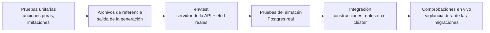

# Pruebas

## Los tipos de pruebas {#the-kinds-of-tests}



| Tipo | Dónde | Necesita | Qué demuestra |
|---|---|---|---|
| **Unitarias** | cada paquete | nada | el análisis, la validación, la planeación, la detección, las huellas, la lectura de registros… |
| **De referencia** | `internal/render` (`testdata/*.golden.yaml`) | nada | los objetos de Kubernetes exactos en que se convierte una especificación |
| **envtest** | `internal/controller`, `internal/platform` | un servidor de la API y un etcd de prueba (los descarga `setup-envtest`) | los controladores contra una API de Kubernetes real: aplicar, adoptar, podar, ganchos, necesidades, finalizadores |
| **Del almacén** | `internal/store`, `internal/api`, `internal/platform` | Postgres (`TEST_DATABASE_URL`) | el SQL, las migraciones, la cola de ejecuciones, las sesiones |
| **De integración** | `internal/pipeline` (etiqueta de construcción `integration`) | el grupo de BuildKit del clúster | una construcción real con Dockerfile y una real con Railpack, enviadas con huella |
| **De la interfaz** | `web` | Node | que el TypeScript compila (`npm run typecheck`) |

## Ejecutarlas {#running-them}

```bash
make test-remote                                 # todo, en un nodo trabajador (use esta)
go test ./internal/spec ./internal/render        # paquetes ligeros, bien en cualquier lado
go test ./internal/render -run Golden -update    # reescribe los archivos de referencia tras un cambio intencional
make itest                                       # construcciones reales en el grupo de BuildKit (minutos)
```

## Pruebas remotas {#remote-tests}

`make test-remote` (`hack/test-remote.sh`) corre los pasos de `make test` en un pod en un nodo trabajador, porque compilar y correr envtest en `main` (el plano de control) hace lento a todo el clúster:

```bash
--8<-- "hack/test-remote.sh:93:109"
```

1. Se crea un pod con tres contenedores en `rendimiento-builds`, lejos del plano de control y de cualquier nodo en `TEST_EXCLUDE_NODES`: **go** (las herramientas), **node** (la revisión de tipos) y **postgres** (un acompañante que las pruebas del almacén usan en `localhost`).
2. Un volumen de **caché local del nodo** (`rendimiento-test-cache`, local-path) guarda entre ejecuciones los módulos de Go, la caché de construcción, los programas de envtest y la caché de npm; la primera ejecución lo llena (unos 20 minutos), las siguientes lo reutilizan.
3. El árbol de trabajo, **incluidos los cambios sin confirmar**, se manda como un archivo tar.
4. Corren `controller-gen`, `go vet`, `go test -p 1 ./...` y `npm run typecheck`, y su salida llega aquí en vivo.
5. Los archivos regenerados se copian de vuelta, así el repositorio coincide con lo que se probó.
6. Se borra el pod.

`-p 1` corre los paquetes uno tras otro: las pruebas del almacén, de la plataforma y de la API comparten una base de datos.

## Escribir pruebas {#writing-tests}

### Pruebas unitarias: con tablas {#unit-tests-table-driven}

```go
for _, tc := range []struct{ yaml, want string }{
	{"services: [{name: a, lan: {ip: 8.8.8.8}}]", "private IPv4"},
} { … }
```

Diga en el mensaje de fallo qué se está comprobando, e incluya el valor obtenido y el esperado.

### Imitaciones en lugar de simulacros {#fakes-over-mocks}

El código depende de interfaces pequeñas, así que las pruebas le pasan imitaciones sencillas: un `fakeExec` que anota el orden de ejecución, un `fakeDNS` que guarda los registros en un mapa, un `fakeGit` que sirve un `fstest.MapFS`, un resolvedor `fakeSRV`, un `httptest.Server` que hace de repositorio de Helm. No hace falta ningún marco de simulacros.

### envtest {#envtest}

`setup(t)` / `setupAddons(t)` arrancan un servidor de la API y un etcd reales, instalan los CRD de `deploy/crds`, arrancan el administrador con el controlador que se prueba y devuelven un cliente. Las pruebas crean objetos y usan `eventually(t, what, cond)` para esperar (hasta 20 segundos) a que el controlador actúe.

envtest **no tiene kubelet ni más controladores que los suyos**: los pods nunca corren, los Deployments nunca quedan listos, la recolección de basura nunca ocurre. Las pruebas hacen esos papeles cuando hace falta: `TestAddonHooks` marca los pods de los ganchos como *Succeeded* o *Failed* actualizando su estado.

### Archivos de referencia {#golden-files}

`render_test.go` genera una especificación y compara el YAML con `testdata/*.golden.yaml`. Ante un cambio intencional: corra con `-update` y luego **lea las diferencias** antes de confirmar; es la revisión más clara posible de cómo se verán las cargas de trabajo de los usuarios.

## Lo que todavía no está cubierto {#what-is-not-covered-yet}

- el comportamiento de la interfaz (no hay pruebas en navegador);
- pruebas de punta a punta de toda la plataforma en un clúster desechable (incorporar, enviar, publicar, revertir);
- pruebas de carga de la cola de ejecuciones y de muchas construcciones simultáneas.

Están en la [hoja de ruta](../future/roadmap.md).
