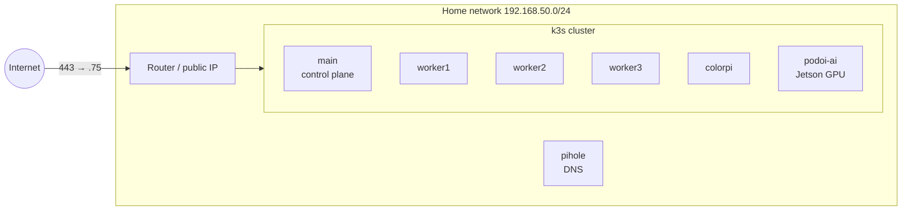

# The cluster

## Nodes

| Node | Address | Role | Hardware and OS | Notes |
|---|---|---|---|---|
| `main` | 192.168.50.147 | **k3s control plane** (server, SQLite datastore) | Raspberry Pi, Debian 12, 59 GB SD card | Also where this repository and the Ansible setup live. Keep it light: no builds, no tests (see [runbooks](runbooks.md#the-control-plane-is-slow-or-its-disk-is-full)). |
| `worker1` | 192.168.50.235 | worker | Raspberry Pi, Debian 12 | BuildKit daemon, Longhorn replicas |
| `worker2` | 192.168.50.164 | worker | Raspberry Pi, Debian 12 | BuildKit daemon, Longhorn replicas |
| `worker3` | 192.168.50.240 | worker | Raspberry Pi, Debian 12 | BuildKit daemon, Longhorn replicas, remote tests (`make test-remote`) |
| `colorpi` | 192.168.50.232 | worker | Raspberry Pi, Debian 12 | BuildKit daemon |
| `podoi-ai` | 192.168.50.156 | worker (**GPU**) | NVIDIA Jetson Orin, Ubuntu 22.04, L4T R36.4 | Runs ollama on its GPU. Excluded from builds: its kernel cannot enforce NetworkPolicy. |

Every node is **arm64**; images are built for arm64 (see [multi-arch](../architecture/builds.md#architectures) for what cloud targets would need). Nodes have 4 CPUs and 8 GB of RAM each. The cluster runs **k3s** v1.34 (the Jetson v1.33).

## Traffic in and out

- **Public HTTPS** arrives at the router and is forwarded to **ingress-nginx** at `192.168.50.75`. Each app domain is an Ingress rule; TLS is terminated there with Let's Encrypt certificates.
- **DNS** for public domains is on **Cloudflare**. rendimiento creates a record per app domain and keeps it pointing at the home network's public IP, which changes from time to time (see [dynamic DNS](../architecture/controller.md#dns-and-certificates)). Records are proxied through Cloudflare.
- **On the LAN**, services can get their own address from **MetalLB**.

### MetalLB addresses

MetalLB's pool is `192.168.50.70–99` (auto-assign on). Addresses in use:

| IP | Service |
|---|---|
| .70 | k3s's built-in traefik (unused) |
| .72 | MinIO console |
| .73 | Longhorn UI |
| .74 | ArgoCD (switched off, to be uninstalled) |
| .75 | **ingress-nginx**, the front door for all public traffic |
| .77 | MinIO S3 API |
| .78 | Hajimari start page |
| .80 | Container registry |
| **.81** | **This book** (`lan:` in rendimiento's own `rendimiento.yaml`) |
| .87 | Grafana |
| .89 | Jenkins (switched off, to be uninstalled) |
| .91–.93 | The older AI-spend dashboard in the `rendimiento` namespace (not this project) |

A service asks for one with [`lan:`](../guide/spec.md#lan) in `rendimiento.yaml`.

## Namespaces

| Namespace | What is in it | Managed by |
|---|---|---|
| `rendimiento-system` | rendimiento and its Postgres | `kubectl apply -k deploy` |
| `rendimiento-builds` | CI pods (short-lived), the remote-test cache | rendimiento |
| `secplus`, `simplerfc`, `podoi`, `stockpulse`, `wellness`, `jobsentry`, `hello-rendimiento` | The apps | rendimiento (App objects) |
| `umami`, `hajimari`, `longhorn-system`, `devops-tools` | umami, Hajimari, Longhorn and its backups, the BuildKit pool | rendimiento **add-ons** (definitions in `p0dxD/gitops/addons/`) |
| `ingress-nginx`, `cert-manager`, `monitoring` | Ingress controller, certificates, VictoriaMetrics + Grafana | Helm (installed by Ansible) |
| `metallb-system`, `kube-system` | Load balancer, core components, sealed-secrets | k3s / Ansible |
| `minio`, `docker-registry` | S3 storage (Longhorn backups), the registry | Ansible |
| `rendimiento` | The older AI-spend dashboard, a different project | leave alone |

## Building blocks rendimiento relies on

| Component | Version | Used for | Where rendimiento configures it |
|---|---|---|---|
| **ingress-nginx** | 1.15 | public HTTP(S) routing | `INGRESS_CLASS` (render) |
| **cert-manager** + ClusterIssuer `letsencrypt-prod` | 1.20 | TLS certificates, via Cloudflare DNS-01 | `CLUSTER_ISSUER` |
| **Longhorn** | 1.10.2 | replicated volumes (databases, app data) | `STORAGE_CLASS`; itself an add-on |
| **local-path** | k3s built-in | node-local volumes (BuildKit caches, test cache) | the BuildKit add-on, `hack/test-remote.sh` |
| **MetalLB** | — | LAN addresses for LoadBalancer Services | `lan:` |
| **Registry** `registry.cube.local:5000` | — | images (plain HTTP, "insecure") | `REGISTRY`, `REGISTRY_INSECURE` |
| **BuildKit** pool | 0.18.2 | image builds | `BUILDKIT_POOL`, `BUILDKIT_ADDR`; itself an add-on |
| **Railpack** | 0.40.0 | builds without a Dockerfile | `RAILPACK_IMAGE`, `RAILPACK_FRONTEND` |
| **Cloudflare** | API v4 | DNS records, dynamic DNS | `CLOUDFLARE_API_TOKEN`, `DNS_TARGET`, `DNS_PROXIED` |
| **sealed-secrets** | — | encrypted secrets committed to app repos | apps' `sealed-secrets/` folders |
| **NVIDIA runtime** on the Jetson | — | GPU containers | `GPU_*` settings |
| **MinIO** | — | Longhorn backup target | the `longhorn-backups` add-on |
| **VictoriaMetrics + Grafana** | — | metrics dashboards | not yet integrated ([roadmap](../future/roadmap.md)) |

## Ansible and the weekly updates

The machines themselves are managed by the Ansible project in `~/main_configs/pi`. Two parts matter to rendimiento:

- **`playbooks/update.yml`** runs every Sunday at 04:00 (systemd timer `cluster-update.timer`): OS updates on every host, then a rolling reboot of the workers one at a time (cordon, drain, reboot, wait for Ready, uncordon, wait for Longhorn to rebuild replicas), then the control plane. On the Jetson it also drops caches and compacts memory before uncordoning, so ollama can allocate GPU memory ([why](runbooks.md#the-ai-models-fail-with-cudamalloc-out-of-memory)).
- **The storm playbooks** (`storm_shutdown.yml`, `storm_startup.yml`, `scripts/storm_watch.py`) scale databases down before severe weather and back up after. They **suspend** rendimiento apps (`spec.suspend`) and **pause** add-ons (the `rendimiento.ai/paused` annotation) so nothing scales the databases back up while the cluster is going down.

`playbooks/charts.yml` installs the Helm-based cluster services; Jenkins, its jobs and the old Renovate CronJob were removed from it when those moved into rendimiento.
