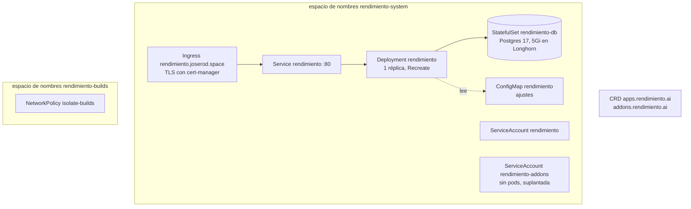
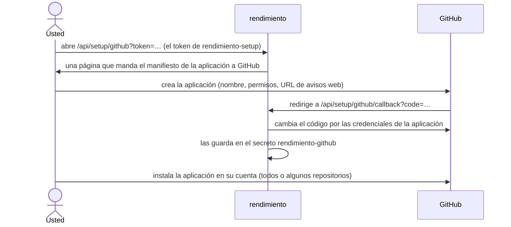

# Cómo se despliega la plataforma

rendimiento despliega aplicaciones, pero no se despliega a sí mismo. La plataforma se instala con manifiestos simples de Kubernetes en [`deploy/`](https://github.com/p0dxD/rendimiento.ai/tree/main/deploy), aplicados con `kubectl apply -k deploy`. Dejar la plataforma fuera de su propio control significa que un rendimiento descompuesto siempre se puede arreglar con `kubectl`.

## Sus propios ajustes {#your-own-settings}

Los manifiestos de `deploy/` traen **valores de ejemplo** (`example.com`, `registry.example.lan`, `you@example.com`). Los ajustes de un clúster real van en una **capa privada**, una kustomization en un repositorio privado que se basa en `deploy/` y reemplaza lo que es distinto:

```yaml
# kustomization.yaml en un repositorio privado, junto a una copia de este
resources:
  - ../../rendimiento.ai/deploy
images:
  - name: registry.example.lan:5000/rendimiento
    newName: registry.home.lan:5000/rendimiento   # su registro
patches:
  - path: configmap.yaml          # el ConfigMap de rendimiento con sus ajustes
  - target: { kind: Ingress, name: rendimiento }
    patch: |-
      - { op: replace, path: /spec/rules/0/host, value: rendimiento.your-domain.com }
      - { op: replace, path: /spec/tls/0/hosts/0, value: rendimiento.your-domain.com }
```

Luego apunte el Makefile hacia ella desde un `local.mk` (ignorado por git) en la raíz del repositorio:

```makefile
IMAGE := registry.home.lan:5000/rendimiento
DEPLOY_DIR := $(HOME)/private-repo/rendimiento-platform
TEST_EXCLUDE_NODES := my-gpu-node     # nodos que las pruebas remotas deben evitar
ITEST_REGISTRY := registry.home.lan:5000
```

`make deploy` genera `DEPLOY_DIR` (`deploy/` de forma predeterminada) y lo aplica. Así sus nombres de host, nombres de nodos y correo nunca entran al repositorio público.

## Qué se instala {#what-gets-installed}



| Archivo | Qué contiene |
|---|---|
| `kustomization.yaml` | La lista de abajo, aplicada junta. |
| `namespace.yaml` | `rendimiento-system` (la plataforma) y `rendimiento-builds` (los pods de integración continua). |
| `crds/rendimiento.ai_apps.yaml`, `crds/rendimiento.ai_addons.yaml` | Las dos definiciones de recursos personalizados, **generadas** desde `api/v1alpha1` con `make generate`. Nunca las edite a mano. |
| `rbac.yaml` | Lo que puede hacer la plataforma (vea abajo), la identidad `rendimiento-addons` ligada a `cluster-admin` y el Role del espacio de nombres de construcción. |
| `postgres.yaml` | La base de datos de la plataforma: un StatefulSet de una réplica sobre un volumen de Longhorn de 5 Gi. |
| `rendimiento.yaml` | El ConfigMap de ajustes, el Deployment, su Service y su Ingress. |
| `networkpolicy.yaml` | El aislamiento de los pods de integración continua: solo DNS, BuildKit e internet público. |
| `railpack/Dockerfile` | No se aplica: la imagen con la herramienta de Railpack que usan los pods de construcción (`make railpack-image`). |

??? example "deploy/rendimiento.yaml (ajustes, Deployment, Service, Ingress)"
    ```yaml
    --8<-- "deploy/rendimiento.yaml"
    ```

??? example "deploy/rbac.yaml"
    ```yaml
    --8<-- "deploy/rbac.yaml"
    ```

??? example "deploy/networkpolicy.yaml"
    ```yaml
    --8<-- "deploy/networkpolicy.yaml"
    ```

### Los permisos, y por qué tienen esta forma {#permissions-and-why-they-are-shaped-this-way}

La cuenta de servicio propia de la plataforma (`rendimiento`) puede:

- administrar los recursos `App` y `Addon`;
- administrar espacios de nombres, Deployments, Services, Ingresses, CronJobs, PVCs y Secrets **en todo el clúster**, porque cada aplicación recibe su propio espacio de nombres. El controlador rechaza los espacios de nombres y nombres de host que no le pertenecen ([comprobaciones de propiedad](../architecture/controller.md#ownership-checks));
- leer nodos, métricas, clases de entrada, clases de almacenamiento, CRD, emisores del clúster y StatefulSets, para las páginas Entorno y Servicios;
- crear y borrar pods y secretos en `rendimiento-builds` (integración continua);
- **suplantar** a la cuenta de servicio `rendimiento-addons`, y nada más.

`rendimiento-addons` está ligada a `cluster-admin`, porque instalar programas como Longhorn significa crear CRD, ClusterRoles y DaemonSets, exactamente lo que necesitaba ArgoCD. Ningún pod corre con ella: solo el controlador de complementos actúa como ella, así la bitácora de auditoría de Kubernetes muestra cada cambio de complemento bajo ese nombre. Vea [Modelo de seguridad](../architecture/security.md).

## Los secretos que se crean una vez {#secrets-you-create-once}

| Secret (espacio de nombres `rendimiento-system`) | Llaves | Se usa para |
|---|---|---|
| `rendimiento-db` | `password` | La contraseña de Postgres (el Deployment arma `DATABASE_URL` con ella) |
| `rendimiento-setup` | `token` | El token de un solo uso que protege la página de configuración de la aplicación de GitHub |
| `rendimiento-dns` (opcional) | `CLOUDFLARE_API_TOKEN`, `DNS_TARGET` | La automatización de DNS. `DNS_TARGET=auto` sigue la IP pública de la red doméstica. |
| `rendimiento-github` | lo crea el flujo de configuración | El ID, la llave privada, el secreto de avisos web y el cliente OAuth de la aplicación de GitHub |

```bash
kubectl -n rendimiento-system create secret generic rendimiento-db --from-literal=password="$(openssl rand -hex 24)"
kubectl -n rendimiento-system create secret generic rendimiento-setup --from-literal=token="$(openssl rand -hex 16)"
# un token de Cloudflare con Zone:DNS:Edit en sus zonas, escrito sin mostrarlo en pantalla:
read -rs CF && kubectl -n rendimiento-system create secret generic rendimiento-dns \
  --from-literal=CLOUDFLARE_API_TOKEN="$CF" --from-literal=DNS_TARGET=auto; unset CF
```

## La aplicación de GitHub {#the-github-app}

rendimiento crea su propia aplicación de GitHub con el **flujo de manifiesto**, así nadie llena a mano los formularios de GitHub:



El manifiesto pide estos permisos de repositorio: **Contents** de lectura y escritura (leer el código, enviar las ramas de incorporación), **Pull requests** de lectura y escritura (abrir las solicitudes de incorporación), **Checks** de lectura y escritura (reportar el estado de la integración continua), **Metadata** de lectura, **Issues** de lectura y escritura y **Commit statuses** de lectura (estos dos para el complemento de Renovate). Se suscribe a los eventos de **envío** (*push*). El inicio de sesión en el panel usa el OAuth de la misma aplicación, y solo los usuarios de `ALLOWED_USERS` reciben una sesión.

!!! tip "Cambiar después los permisos de la aplicación"
    Cámbielos en `https://github.com/settings/apps/<app-name>/permissions` y luego **acepte** los permisos nuevos en la instalación (`https://github.com/settings/installations` → Configure). Mientras no se acepten, las instalaciones conservan los anteriores; la página Complementos avisa cuando a Renovate le falta lo que necesita.

!!! note "Instalar en una organización"
    El manifiesto crea una aplicación **privada**, que solo puede instalar la cuenta de su dueño. Para instalarla en una organización (el `PAGES_ORG` del [Mercado](../guide/mercado.md)), hágala pública (`https://github.com/settings/apps/<app-name>/advanced` → *Make public*) después de poner en `GITHUB_ACCOUNTS` las cuentas que usa rendimiento: entonces cualquiera puede instalar la aplicación, y rendimiento deja fuera del asistente cualquier otra instalación e ignora sus envíos.

## Publicar una versión nueva de rendimiento {#shipping-a-new-version-of-rendimiento}

```bash
make test-remote     # todas las pruebas, en un nodo trabajador
make image           # construye y envía registry.example.lan:5000/rendimiento:latest en el grupo de BuildKit
make deploy          # kubectl apply -k deploy (solo hace falta si cambiaron deploy/ o los CRD)
kubectl -n rendimiento-system rollout restart deploy/rendimiento
kubectl -n rendimiento-system rollout status deploy/rendimiento
```

El Deployment descarga `:latest` con `imagePullPolicy: Always` y usa la estrategia `Recreate` (una réplica, nunca dos a la vez), así que un reinicio tarda unos 20 segundos durante los cuales la interfaz y los avisos web no están disponibles. Las aplicaciones siguen corriendo: no dependen de que la plataforma esté arriba. GitHub reintenta los avisos web que fallan.

Al reiniciar, la plataforma:

1. aplica las migraciones de la base de datos (`internal/store/migrations`), cada una una sola vez;
2. en cuanto tiene el candado de la fila de ejecuciones en Postgres (una segunda copia de la plataforma lo espera), vuelve a poner en cola las ejecuciones de integración continua que un proceso anterior dejó corriendo (hasta dos reintentos) y borra los pods de construcción sobrantes;
3. cierra las ejecuciones de Renovate que se interrumpieron;
4. arranca los controladores, el trabajador de integración continua, el programador de Renovate, la sincronización de complementos desde git y el DNS dinámico.

!!! warning "`:latest` no tiene historial"
    Revertir una plataforma construida a mano significa volver a construir la confirmación anterior (`git checkout <confirmación buena> && make image`). Las imágenes que rendimiento construye de sí mismo se guardan por versión, así que [actualizar desde la página Entorno](#updating-from-the-environment-page) tiene un historial al cual regresar.

## rendimiento se construye a sí mismo {#rendimiento-builds-itself}

El repositorio de rendimiento está incorporado como cualquier aplicación. Su `rendimiento.yaml` tiene el libro (`docs`, un servicio) y la imagen de la plataforma (`builds: platform`), así que cada envío corre:

- `platform:test`: `hack/ci-test.sh` (generar, vet y las pruebas de Go, con envtest y un Postgres desechable) en `golang`, con una caché que se conserva;
- `platform:build`: el Dockerfile, que además revisa los tipos y las traducciones de la interfaz, publicado como `<registro>/rendimiento-ai-platform:<confirmación>`.

Las solicitudes de incorporación reciben la misma comprobación, sin versión. En la rama principal, el resumen (digest) de la imagen se guarda con la versión, junto al del libro.

### Actualizar desde la página Entorno {#updating-from-the-environment-page}

Con `SELF_APP` puesto en el nombre de la aplicación con la que está incorporado el repositorio de rendimiento, la plataforma sabe cuál de esas versiones ejecuta (por el resumen de la imagen de su pod). Cuando la versión más reciente tiene otra imagen, el enlace **Entorno** muestra *nueva* y la página Entorno tiene un botón **Actualizar**. Sustituye los pasos de arriba para una versión que pasó sus comprobaciones:

1. el botón apunta el Deployment a la imagen de la versión, fijada por su resumen (`<registro>/rendimiento-ai-platform@sha256:…`), y anota en la plantilla del pod la versión y quién lo presionó;
2. el Deployment se reinicia como arriba (`Recreate`) y el proceso nuevo aplica sus migraciones;
3. la página espera a que responda la versión nueva y luego se recarga.

`make deploy` conserva esa imagen (`hack/keep-image.sh` pone el resumen en ejecución en lugar del de la capa privada), así que cambiar la configuración no regresa la plataforma a `:latest`. Sigue siendo la forma de llevar al clúster los cambios de `deploy/` y de la capa privada; el botón solo cambia la imagen.

!!! warning "Si la versión nueva no arranca"
    Con una réplica y `Recreate`, la versión anterior ya no está cuando la nueva arranca, así que una versión que no puede arrancar deja la plataforma caída (las aplicaciones siguen corriendo). Regrese con `kubectl -n rendimiento-system rollout undo deploy/rendimiento`. Una actualización gradual que conserve la versión anterior hasta que la nueva esté lista queda para un paso posterior.

Para regresar a una imagen construida a mano: `kubectl -n rendimiento-system set image deploy/rendimiento rendimiento=registry.example.lan:5000/rendimiento:latest`.

!!! note "Un campo que la plataforma en marcha no conoce"
    La plataforma lee `rendimiento.yaml` de forma estricta. Un cambio que le agrega un campo (como `builds:`) debe publicarse **antes** de enviar la confirmación que lo usa; si no, la ejecución de ese envío no puede leer su propio spec.

## El lado de las construcciones {#the-build-side}

| Qué | De dónde viene |
|---|---|
| Demonios de BuildKit | el complemento `buildkit` (`p0dxD/gitops/buildkit/`): un StatefulSet con un demonio por nodo trabajador |
| Imagen de la herramienta de Railpack | `make railpack-image` desde `deploy/railpack/Dockerfile`, fijada por suma de verificación |
| Interfaz de entrada de Railpack | BuildKit la descarga de `ghcr.io/railwayapp/railpack-frontend` en la versión fijada |
| Imágenes de clonado y del cliente de construcción | `alpine/git`, `moby/buildkit` (el cliente debe coincidir con la versión del demonio) |
