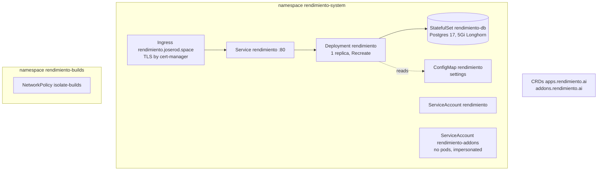
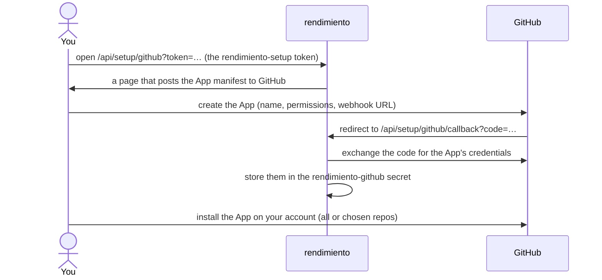

# How the platform is deployed

rendimiento deploys apps, but it does not deploy itself. The platform is installed with plain Kubernetes manifests in [`deploy/`](https://github.com/p0dxD/rendimiento.ai/tree/main/deploy), applied with `kubectl apply -k deploy`. Keeping the platform outside its own control means a broken rendimiento can always be fixed with `kubectl`.

## What gets installed



| File | What it contains |
|---|---|
| `kustomization.yaml` | The list below, applied together. |
| `namespace.yaml` | `rendimiento-system` (the platform) and `rendimiento-builds` (CI pods). |
| `crds/rendimiento.ai_apps.yaml`, `crds/rendimiento.ai_addons.yaml` | The two custom resource definitions, **generated** from `api/v1alpha1` by `make generate`. Never edit them by hand. |
| `rbac.yaml` | What the platform may do (see below), the `rendimiento-addons` identity bound to `cluster-admin`, and the build namespace's Role. |
| `postgres.yaml` | The platform database: a one-replica StatefulSet on a 5 Gi Longhorn volume. |
| `rendimiento.yaml` | The settings ConfigMap, the Deployment, its Service and Ingress. |
| `networkpolicy.yaml` | Isolation for CI pods: DNS, BuildKit and the public internet only. |
| `railpack/Dockerfile` | Not applied: the image with the Railpack CLI that build pods use (`make railpack-image`). |

??? example "deploy/rendimiento.yaml (settings, Deployment, Service, Ingress)"
    ```yaml
    --8<-- "deploy/rendimiento.yaml"
    ```

??? example "deploy/rbac.yaml"
    ```yaml
    --8<-- "deploy/rbac.yaml"
    ```

??? example "deploy/networkpolicy.yaml"
    ```yaml
    --8<-- "deploy/networkpolicy.yaml"
    ```

### Permissions, and why they are shaped this way

The platform's own service account (`rendimiento`) can:

- manage the `App` and `Addon` resources;
- manage namespaces, Deployments, Services, Ingresses, CronJobs, PVCs and Secrets **cluster-wide**, because every app gets its own namespace. The controller refuses namespaces and hostnames it does not own ([ownership checks](../architecture/controller.md#ownership-checks));
- read nodes, metrics, ingress classes, storage classes, CRDs, cluster issuers and StatefulSets, for the Environment and Services pages;
- create and delete pods and secrets in `rendimiento-builds` (CI);
- **impersonate** the `rendimiento-addons` service account, and nothing more.

`rendimiento-addons` is bound to `cluster-admin`, because installing software like Longhorn means creating CRDs, ClusterRoles and DaemonSets, exactly what ArgoCD needed. No pod runs as it: only the add-on controller acts as it, so the Kubernetes audit log shows every add-on change under that name. See [Security model](../architecture/security.md).

## Secrets you create once

| Secret (namespace `rendimiento-system`) | Keys | Used for |
|---|---|---|
| `rendimiento-db` | `password` | Postgres password (the Deployment builds `DATABASE_URL` from it) |
| `rendimiento-setup` | `token` | One-time token that protects the GitHub App setup page |
| `rendimiento-dns` (optional) | `CLOUDFLARE_API_TOKEN`, `DNS_TARGET` | DNS automation. `DNS_TARGET=auto` follows the home network's public IP. |
| `rendimiento-github` | created by the setup flow | The GitHub App's ID, private key, webhook secret and OAuth client |

```bash
kubectl -n rendimiento-system create secret generic rendimiento-db --from-literal=password="$(openssl rand -hex 24)"
kubectl -n rendimiento-system create secret generic rendimiento-setup --from-literal=token="$(openssl rand -hex 16)"
# a Cloudflare token with Zone:DNS:Edit on your zones, entered without echoing it:
read -rs CF && kubectl -n rendimiento-system create secret generic rendimiento-dns \
  --from-literal=CLOUDFLARE_API_TOKEN="$CF" --from-literal=DNS_TARGET=auto; unset CF
```

## The GitHub App

rendimiento creates its own GitHub App with the **manifest flow**, so nobody fills in GitHub's forms by hand:



The manifest asks for these repository permissions: **Contents** read & write (read code, push onboarding branches), **Pull requests** read & write (open onboarding PRs), **Checks** read & write (report CI status), **Metadata** read, **Issues** read & write and **Commit statuses** read (both for the Renovate add-on). It subscribes to **push** events. Login to the dashboard uses the same App's OAuth, and only users in `ALLOWED_USERS` get a session.

!!! tip "Changing the App's permissions later"
    Change them at `https://github.com/settings/apps/<app-name>/permissions`, then **accept** the new permissions on the installation (`https://github.com/settings/installations` → Configure). Until accepted, installations keep the old ones; the Add-ons page warns when Renovate lacks what it needs.

## Shipping a new version of rendimiento

```bash
make test-remote     # the full test suite, on a worker node
make image           # build and push registry.example.lan:5000/rendimiento:latest on the BuildKit pool
make deploy          # kubectl apply -k deploy (only needed when deploy/ or the CRDs changed)
kubectl -n rendimiento-system rollout restart deploy/rendimiento
kubectl -n rendimiento-system rollout status deploy/rendimiento
```

The Deployment pulls `:latest` with `imagePullPolicy: Always` and uses the `Recreate` strategy (one replica, never two at once), so a restart takes about 20 seconds during which the UI and webhooks are unavailable. Apps keep running: they do not depend on the platform being up. GitHub retries webhooks that fail.

On restart the platform:

1. applies database migrations (`internal/store/migrations`), each once;
2. requeues CI runs a previous process left running (up to two retries) and deletes leftover build pods;
3. closes Renovate runs that were interrupted;
4. starts the controllers, the CI worker, the Renovate scheduler, the add-on sync from git, and dynamic DNS.

!!! warning "`:latest` has no history"
    Rolling back the platform means rebuilding the previous commit. Tagging each build with its commit is on the [roadmap](../future/roadmap.md); until then, `git checkout <good commit> && make image` is the rollback.

## The build side

| What | Where it comes from |
|---|---|
| BuildKit daemons | the `buildkit` add-on (`p0dxD/gitops/buildkit/`): a StatefulSet on worker4 and worker1–3 |
| Railpack CLI image | `make railpack-image` from `deploy/railpack/Dockerfile`, checksum-pinned |
| Railpack frontend | pulled by BuildKit from `ghcr.io/railwayapp/railpack-frontend` at the pinned version |
| Clone and build client images | `alpine/git`, `moby/buildkit` (the client must match the daemon's version) |
