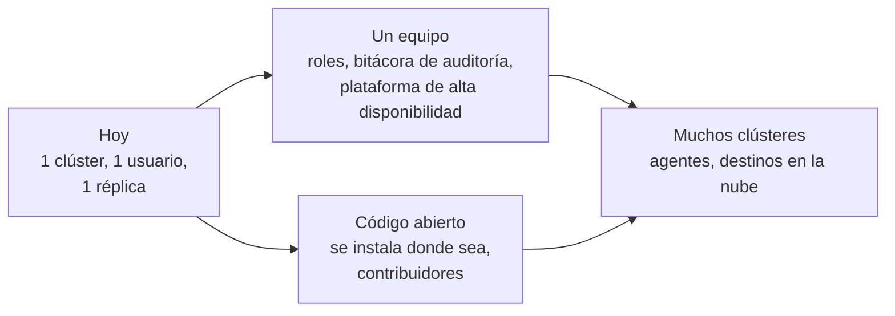

# Hacerlo crecer

rendimiento funciona hoy para una persona y un clúster de Raspberry Pi. Esta parte trata de lo que sigue:

1. **[Escalar](scaling.md)**: dónde llega cada parte a su límite, y qué cambiar cuando pase: las construcciones, la cola, los controladores, la API, el almacenamiento y varios clústeres.
2. **[Hoja de ruta](roadmap.md)**: las funciones en un orden sensato, cada una con los archivos que toca.
3. **[Código abierto](open-source.md)**: licencia, forma de contribuir, integración continua, versiones, imágenes para varias arquitecturas, instalación para otras personas y gobierno del proyecto.

