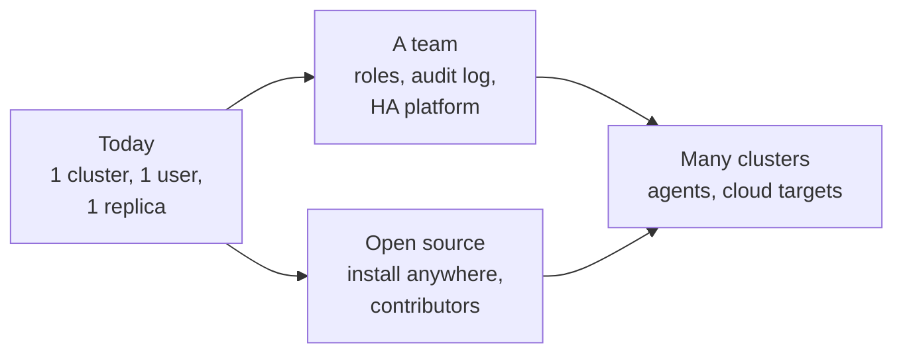

# Growing it

rendimiento works today for one person and one cluster of Raspberry Pis. This part is about what comes next:

1. **[Scaling](scaling.md)**: where each part hits its limit, and what to change when it does: builds, the queue, the controllers, the API, storage, and multiple clusters.
2. **[Roadmap](roadmap.md)**: features in a sensible order, each with the files it touches.
3. **[Open source](open-source.md)**: licensing, contribution flow, CI, releases, multi-arch images, installation for other people, governance.

