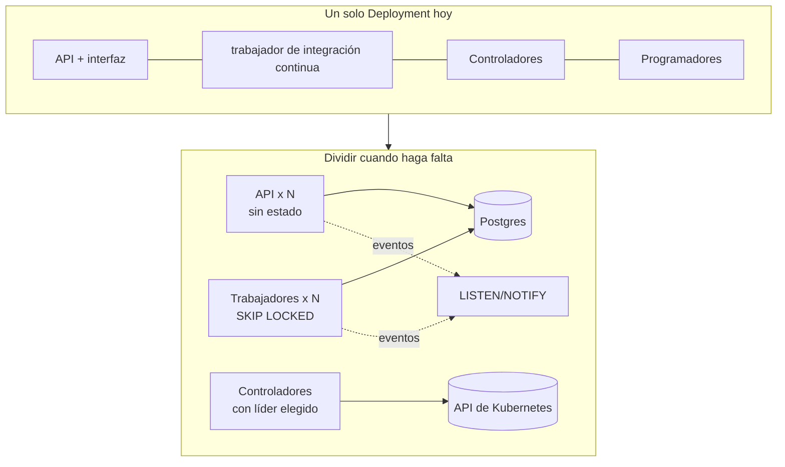
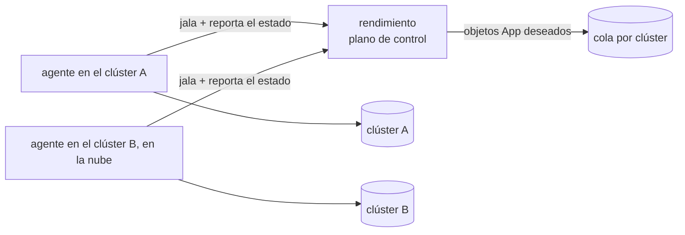

# Escalar

Escalar aquí significa aguantar más aplicaciones, más construcciones, más usuarios y más clústeres. Para cada parte de la plataforma, esta página dice qué la limita hoy, cómo se dará cuenta cuando llegue a ese límite y qué hacer al respecto.

## Construcciones {#builds}

**Hoy:** cuatro demonios de BuildKit (`buildkitd-0..3`) corren en los nodos trabajadores. Cada imagen va a un demonio por hash de encuentro, así la caché de ese demonio se mantiene caliente. `MAX_PARALLEL_STEPS=4` limita los pasos simultáneos en toda la plataforma. La caché en el registro (`mode=max`) deja que cualquier demonio reutilice capas que construyó otro.

**Límites:** el procesador y la memoria de las Pi, y luego el disco y la red del registro.

**Señales:** las ejecuciones pasan mucho tiempo *en cola*, los pasos llegan a `STEP_TIMEOUT` y el sistema mata a los demonios por falta de memoria.

**Palancas, de la más barata a la más cara:**

1. Agregar réplicas al complemento `buildkit` (en `p0dxD/gitops`). El grupo encuentra los demonios nuevos por los registros DNS SRV, y solo cerca de 1/N de las imágenes se cambia de demonio.
2. Subir `MAX_PARALLEL_STEPS` cuando los demonios aguanten más trabajo.
3. Darles más memoria a los demonios y definir `max-parallelism` en la configuración de buildkitd.
4. Hacer que el límite sea *por demonio* y no global: el corredor llevaría la cuenta de los pasos de cada demonio.
5. Agregar un constructor amd64 o en la nube para las tecnologías pesadas (Java, Rust), elegido con un campo `build.platform` o según el tamaño de la tecnología.

## Cola y trabajadores {#queue-and-workers}

**Hoy:** una tabla de Postgres que se aparta con `FOR UPDATE SKIP LOCKED`, y un solo ciclo de trabajador dentro de la plataforma.

**Límites:** miles de ejecuciones por minuto, mucho más de lo que hace este clúster. Postgres no es el cuello de botella; la capacidad de construcción sí.

**Para escalar:** correr el trabajador como su propio Deployment (`rendimiento worker`, un subcomando que solo arranca el corredor) con varias réplicas. `SKIP LOCKED` ya hace seguro que varios aparten a la vez. Agregar una columna de latido para que las ejecuciones de un trabajador caído vuelvan a la cola sin esperar un reinicio.

## Controladores {#controllers}

**Hoy:** una réplica, `LEADER_ELECTION=false`.

**Para escalar:** activar la elección de líder y correr dos réplicas. La de respaldo toma el control en unos 15 segundos. Los controladores escalan *hacia arriba* (más conciliaciones simultáneas, con `MaxConcurrentReconciles`), no *hacia los lados*. Un líder por controlador es lo normal en Kubernetes y aguanta miles de objetos.

## Actualizaciones en vivo entre réplicas {#live-updates-across-replicas}

**Hoy:** la API casi no tiene estado: las sesiones viven en Postgres. La excepción es `events.Hub`, que está en memoria. Un navegador conectado a la réplica A se perdería los eventos que publica un trabajador en la réplica B.

**Para escalar:** mandar los eventos por `LISTEN/NOTIFY` de Postgres, sin infraestructura nueva. Cada réplica escucha y vuelve a publicar a sus propios clientes de SSE. La API `Publish` y `Subscribe` del concentrador se queda igual; solo cambia el transporte. Después de eso, correr la API con varias réplicas detrás del Service.

## Base de datos {#database}

**Hoy:** un pod de Postgres en `rendimiento-system` sobre almacenamiento de Longhorn. Los registros de construcción son filas mientras corre una ejecución, y luego se mudan al almacenamiento de objetos ([el archivo de registros](../architecture/data.md#the-log-archive)).

**Señales:** la base de datos crece sobre todo por el historial de ejecuciones y los datos de disponibilidad.

**Palancas:**

- Agregar retención: borrar las ejecuciones de más de N días, o conservar solo las últimas N ejecuciones por aplicación.
- Usar un Postgres administrado o con operador (CloudNativePG) para tener respaldos, recuperación a un momento dado y réplicas.

## Registro {#registry}

**Hoy:** `registry.example.lan:5000` sobre HTTP simple, sin recolección de basura.

**Palancas:** correr la recolección de basura del registro según una programación, conservar solo las últimas N huellas por aplicación (la reversión solo necesita las recientes), o pasarse a Harbor o Zot para tener TLS, políticas de retención, replicación y revisión de vulnerabilidades.

## Muchos clústeres {#many-clusters}

**Hoy:** la plataforma aplica los objetos al clúster en el que corre.

**Rumbo:** un **agente** por clúster que jala el trabajo:

- El agente es el controlador de aplicaciones que ya existe con otro origen: obtiene los `App` deseados de la API del plano de control en lugar de leerlos localmente.
- Los clústeres detrás de NAT solo necesitan HTTPS de salida, sin puertos de entrada.
- Agregar `environment:` o `target:` a `rendimiento.yaml` para elegir el clúster, y usar la promoción (desarrollo → producción) para mover la huella de una versión entre destinos.

## Usuarios y equipos {#users-and-teams}

**Hoy:** una lista de cuentas de GitHub permitidas (`ALLOWED_USERS`), donde todos pueden hacer todo.

**Después:** roles por aplicación (observador, quien despliega, administrador), tomados de los equipos de GitHub; una tabla de bitácora de auditoría que anote quién desplegó, revirtió o cambió un secreto; y RBAC por espacio de nombres para la propia plataforma en lugar de permisos amplios en el clúster.

## Números que vigilar {#numbers-to-watch}

| Métrica | Por qué |
|---|---|
| espera en la cola (apartada − creada) | si la capacidad de construcción alcanza |
| duración de los pasos por servicio, p50/p95 | si la caché funciona y si las construcciones se vuelven más lentas |
| errores de conciliación por controlador | configuración equivocada o problemas en el clúster |
| tamaño de la base de datos, y de los registros de la tabla `steps` | cuándo archivar los registros |
| uso del disco del registro | cuándo recolectar basura |

Estas métricas todavía no se exportan. Agregarlas está en [Reestructuración](../develop/refactoring.md#metrics-of-our-own).
