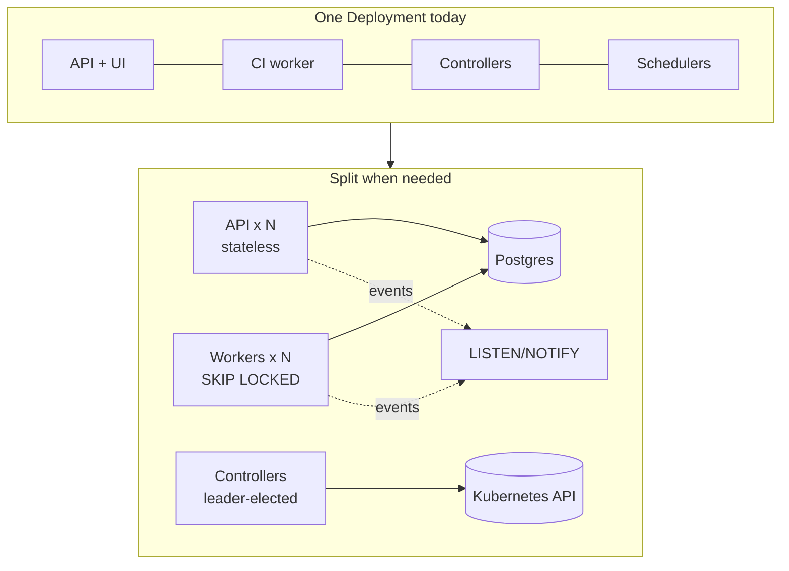
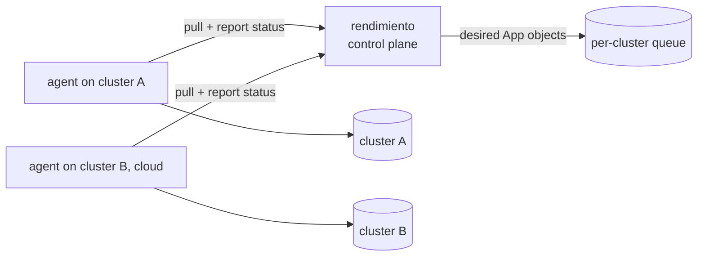

# Scaling

Scaling here means handling more apps, more builds, more users and more clusters. For each part of the platform, this page says what limits it today, how you will notice when it hits that limit, and what to do about it.

## Builds

**Today:** four BuildKit daemons (`buildkitd-0..3`) run on the workers. Each image is sent to one daemon by rendezvous hashing, so that daemon's cache stays warm. `MAX_PARALLEL_STEPS=4` caps the number of concurrent steps across the platform. The registry cache (`mode=max`) lets any daemon reuse layers another daemon built.

**Limits:** CPU and memory on the Pis, then the registry's disk and network.

**Signs:** runs sit in *queued* for a long time, steps hit `STEP_TIMEOUT`, and daemons are OOM-killed.

**Levers, cheapest first:**

1. Add replicas to the `buildkit` add-on (in `p0dxD/gitops`). The pool finds new daemons through DNS SRV records, and only about 1/N of the images move to a different daemon.
2. Raise `MAX_PARALLEL_STEPS` once the daemons can take more work.
3. Give daemons more memory, and set `max-parallelism` in buildkitd's config.
4. Make the cap *per daemon* rather than global: the runner would track steps per daemon.
5. Add an amd64 or cloud builder for heavy stacks (Java, Rust), chosen by a `build.platform` field or by the size of the stack.

## Queue and workers

**Today:** a Postgres table claimed with `FOR UPDATE SKIP LOCKED`, and one worker loop inside the platform.

**Limits:** thousands of runs a minute, far beyond this cluster. Postgres is not the bottleneck; build capacity is.

**To scale:** run the worker as its own Deployment (`rendimiento worker`, a subcommand that only starts the runner) with several replicas. `SKIP LOCKED` already makes concurrent claims safe. Add a heartbeat column so a crashed worker's runs are requeued without waiting for a restart.

## Controllers

**Today:** one replica, `LEADER_ELECTION=false`.

**To scale:** turn leader election on and run two replicas. The standby takes over within about 15 seconds. Controllers scale *up* (more concurrent reconciles, via `MaxConcurrentReconciles`), not *out*. One leader per controller is the Kubernetes norm and handles thousands of objects.

## Live updates across replicas

**Today:** the API is almost stateless: sessions live in Postgres. The exception is `events.Hub`, which is in memory. A browser connected to replica A would miss events published by a worker on replica B.

**To scale:** send events through Postgres `LISTEN/NOTIFY`, with no new infrastructure. Every replica listens and republishes to its own SSE clients. The hub's `Publish` and `Subscribe` API stays the same; only the transport changes. After that, run the API with several replicas behind the Service.

## Database

**Today:** one Postgres pod in `rendimiento-system` on Longhorn storage. Build logs are rows while a run is going, then move to object storage ([the log archive](../architecture/data.md#the-log-archive)).

**Signs:** the database grows mostly from run history and uptime data.

**Levers:**

- Add retention: delete runs older than N days, or keep only the last N runs per app.
- Use a managed or operator-run Postgres (CloudNativePG) for backups, point-in-time recovery and replicas.

## Registry

**Today:** `registry.example.lan:5000` over plain HTTP, with no garbage collection.

**Levers:** run registry garbage collection on a schedule, keep only the last N digests per app (rollback only needs recent ones), or move to Harbor or Zot for TLS, retention policies, replication and vulnerability scanning.

## Many clusters

**Today:** the platform applies objects to the cluster it runs in.

**Direction:** a pull-based **agent** per cluster:

- The agent is the existing App controller with a different source: it fetches desired `App`s from the control plane's API instead of reading them locally.
- Clusters behind NAT need only outbound HTTPS, with no inbound ports.
- Add `environment:` or `target:` to `rendimiento.yaml` to choose the cluster, and use promotion (dev → prod) to move a release digest between targets.

## Users and teams

**Today:** a GitHub login allowlist (`ALLOWED_USERS`), where everyone can do everything.

**Next:** roles (viewer, deployer, admin) per app, taken from GitHub team membership; an audit log table recording who deployed, rolled back or changed a secret; and per-namespace RBAC for the platform itself instead of broad cluster rights.

## Numbers to watch

| Metric | Why |
|---|---|
| queue wait (claimed − created) | whether build capacity is enough |
| step duration per service, p50/p95 | whether caching works and whether builds are getting slower |
| reconcile errors per controller | misconfiguration or cluster trouble |
| DB size, and the size of the `steps` table's logs | when to archive logs |
| registry disk use | when to garbage-collect |

These metrics are not exported yet. Adding them is in [Refactoring](../develop/refactoring.md#metrics-of-our-own).
