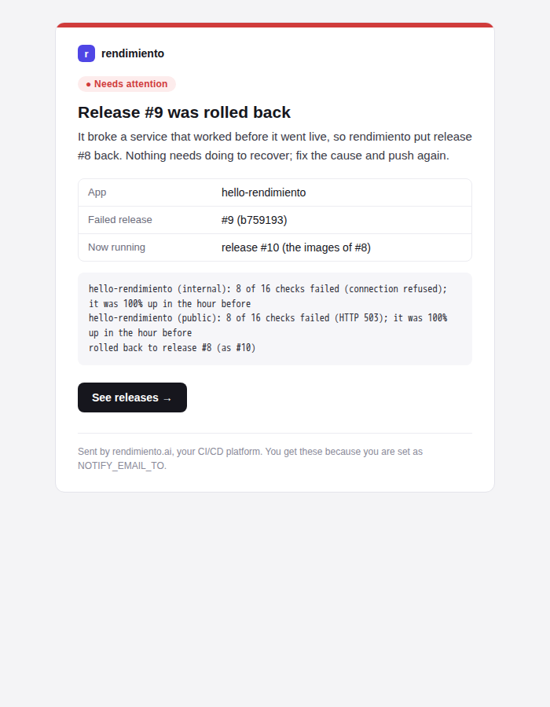

# Notifications

rendimiento emails you when something needs your attention, so you don't have to watch the UI.



## What you are told about

| Event | Email | Sent by |
|---|---|---|
| A release **failed verification and was rolled back** | ↩ *app: release #9 rolled back*: what broke, and what runs now | release verification (`platform/verify.go`) |
| A release failed verification but was **kept** (`verify.rollback: false`, or nothing to roll back to) | ⚠ *app: release #9 failed verification* | release verification |
| A **build on the default branch failed**, so nothing was released | ✗ *app: build failed on main*: the failing steps and their errors | the CI worker (`platform.execute`) |
| A service **went down**: an outage opened after two failed checks | 🔴 *app is down*: which checks, since when, and the errors | uptime checks (`uptime.Prober`) |
| …and **recovered** | ✅ *app recovered*, with how long it was down | uptime checks |

Branch and pull-request builds don't email you; their result is on the commit's GitHub check.

## Noise control

- **One email per app per minute of changes.** When several checks of an app go down together (its public URL and its in-cluster check), you get one email listing them all.
- **No repeats.** The same event (the same app down, the same release rolled back) is sent at most once every 30 minutes. A flapping service doesn't send a stream of emails.
- **An hourly cap of 20 emails.** Past it, emails are dropped and logged, so a bad night can't flood your inbox.

## What an email contains

- a coloured bar and label: **Needs attention** (red), **Warning** (amber), **Resolved** (green);
- a heading and a one-line summary of what happened and whether you need to act;
- a small table of facts (app, release, commit, run, durations);
- the exact errors, in a box;
- a button to the right page: the run, the releases, or the Reliability tab.

There's also a plain-text version for mail clients that don't show HTML. The layout uses only tables and inline styles, which Gmail, Apple Mail and Outlook all render the same way.

## Setting it up

Email is sent through [Resend](https://resend.com), from a sender on a domain verified there (here `alerts@joserod.space`, shared with the cluster-update and StockFinancia emails).

```bash
# the API key, in its own secret (read by the platform's envFrom)
kubectl -n rendimiento-system create secret generic rendimiento-notify --from-literal=RESEND_API_KEY=re_…
```

| Setting | Where | Meaning |
|---|---|---|
| `NOTIFY_EMAIL_TO` | ConfigMap `rendimiento` | Recipients, comma-separated. Empty turns email off. |
| `NOTIFY_EMAIL_FROM` | ConfigMap | Sender (default `rendimiento <alerts@joserod.space>`); must be on a verified domain. |
| `RESEND_API_KEY` | Secret `rendimiento-notify` | The Resend API key. |

Restart the platform after changing them. The **Environment** page's *Email notifications* check shows whether email is set up. Its **Send test email** button sends a sample right away and shows any error from the provider.

!!! tip "A key of its own"
    The key currently is the one StockFinancia uses. A separate Resend key just for rendimiento, allowed only to send, can be revoked without affecting the other apps.

## In the code

| Piece | Where |
|---|---|
| Messages, the HTML and text template, de-duplication, the hourly cap, the Resend client | `internal/notify` |
| Outage and recovery emails, grouped per app per round | `uptime.Prober.notifyChanges` |
| Rollback and failed-run emails | `platform.verifyMessage`, `platform.notifyRunFailed` |
| The test email | `POST /api/notifications/test` |

**Adding another channel** (Discord, ntfy, Slack): implement `notify.Sender`, or turn a `Message` into that channel's format, and pick it in `cmd/rendimiento/main.go` from new settings. Everything that sends notifications goes through `Notifier`, so de-duplication and the cap apply to every channel.
