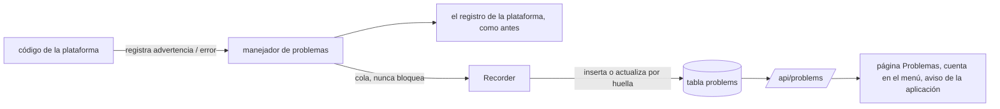

# Problemas

Cuando algo sale mal **dentro de rendimiento mismo**, aparece en la página **Problemas** (en la barra superior, con el número de problemas abiertos). Por ejemplo: un envío cuyo `rendimiento.yaml` fue rechazado, un correo de alerta que no se pudo enviar, una llamada a DNS o a GitHub que falló, un complemento que no se pudo sincronizar.

Las interrupciones de sus aplicaciones no son problemas: están en la [pestaña Confiabilidad](reliability.md) de cada aplicación.

## Lo que se ve {#what-you-see}

- Cada problema tiene su **nivel** (advertencia o error), su **mensaje** y el error que reportó, la **aplicación** a la que se refiere (si hay una) y la **parte de la plataforma** que lo reportó.
- **Las repeticiones se agrupan.** El mismo problema que vuelve a ocurrir (aunque traiga otra confirmación u otro número) suma a su cuenta: *"40 veces desde las 2:10 p. m., la última hace 3 min"*.
- Un problema sigue **abierto** durante 24 horas desde la última vez que ocurrió, a menos que antes se **resuelva** o se **descarte**:
    - **Resuelto** significa que rendimiento vio la prueba de que se corrigió, y dice cuál: un `rendimiento.yaml` rechazado se resuelve con el siguiente envío aceptado en la misma rama (*"corregido con c6eae54"*); un correo fallido, con el siguiente correo enviado.
    - **Descartar** oculta un problema a mano.
    - En cualquier caso, se vuelve a abrir si ocurre de nuevo.
- Los problemas se guardan durante **30 días** desde la última vez que ocurrieron.
- Los problemas de una aplicación también aparecen como un **aviso en la página de la aplicación**.

## Un `rendimiento.yaml` rechazado {#a-rejected-rendimientoyaml}

Si un envío trae un `rendimiento.yaml` que no se puede usar (un error de dedo, un host repetido), no se construye ni se publica nada, y la aplicación sigue ejecutando su versión actual. El envío de todos modos aparece:

- como una **ejecución fallida** en la pestaña Ejecuciones de la aplicación, cuya página dice por qué;
- como una **comprobación fallida** (✗ roja) en la confirmación en GitHub;
- en un **correo**, para la rama principal (vea [Notificaciones](notifications.md));
- en la página Problemas y en el aviso de la aplicación.

Corrija el archivo y envíelo de nuevo: en cuanto ese envío se acepta, el problema queda resuelto.

## Cómo funciona {#how-it-works}

- El registrador de la plataforma pasa cada registro a su salida normal; las advertencias y los errores **además** se ponen en cola para la página Problemas (`internal/problems`). Registrar nunca hace más lento al código que registra: si la cola está llena, los problemas se cuentan y se descartan.
- La **huella** de un problema es su nivel, su componente, su aplicación, su mensaje y su error, con los números y los hashes en blanco, para que las repeticiones caigan en una sola fila.
- Algunas advertencias se dejan fuera a propósito: los conflictos de escritura de Kubernetes que los controladores reintentan de inmediato, las aplicaciones caídas (de esas lleva la cuenta la pestaña Confiabilidad) y el trabajo detenido por un apagado.
- API: `GET /api/problems` (`?app=`, `?dismissed=1`), `GET /api/problems/count`, `POST /api/problems/{id}/dismiss`.
