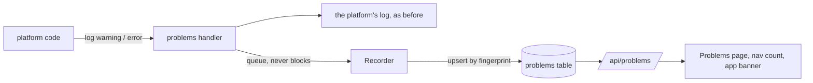

# Problems

When something goes wrong **inside rendimiento itself**, it shows up on the **Problems** page (in the top bar, with the number of open problems). Examples: a push whose `rendimiento.yaml` was rejected, an alert email that could not be sent, a DNS or GitHub call that failed, an add-on that would not sync.

Outages of your apps are not problems: they're on each app's [Reliability tab](reliability.md).

## What you see

- Each problem has its **level** (warning or error), its **message** and the error it reported, the **app** it concerns (if any), and the **part of the platform** that reported it.
- **Repeats are grouped.** The same problem happening again (even with a different commit or number in it) adds to its count: *"40 times since 2:10 PM, last 3 min ago"*.
- A problem is **open** for 24 hours after it last happened. **Dismiss** hides it until it happens again.
- Problems are kept for **30 days** after they last happened.
- Problems about an app also appear as a **banner on the app's page**.

## A rejected `rendimiento.yaml`

If a push has a `rendimiento.yaml` that cannot be used (a typo, a host listed twice), nothing is built or released, and the app keeps running its current release. The push still shows up:

- as a **failed run** on the app's Runs tab, whose page says why;
- as a **failed check** (red ✗) on the commit in GitHub;
- in an **email**, for the default branch (see [Notifications](notifications.md));
- on the Problems page and the app's banner.

Fix the file and push again.

## How it works

- The platform's logger passes every record to its normal output; warnings and errors are **also** queued for the Problems page (`internal/problems`). Recording never slows the code that logs: if the queue is full, problems are counted and dropped.
- The **fingerprint** of a problem is its level, component, app, message and error, with numbers and hashes blanked, so repeats land on one row.
- Some warnings are left out on purpose: Kubernetes write conflicts that the controllers retry immediately, apps going down (the Reliability tab tracks those), and work stopped by a shutdown.
- API: `GET /api/problems` (`?app=`, `?dismissed=1`), `GET /api/problems/count`, `POST /api/problems/{id}/dismiss`.
