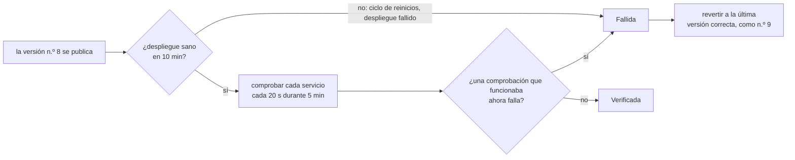

# Confiabilidad: comprobaciones de disponibilidad y gráficas

Un despliegue en verde dice que una versión *arrancó*. La pestaña **Confiabilidad** de cada aplicación dice si sus servicios de verdad *funcionan*, qué tan rápido responden, cuándo estuvieron caídos y si una versión cambió algo de eso.


## Qué se comprueba {#what-gets-checked}

Una vez por minuto, la plataforma comprueba cada servicio de cada aplicación. Se omiten los servicios con cero réplicas, y también las aplicaciones que **todavía no tienen una versión**: una aplicación que espera su primera construcción no está caída, así que no se avisa como una interrupción.

| Comprobación | Cómo | Qué detecta |
|---|---|---|
| **Dentro del clúster** | `GET` a la `health.path` del servicio a través de su Service (`http://<servicio>.<aplicación>.svc.cluster.local/<ruta>`); sin comprobación de estado, abre una conexión TCP a su puerto | la aplicación misma: caídas, bloqueos, una versión descompuesta |
| **URL pública** | `GET https://<dominio><ruta de estado>` a través de internet y de Cloudflare, como un visitante | también todo lo que está delante: DNS, Cloudflare, el enrutador, la entrada, el certificado |

Cuando la comprobación de dentro pasa y la pública falla, el problema está delante de la aplicación. Cuando las dos fallan, es la aplicación.

- Una comprobación HTTP **pasa** con cualquier estado 2xx o 3xx. Las redirecciones no se siguen: una redirección a una página de inicio de sesión significa que el servicio respondió. La comprobación pública de un servicio **sin ruta de estado** pide `/`, así que pasa con cualquier estado menor a 500: una API que no tiene nada en `/` igual responde 404, y eso demuestra que DNS, Cloudflare, la entrada y la aplicación funcionan.
- Cada comprobación tiene **10 segundos**.
- Las comprobaciones envían `Cache-Control: no-cache`, para que Cloudflare las pase al origen.
- Las peticiones llevan el agente de usuario `rendimiento-uptime/1`. Piden la ruta de estado o la página sin ejecutar JavaScript, así que las analíticas como Umami no las cuentan como visitas.

No hace falta configurar nada. Una comprobación `health:` en `rendimiento.yaml` le da más sentido a la comprobación de dentro (una página que se genera, no solo un puerto abierto), así que agregue una donde pueda.

## Cómo leer la pestaña {#reading-the-tab}

Elija **Últimas 24 horas**, **7 días** o **30 días**. Cada comprobación tiene una tarjeta:

- **Cifras:**
  - **Disponibilidad:** el porcentaje de comprobaciones que salieron bien.
  - **Respuesta típica (p50):** la mitad de las comprobaciones fue más rápida.
  - **El 5% más lento (p95):** el 95% de las comprobaciones fue más rápido. Es lo que ven sus visitantes más lentos.
  - **Interrupciones:** cuántas hubo en el periodo.
  - La insignia de la esquina es la **última comprobación**: activa o caída, y hace cuánto.
- **Franja de estado:** una celda por cada 15 minutos (24 h), cada hora (7 d) o cada 6 horas (30 d). Las celdas son **Activo**, **Parcialmente caído** (fallaron algunas comprobaciones), **Caído** (fallaron la mayoría) o **Sin comprobaciones**. Pase el cursor sobre una celda para ver sus cifras.
- **Gráfica de tiempos de respuesta:** p95 y p50 a lo largo del tiempo. Las **marcas de versión** (`#7`, `#8`) muestran cuándo salió cada versión, así que una lentitud que empieza con una versión salta a la vista. Un hueco en las líneas significa que ninguna comprobación salió bien en ese momento. Pase el cursor para ver los valores exactos y cualquier versión en ese tramo.

  

- **Tabla de datos:** todas las cifras de la gráfica, sin pasar el cursor.
- **Interrupciones:** cada interrupción con su servicio, su comprobación, su inicio, su duración y su primer error.

El panel muestra en la tarjeta de cada aplicación su **disponibilidad de las últimas 24 horas**:

| Insignia | Disponibilidad |
|---|---|
| verde | 99.9% o más |
| ámbar | 98% o más |
| roja | menos de 98% |

## Interrupciones {#outages}

Una interrupción empieza tras **dos comprobaciones fallidas seguidas**, con fecha de la primera. Una sola falla suele ser un parpadeo, como un pod que se reinicia o una respuesta lenta. La interrupción termina con la siguiente comprobación correcta. Las interrupciones sobreviven a los reinicios de la plataforma: una plataforma reiniciada retoma las que están abiertas y las cierra cuando el servicio se recupera.

## Verificar cada versión {#verifying-each-release}

Cada versión de la rama principal se **vigila después de publicarse**, y una versión que descompone un servicio **se revierte automáticamente**.



1. **El despliegue:** la versión debe quedar sana en 10 minutos, es decir, con todos los pods en la versión nueva y listos. Un despliegue que falla o entra en un ciclo de reinicios no supera la verificación de inmediato.
2. **La ventana:** durante 5 minutos, cada comprobación de la versión (dentro del clúster y pública) se ejecuta cada 20 segundos.
3. **El veredicto.** Una comprobación hace fallar la versión cuando **al menos 3 de sus intentos, y al menos una quinta parte, fallaron**, y estaba sana (90% o más de disponibilidad) en la hora previa a la versión, o es nueva. Dos excepciones:
   - Una comprobación que **ya fallaba antes** se reporta, pero no se le achaca a la versión.
   - Una versión **mucho más lenta** (p95 tres veces mayor, y un segundo más) se reporta pero no se revierte, porque las cachés frías hacen que eso sea ruidoso.
4. **La reversión:** una versión fallida se revierte a la **versión anterior más reciente que no falló la verificación**, como una versión nueva (`reversión a la n.º 7`). Las reversiones, manuales o automáticas, no se vuelven a verificar, así que no hay ciclos de reversión.

El resultado aparece en cada versión de la pestaña **Versiones**, con el motivo:

| Insignia | Qué significa |
|---|---|
| Verificando… | se está vigilando ahora |
| Verificada | sana durante toda la ventana |
| Fallida · revertida | descompuso un servicio, y volvió la última versión correcta |
| No superó la verificación | descompuso un servicio, y se mantuvo porque `verify.rollback: false` o no había a cuál volver |
| Sin verificar: reemplazada | una versión más nueva (o una reversión manual) llegó antes de que terminara la ventana |

Mientras una versión se verifica, y durante un día después de que una falla, un aviso en la página de la aplicación lo dice. En la gráfica de tiempos de respuesta, la marca de una versión revertida dice `#8 ✕`.

**Por aplicación**, en `rendimiento.yaml`:

```yaml
verify:
  window: 600        # vigilar 10 minutos (60–3600 s; de forma predeterminada, los 5 min de la plataforma)
  rollback: false    # solo reportar una verificación fallida
  # disabled: true   # no verificar las versiones de esta aplicación
```

La ventana de toda la plataforma es `VERIFY_WINDOW` (de forma predeterminada `5m`; `0` desactiva la verificación). La verificación se ejecuta en el líder. Si la plataforma se reinicia a media ventana, la versión se vuelve a vigilar desde el principio, a menos que una más nueva la haya reemplazado.

## Estadísticas públicas {#public-stats}

Con `PUBLIC_STATS=true`, rendimiento publica **cifras agregadas** en `GET /api/public/stats` para una página pública. [joserod.space](https://joserod.space/#live) las usa en su sección *Live from the Home Lab*.

Con `STATS_LISTEN` definido (aquí `:8081`), las estadísticas se sirven **solo en ese puerto interno**, que el Service expone como `stats` y que la entrada pública no dirige. La página las obtiene del lado del servidor por la red del clúster (`http://rendimiento.rendimiento-system.svc.cluster.local:8081/api/public/stats`), así que se pueden alcanzar desde dentro del clúster pero **no desde internet**.

| Parte | Contenido |
|---|---|
| `delivery30d` | despliegues, construcciones y su éxito, tiempos típicos de construcción y del envío a en vivo, versiones verificadas y fallidas, reversiones automáticas, interrupciones y recuperación media, despliegues por día |
| `sites` | cada comprobación de URL pública: si está activa ahora, disponibilidad de 24 horas y de 30 días, tiempo de respuesta típico, disponibilidad diaria de 90 días y por hora de 48 horas |
| `cluster` | pods y aplicaciones y, por nodo, una **etiqueta genérica** (plano de control, trabajador 1…, nodo con GPU), arquitectura, si está listo, CPU y memoria, pods y GPU |
| `recent` | las últimas versiones: aplicación, número, hora, resultado de la verificación y si fue una reversión automática |

A propósito es vaga sobre la instalación. **No hay nombres de nodos, sistemas operativos ni versiones de programas** (una versión exacta le dice a un atacante qué vulnerabilidades conocidas probar), ni direcciones, secretos, mensajes de confirmación ni autores. Se calcula como máximo una vez por minuto.

## Dónde viven los datos {#where-the-data-lives}

Los resultados se guardan en el propio Postgres de rendimiento, así que funciona sin ningún sistema de monitoreo:

| Qué | Se conserva | Lo usa |
|---|---|---|
| cada comprobación | 7 días | las gráficas de 24 horas, los percentiles exactos |
| resúmenes por hora (comprobaciones, aciertos, p50, p95) | 400 días | las gráficas de 7 y de 30 días |
| interrupciones | siempre | la lista de interrupciones |

En la vista de 30 días, el p95 de un tramo es el mayor de los p95 de sus horas, una cota superior. Vea [el capítulo de datos](../architecture/data.md#uptime-data).

El resultado más reciente de cada comprobación también se exporta como métricas de Prometheus en `METRICS_ADDR` (`:9090`):
- `rendimiento_uptime_up`
- `rendimiento_uptime_latency_seconds`
- `rendimiento_uptime_checks_total`

Eso queda listo para Grafana en cuanto se recolecte.

## Ajustes {#settings}

| Ajuste | Predeterminado | |
|---|---|---|
| `UPTIME_INTERVAL` | `1m` | Cada cuánto comprobar; `0` desactiva las comprobaciones. |

## En el código {#in-the-code}

| Pieza | Dónde |
|---|---|
| Qué comprobar, ejecutar las comprobaciones, las interrupciones, las métricas | `internal/uptime` (`Targets`, `Checker`, `Prober`) |
| La verificación de versiones y la reversión automática | `internal/platform/verify.go` (`startVerification`, `judge`, `rollbackTo`) |
| El almacenamiento, los resúmenes y las consultas de las gráficas | `internal/store/uptime.go`, migración `0005_uptime.sql` |
| La API | `GET /api/apps/{app}/reliability` en `internal/api/reliability.go` |
| Las gráficas | `web/src/components/reliability.tsx`: SVG simple, sin bibliotecas de gráficas |

**Lo que sigue:** las *tareas* posteriores al despliegue (pruebas rápidas y migraciones contra la versión nueva, dentro del espacio de nombres de la aplicación) como parte de la verificación. Vea la [hoja de ruta](../future/roadmap.md).
