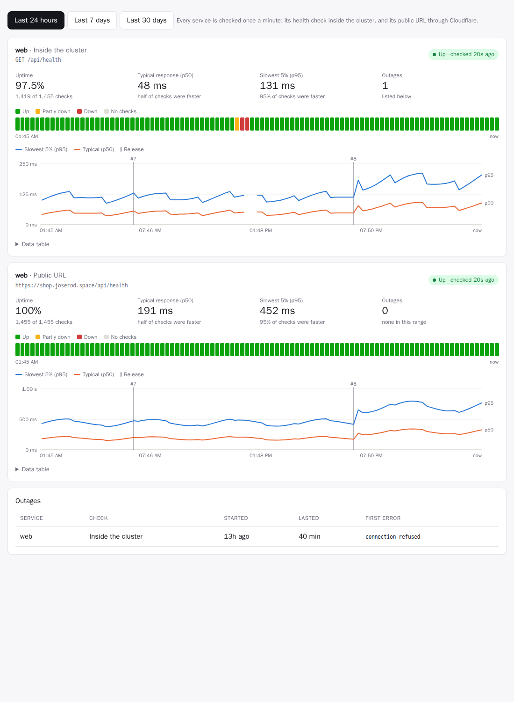
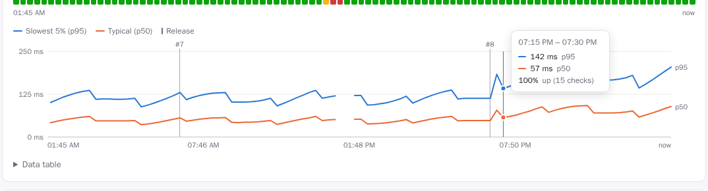
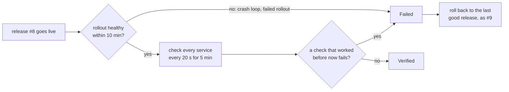

# Reliability: uptime checks and charts

A green deploy says a release *started*. The **Reliability** tab of every app says whether its services actually *work*, how fast they answer, when they were down, and whether a release changed any of that.



## What gets checked

Once a minute, the platform checks every service of every app (services scaled to zero are skipped):

| Check | How | What it catches |
|---|---|---|
| **Inside the cluster** | `GET` the service's `health.path` through its Service (`http://<service>.<app>.svc.cluster.local/<path>`); without a health check, opens a TCP connection to its port | the app itself: crashes, hangs, a broken release |
| **Public URL** | `GET https://<domain><health path>` through the public internet and Cloudflare, like a visitor | everything in front of it too: DNS, Cloudflare, the router, ingress, the certificate |

When the inside check passes and the public one fails, the problem is in front of the app. When both fail, it's the app.

- An HTTP check **passes** on any 2xx or 3xx status. Redirects are not followed: a redirect to a login page means the service answered. A public check of a service **without a health path** requests `/`, so it passes on any status below 500: an API with nothing at `/` still answers 404, which proves DNS, Cloudflare, ingress and the app are all up.
- Each check has **10 seconds**.
- Checks send `Cache-Control: no-cache`, so Cloudflare passes them to the origin.
- Requests carry the user agent `rendimiento-uptime/1`. They fetch the health endpoint or page without running JavaScript, so analytics like Umami don't count them as visits.

No setup is needed. A `health:` check in `rendimiento.yaml` makes the inside check more meaningful (a page that renders, not just an open port), so add one where you can.

## Reading the tab

Pick **Last 24 hours**, **7 days** or **30 days**. Every check gets a card:

- **Tiles:**
  - **Uptime:** the share of checks that succeeded.
  - **Typical response (p50):** half the checks were faster.
  - **Slowest 5% (p95):** 95% of checks were faster. This is what your slowest visitors see.
  - **Outages:** how many there were in the range.
  - The badge in the corner is the **latest check**: up or down, and how long ago.
- **Status strip:** one cell per 15 minutes (24h), hour (7d) or 6 hours (30d). The cells are **Up**, **Partly down** (some checks failed), **Down** (most failed) or **No checks**. Hover a cell for its numbers.
- **Response time chart:** p95 and p50 over time. **Release markers** (`#7`, `#8`) show when each release went out, so a slowdown that starts at a release is obvious. A gap in the lines means no check succeeded then. Hover for exact values and any release in that slot.

  

- **Data table:** every number in the chart, without hovering.
- **Outages:** each outage with its service, check, start, duration and first error.

The dashboard shows each app's **24-hour uptime** on its card:

| Badge | Uptime |
|---|---|
| green | 99.9% or more |
| amber | 98% or more |
| red | below 98% |

## Outages

An outage starts after **two failed checks in a row**, dated from the first one. One failure alone is usually a blip, such as a pod restarting or a slow response. The outage ends at the next successful check. Outages survive platform restarts: a restarted platform picks up the open ones and closes them when the service recovers.

## Verifying each release

Every release on the default branch is **watched after it goes live**, and a release that breaks a service is **rolled back automatically**.



1. **The rollout:** the release must become healthy within 10 minutes, meaning every pod on the new version and ready. A rollout that fails or crash-loops fails verification right away.
2. **The window:** for 5 minutes, every check of the release (inside the cluster and public) runs every 20 seconds.
3. **The verdict.** A check fails the release when **at least 3 of its checks, and at least a fifth, failed**, and it was healthy (90%+ up) in the hour before the release, or is new. Two exceptions:
   - A check that was **already failing before** is reported but not blamed on the release.
   - A release that's **much slower** (p95 three times higher, and a second more) is reported, not rolled back, because cold caches make that noisy.
4. **The rollback:** a failed release is rolled back to the **newest earlier release that didn't fail verification**, as a new release (`rollback to #7`). Rollbacks, manual or automatic, aren't verified again, so there's no rollback loop.

The result shows on each release in the **Releases** tab, with the reason:

| Badge | Meaning |
|---|---|
| Verifying… | being watched now |
| Verified | healthy for the whole window |
| Failed · rolled back | broke a service, and the last good release is back |
| Failed verification | broke a service, kept because `verify.rollback: false` or there was nothing to return to |
| Not verified: replaced | a newer release (or a manual rollback) came before the window ended |

While a release is verified, and for a day after one fails, a banner on the app's page says so. On the response-time chart, a rolled-back release's marker reads `#8 ✕`.

**Per app**, in `rendimiento.yaml`:

```yaml
verify:
  window: 600        # watch for 10 minutes (60–3600 s; default: the platform's 5 min)
  rollback: false    # only report a failed verification
  # disabled: true   # don't verify this app's releases
```

The platform-wide window is `VERIFY_WINDOW` (default `5m`, `0` turns verification off). Verification runs on the leader. If the platform restarts mid-window, the release is watched again from the start, unless a newer one replaced it.

## Public stats

With `PUBLIC_STATS=true`, rendimiento publishes **aggregate numbers** at `GET /api/public/stats`, without login, for a public page. [joserod.space](https://joserod.space/#live) uses it for its *Live from the Home Lab* section, fetched server-side over the cluster network (`http://rendimiento.rendimiento-system.svc.cluster.local/api/public/stats`).

| Part | Contents |
|---|---|
| `delivery30d` | deploys, builds and their success, typical build time and push-to-live time, verified and failed releases, automatic rollbacks, outages and mean recovery, deploys per day |
| `sites` | every public URL check: up now, uptime over 24 h and 30 days, typical response time, daily uptime for 90 days, hourly for 48 hours |
| `cluster` | distribution and version, pods, apps, and per node its role, architecture, CPU and memory (capacity and live use), pods and GPUs |
| `recent` | the latest releases: app, number, time, verification result, whether it was an automatic rollback |

It contains no IP addresses, internal hostnames, secrets, commit messages or authors. It's computed at most once a minute, and served with `Cache-Control: max-age=60`, so visitors can't make the platform recompute it. Browsers on `PUBLIC_STATS_ORIGINS` may fetch it directly.

## Where the data lives

Results are kept in rendimiento's own Postgres, so it works without any monitoring stack:

| What | Kept | Used by |
|---|---|---|
| every check | 7 days | the 24-hour charts, exact percentiles |
| hourly summaries (checks, successes, p50, p95) | 400 days | the 7- and 30-day charts |
| outages | always | the outage list |

On the 30-day view, a bucket's p95 is the highest of its hours' p95s, an upper bound. See [the data chapter](../architecture/data.md#uptime-data).

The latest result of every check is also exported as Prometheus metrics on `METRICS_ADDR` (`:9090`):
- `rendimiento_uptime_up`
- `rendimiento_uptime_latency_seconds`
- `rendimiento_uptime_checks_total`

That's ready for Grafana once it's scraped.

## Settings

| Setting | Default | |
|---|---|---|
| `UPTIME_INTERVAL` | `1m` | How often to check; `0` turns checks off. |

## In the code

| Piece | Where |
|---|---|
| What to check, running checks, outages, metrics | `internal/uptime` (`Targets`, `Checker`, `Prober`) |
| Release verification and automatic rollback | `internal/platform/verify.go` (`startVerification`, `judge`, `rollbackTo`) |
| Storage, summaries, chart queries | `internal/store/uptime.go`, migration `0005_uptime.sql` |
| The API | `GET /api/apps/{app}/reliability` in `internal/api/reliability.go` |
| The charts | `web/src/components/reliability.tsx`: plain SVG, no chart library |

**Next:** post-deploy *tasks* (smoke tests and migrations run against the new version, inside the app's namespace) as part of verification. See the [roadmap](../future/roadmap.md).
