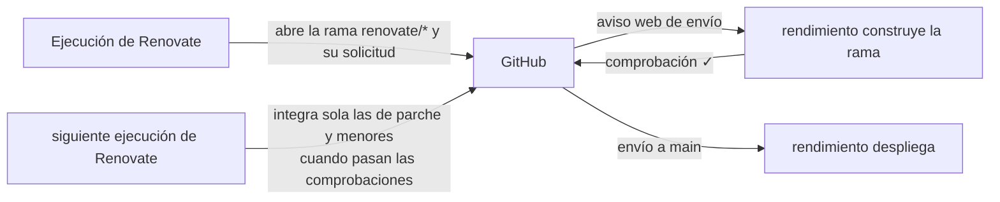

# Renovate

[Renovate](https://docs.renovatebot.com) mantiene las dependencias al día: encuentra actualizaciones (npm, pip, módulos de Go, Maven, imágenes base de Docker, versiones de paquetes de Helm en Ansible…) y abre una solicitud de incorporación por cada una. rendimiento lo ejecuta como un **complemento integrado** (`internal/renovate`).

## Cómo se ejecuta {#how-it-runs}

- Según una **programación** (cron, en UTC; de forma predeterminada `0 5 * * *`) o con **Ejecutar ahora**.
- Cada ejecución es un pod en el espacio de nombres aislado de construcción, con un **token nuevo de la aplicación de GitHub** válido por una hora. No hay ningún token personal que pueda vencer o filtrarse.
- Las confirmaciones y las solicitudes vienen del bot de la aplicación (`<nombre-de-la-aplicación>[bot]`) y se firman a través de la API de GitHub (confirmaciones verificadas).
- Cubre cada aplicación que tiene encendido su interruptor de **Actualizaciones de dependencias** (en la página de la aplicación o en la de Complementos), más los **otros repositorios** que aparecen en la configuración (por ejemplo `p0dxD/main_configs`).
- Su **configuración** (`config.js`) se edita en la página Complementos; rendimiento pone por su cuenta el token, los repositorios y la identidad.
- Cada ejecución registra, por repositorio, el resultado, las solicitudes abiertas, las integradas y los errores, más un registro legible. El nivel de registro se puede poner en *debug* para ver por qué pasó algo.

## El ciclo con la integración continua {#the-loop-with-ci}

La configuración actual integra sola las actualizaciones **de parche y menores** en cuanto pasan las comprobaciones de rendimiento, excepto las etiquetas **menores y mayores de Docker** (un nuevo entorno de ejecución del lenguaje puede romper las construcciones) y las **menores y mayores de SQLAlchemy** (la 2.1 cambió el controlador predeterminado de Postgres). Las actualizaciones mayores siempre lo esperan a usted. Los repositorios sin una aplicación en rendimiento (como `main_configs`) no tienen comprobación de construcción.

!!! warning "Que se construya no significa que funcione"
    En las aplicaciones sin pruebas, la comprobación solo demuestra que la imagen se construye. Una actualización todavía puede descomponerse al ejecutarse, como le habría pasado a wellness con SQLAlchemy 2.1. Agregue pruebas, o excluya de la integración automática los paquetes riesgosos en la configuración.

## Permisos necesarios de la aplicación de GitHub {#required-github-app-permissions}

La primera petición de Renovate para cada repositorio lee sus incidencias (el panel de dependencias), así que la aplicación necesita **Issues: lectura y escritura** y **Commit statuses: solo lectura**, además de contenido, solicitudes de incorporación y comprobaciones. La página Complementos enumera lo que falte y lleva adonde se otorga; las ejecuciones no empiezan hasta que la instalación lo acepta.

## Ramas que dejó un Renovate anterior {#branches-left-by-an-earlier-renovate}

Renovate solo toca las ramas que creó su propia identidad. Las ramas de una configuración anterior (con un token personal) aparecen como *editadas por alguien más*: se omiten **y aun así** cuentan para el límite de ramas abiertas, lo que puede detener todas las solicitudes nuevas. Elimínelas (sus confirmaciones se pueden recuperar con sus SHA), o agregue `ignorePrAuthor: true` y `gitIgnoredAuthors: [<correo del autor anterior>]` a la configuración para adoptarlas.
