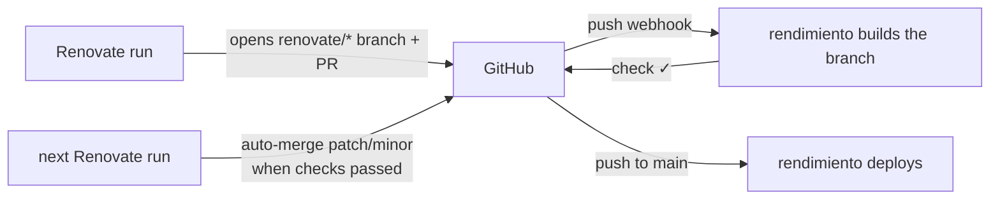

# Renovate

[Renovate](https://docs.renovatebot.com) keeps dependencies up to date: it finds updates (npm, pip, Go modules, Maven, Docker base images, Helm chart versions in Ansible…) and opens a pull request for each. rendimiento runs it as a **built-in add-on** (`internal/renovate`).

## How it runs

- On a **schedule** (cron, in UTC; default `0 5 * * *`) or with **Run now**.
- Each run is a pod in the isolated build namespace, with a **fresh GitHub App token** valid for an hour. There is no personal token to expire or leak.
- Commits and PRs come from the App's bot (`<app-name>[bot]`) and are signed through GitHub's API (verified commits).
- It covers every app whose **Dependency updates** switch is on (on the app's page or the Add-ons page), plus **other repositories** listed in the settings (e.g. `p0dxD/main_configs`).
- Its **config** (`config.js`) is edited on the Add-ons page; rendimiento sets the token, repositories and identity itself.
- Each run records, per repository, the result, PRs opened, PRs merged and errors, plus a readable log. The log level can be set to *debug* to see why something happened.

## The loop with CI

The current configuration auto-merges **patch and minor** updates once rendimiento's checks pass, except **Docker minor/major** tags (a new language runtime can break builds) and **SQLAlchemy minor/major** (2.1 changed the default Postgres driver). Major updates always wait for you. Repositories without a rendimiento app (like `main_configs`) have no build check.

!!! warning "A passing build is not a passing app"
    For apps without tests, the check only proves the image builds. An update can still break at runtime, as SQLAlchemy 2.1 would have for wellness. Add tests, or exclude risky packages from auto-merge in the config.

## Required GitHub App permissions

Renovate's first request for each repository reads its issues (the Dependency Dashboard), so the App needs **Issues: Read and write** and **Commit statuses: Read-only** in addition to contents, pull requests and checks. The Add-ons page lists anything missing and links to where to grant it; runs do not start until the installation has accepted it.

## Branches left by an earlier Renovate

Renovate only touches branches its own identity created. Branches from an earlier setup (a personal token) look *edited by someone else*: they are skipped **and** still count toward the limit on open branches, which can stop all new PRs. Delete them (their commits can be restored from their SHAs), or add `ignorePrAuthor: true` and `gitIgnoredAuthors: [<old author email>]` to the config to adopt them.
