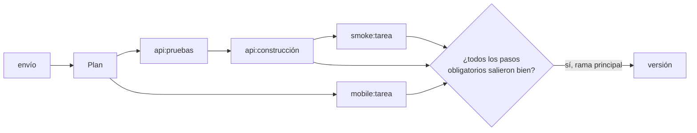
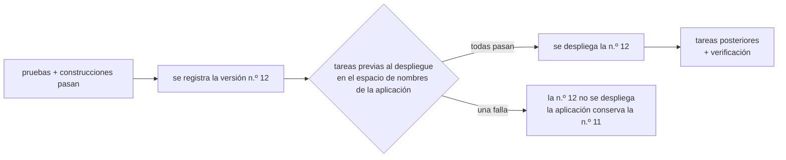

# Tareas: comandos en la integración continua

Una **tarea** es cualquier comando que usted quiera ejecutar en la integración continua junto a las pruebas y las construcciones. Por ejemplo: una construcción para celulares con EAS de Expo, una prueba rápida contra una API de pruebas, un guion que publica documentación o una notificación. Las tareas se declaran bajo `tasks:` en `rendimiento.yaml`, y cada una se ejecuta como un paso de la ejecución, con su propio pod, su registro y su estado.

```yaml
services:
  - name: api
    path: api

tasks:
  - name: mobile                          # una etiqueta DNS, única entre servicios, tareas programadas y tareas
    image: node:20-bookworm               # cualquier imagen con las herramientas que el comando necesita
    path: mobile                          # carpeta de trabajo; también lo que cuenta como cambio
    command: npx --yes eas-cli build --platform all --non-interactive --no-wait
    secretEnv: { EXPO_TOKEN: expo/token } # una variable tomada de la clave de un secreto

  - name: smoke
    image: curlimages/curl:8.10.1
    command: curl -fsS https://api.shop.joserod.space/health
    after: [api]                          # esperar a la construcción de api (o a otra tarea)
    when: always                          # también en ramas y solicitudes de incorporación
    optional: true                        # si falla, la ejecución no falla
```

## Cómo se ejecuta una tarea {#how-a-task-runs}



1. La confirmación se clona en el pod, exactamente igual que para las pruebas y las construcciones.
2. El comando se ejecuta con `sh -c` en `image`, desde `path`.
3. Su salida aparece en la página de la ejecución como la de cualquier otro paso.
4. Al terminar, se eliminan el pod y su secreto temporal, pase lo que pase.

El entorno de la tarea:

| Variable | Valor |
|---|---|
| `CI` | `true` |
| `GIT_SHA`, `GIT_BRANCH` | la confirmación y la rama que se ejecutan |
| `RENDIMIENTO_APP` | el nombre de la aplicación (también su espacio de nombres) |
| sus `env:` | tal como los escribió |
| sus `secrets:` y `secretEnv:` | leídos de los secretos de la aplicación cuando empieza el paso |

## Cuándo se ejecutan las tareas {#when-tasks-run}

| Situación | Qué pasa |
|---|---|
| Envío a la rama principal | Se ejecuta, a menos que no haya cambiado nada en su `path` ni en `watch:` desde la última versión. |
| Envío a otra rama, o una solicitud de incorporación | Solo se ejecuta con `when: always`. El valor predeterminado, `when: deploy`, mantiene los secretos lejos del código sin integrar. |
| Botón **Construir ahora**, o un cambio en `rendimiento.yaml` | Se ejecuta (ante la duda, "se ejecuta todo"). |
| Falló un servicio al que espera (`after:`) | Se omite. |
| Un servicio al que espera se reutilizó (no cambió) | Se ejecuta sin esperar. |

Una tarea en la raíz del repositorio (`path: .`, el valor predeterminado) cuenta cualquier cambio, así que se ejecuta en cada envío. Dele a una tarea su propio `path` (y `watch:` para las carpetas compartidas) para que solo se ejecute cuando cambió algo relevante. Una construcción para celulares que solo corre cuando cambia `mobile/` ahorra tiempo y créditos de construcción de EAS.

## Éxito y versiones {#success-and-releases}

- Una tarea **obligatoria** que falla hace fallar la ejecución, y **no se publica nada**. Es lo que usted quiere en comprobaciones como un ensayo de una migración, o una prueba rápida de algo de lo que depende la versión.
- Una tarea **opcional** (`optional: true`) aparece como fallida en la página de la ejecución, pero la ejecución sale bien de todos modos y se publica.
- Las tareas nunca producen imágenes, así que no cambian lo que contiene una versión.

## Secretos {#secrets}

Defina los valores en la página **Configuración → Secretos** de la aplicación. Los secretos que nombran las tareas aparecen ahí junto a los de los servicios.

- `secrets: [nombre]` carga cada clave del secreto que sea un nombre de variable válido, como `envFrom`.
- `secretEnv: { VAR: secreto/clave }` define una variable. Tiene prioridad sobre un secreto completo.

Cuando empieza el paso, los valores se copian del espacio de nombres de la aplicación al secreto propio y de corta vida del paso. El pod nunca obtiene acceso al espacio de nombres de la aplicación, y la copia se elimina junto con el pod.

Los valores que aparecen en el registro se reemplazan con `***`. Es una red de seguridad, no una garantía: un valor impreso en partes, codificado o transformado no se detecta. No imprima secretos.

## Recursos y tiempo {#resources-and-time}

| Campo | Predeterminado | Qué significa |
|---|---|---|
| `size` | `medium` | Tamaños predefinidos `small`, `medium` o `large` (medium: 100m de CPU / 256Mi, hasta 1 CPU / 512Mi). |
| `resources` | | Sobrescribir valores sueltos, como en los servicios. |
| `timeout` | el `STEP_TIMEOUT` de la plataforma (45 min) | Segundos; solo puede ser menor que el de la plataforma. |

## A qué puede llegar una tarea {#what-a-task-can-reach}

Los pods de las tareas tienen las mismas [protecciones](../architecture/pipeline.md#guard-rails-on-build-pods) que las construcciones. Pueden llegar a **internet** (npm, Expo, GitHub, cualquier API pública), pero **no** al clúster, a otras aplicaciones, a las bases de datos ni a su red doméstica. Así que:

- **Funciona:** las construcciones de EAS (corren en los servidores de Expo), las llamadas a API públicas y a sus sitios públicos, publicar paquetes, las notificaciones.
- **Todavía no funciona:** las migraciones contra el propio Postgres de la aplicación, o llamar a un servicio que solo se alcanza dentro del clúster. Para eso hace falta una tarea *posterior al despliegue* que corra en el espacio de nombres de la aplicación, que está en la [hoja de ruta](../future/roadmap.md).

## Tareas previas al despliegue {#pre-deploy-tasks}

Una tarea con **`stage: pre-deploy`** se ejecuta después de construir las imágenes pero **antes del despliegue**. Es el lugar para las migraciones de la base de datos: el esquema cambia antes de que cualquier código nuevo atienda tráfico.

```yaml
tasks:
  - name: migrate
    stage: pre-deploy
    service: api                 # la imagen NUEVA de api, con el entorno de la api en ejecución
    command: python manage.py migrate --noinput
```



- **Dónde:** una tarea de Kubernetes (Job) en el espacio de nombres de la aplicación, igual que las tareas posteriores al despliegue. Con `service:`, ejecuta la imagen **nueva** del servicio con el entorno del Deployment **que está en ejecución** (su `DATABASE_URL`, sus secretos, sus `needs:`).
- **Cuando falla:** la versión se registra pero **no se despliega**. Aparece como *Sin desplegar* con el motivo, la ejecución falla y usted recibe un correo ("versión sin desplegar"). La aplicación sigue ejecutando su versión actual, así que no hay nada que deshacer. No se puede revertir a una versión bloqueada, porque su migración nunca salió bien.
- **La primera versión:** el entorno de la aplicación (espacio de nombres, base de datos, secretos) no existe antes de ella, así que las tareas previas se omiten con una nota y se ejecutan a partir de la segunda versión. Haga que las migraciones se puedan volver a ejecutar sin problema (casi todas las herramientas de migración lo permiten).
- **El orden:** `after:` se refiere a otras tareas previas al despliegue. `optional: true` solo reporta la falla, y la versión se despliega de todos modos.

## Tareas posteriores al despliegue {#post-deploy-tasks}

Una tarea con **`stage: post-deploy`** se ejecuta *después* de que la versión está en vivo, contra la versión nueva, como parte de la [verificación de versiones](reliability.md#verifying-each-release):

```yaml
tasks:
  - name: migrate
    stage: post-deploy
    service: api                 # la imagen y el entorno nuevos de api (DATABASE_URL de needs…)
    command: python manage.py migrate --noinput

  - name: smoke
    stage: post-deploy
    image: curlimages/curl:8.10.1
    command: curl -fsS http://web/api/health && curl -fsS http://web/api/products | grep -q items
    after: [migrate]             # las tareas posteriores solo se esperan entre sí

  - name: report
    stage: post-deploy
    image: curlimages/curl:8.10.1
    command: ./notify-slack.sh
    optional: true               # una falla se reporta, nunca se revierte
```

- **Dónde:** una tarea de Kubernetes (Job) en **el espacio de nombres de la aplicación**, así que llega a los servicios de la aplicación por su nombre (`http://web`) y a sus bases de datos. *No* corre en el espacio de nombres aislado de construcción.
- **Qué imagen:** `image:` ejecuta esa imagen. `service:` ejecuta **la imagen en vivo de ese servicio con su entorno**: variables, secretos, direcciones de `needs:` y archivos secretos, copiados del Deployment que el controlador acaba de aplicar. Es justo lo que necesita una migración. El volumen de datos del servicio no se monta, porque le pertenece al pod en ejecución.
- **Cuándo:** en cuanto la versión se despliega sana, junto con la ventana de verificación. Las tareas sin `after:` empiezan juntas; una tarea cuyo `after:` falló **se omite**.
- **Qué hace una falla:** una tarea obligatoria que falla (código de salida distinto de cero, o `timeout`, de 10 minutos de forma predeterminada) **no supera la verificación, y la versión se revierte** a la última correcta. El correo de la reversión nombra la tarea y sus últimas líneas. Una tarea `optional: true` que falla solo se reporta.
- **Qué más reciben:** `RENDIMIENTO_APP`, `RENDIMIENTO_RELEASE` y `GIT_SHA`, además de sus `env`, `secrets` y `secretEnv` (leídos directamente del espacio de nombres de la aplicación).
- **Dónde se ven:** bajo cada versión en la pestaña **Versiones**, con su estado, su duración, el motivo de la falla y un botón **Registro**. Las tareas se borran solas después de un día; el registro se queda con la versión (sus últimos 256 KiB).

!!! tip "Las migraciones van antes del despliegue"
    Una migración posterior al despliegue se ejecuta cuando los pods de la versión nueva ya están atendiendo. Use [`stage: pre-deploy`](#pre-deploy-tasks) para las migraciones, y deje las tareas posteriores para las pruebas rápidas y las comprobaciones de la versión en vivo. De cualquier forma, una reversión no deshace una migración, así que escriba migraciones con las que la versión anterior también pueda vivir: agregue antes de quitar, el patrón de "expandir y contraer".

Cuando la verificación está desactivada (`VERIFY_WINDOW=0` o `verify.disabled`), las tareas posteriores igual se ejecutan en cuanto el despliegue está sano, y sus resultados se registran, pero no se revierte nada.

## Recetas {#recipes}

**Construcción de Expo / EAS en cada cambio de la aplicación móvil:**

1. Cree un token de acceso en expo.dev (Account settings → Access tokens).
2. Agregue la tarea de arriba a `rendimiento.yaml` e intégrela.
3. En **Configuración → Secretos** de la aplicación, defina el secreto `expo` con la clave `token`.

`--no-wait` le entrega la construcción a Expo y termina el paso de inmediato. Sígala en expo.dev. Quite `--no-wait` para esperar el resultado, y suba `timeout` si hace falta.

**Prueba rápida después de cada construcción de despliegue:**

```yaml
tasks:
  - name: smoke
    image: curlimages/curl:8.10.1
    command: curl -fsS --retry 5 --retry-delay 3 https://shop.joserod.space/api/health
    after: [api]
    optional: true
```

Esto comprueba la versión *desplegada en ese momento*: las tareas corren antes de la versión de su propia ejecución. Para comprobar la versión nueva cuando ya está en vivo hacen falta las tareas posteriores al despliegue.

## Referencia {#reference}

La tabla de campos está en la [referencia de `rendimiento.yaml`](spec.md#tasks). El código es `spec.Task` (campos, valores predeterminados, validación), `pipeline.Plan` (pasos y dependencias de `after:`), `KubeExecutor.taskSecrets` y `maskSecrets` (`internal/pipeline/task.go`), y `skippedTasks` en `internal/platform/platform.go` (cuándo se omiten las tareas).
