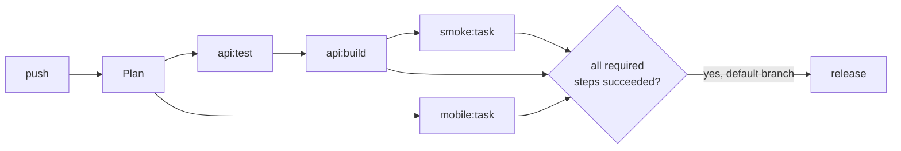

# Tasks: commands in CI

A **task** is any command you want to run in CI next to the tests and builds. For example: a mobile build with Expo's EAS, a smoke test against a staging API, a script that publishes docs, or a notification. Tasks are declared under `tasks:` in `rendimiento.yaml`, and each one runs as a step of the run, with its own pod, log and status.

```yaml
services:
  - name: api
    path: api

tasks:
  - name: mobile                          # a DNS label, unique among services, jobs and tasks
    image: node:20-bookworm               # any image with the tools the command needs
    path: mobile                          # working directory; also what counts as a change
    command: npx --yes eas-cli build --platform all --non-interactive --no-wait
    secretEnv: { EXPO_TOKEN: expo/token } # one variable from a secret key

  - name: smoke
    image: curlimages/curl:8.10.1
    command: curl -fsS https://api.shop.joserod.space/health
    after: [api]                          # wait for the api's build (or another task)
    when: always                          # also on branches and pull requests
    optional: true                        # a failure doesn't fail the run
```

## How a task runs



1. The commit is cloned into the pod, exactly as for tests and builds.
2. The command runs with `sh -c` in `image`, from `path`.
3. Its output streams into the run page like any other step.
4. The pod and its temporary secret are deleted afterwards, whatever happened.

The task's environment:

| Variable | Value |
|---|---|
| `CI` | `true` |
| `GIT_SHA`, `GIT_BRANCH` | the commit and branch being run |
| `RENDIMIENTO_APP` | the app's name (also its namespace) |
| your `env:` | as written |
| your `secrets:` and `secretEnv:` | read from the app's secrets when the step starts |

## When tasks run

| Situation | What happens |
|---|---|
| Push to the default branch | Runs, unless nothing under its `path` or `watch:` changed since the last release. |
| Push to another branch, or a pull request | Runs only with `when: always`. The default, `when: deploy`, keeps secrets away from unmerged code. |
| **Run** button, or a change to `rendimiento.yaml` | Runs (anything uncertain means "run everything"). |
| A service it waits for (`after:`) failed | Skipped. |
| A service it waits for was reused (unchanged) | Runs without waiting. |

A task at the repository root (`path: .`, the default) counts every change, so it runs on every push. Give a task its own `path` (and `watch:` for shared folders) so it only runs when something relevant changed. A mobile build that runs only when `mobile/` changes saves both time and EAS build credits.

## Success and releases

- A **required** task that fails fails the run, and **nothing is released**. That's what you want for checks such as a migration dry run, or a smoke test of something the release depends on.
- An **optional** task (`optional: true`) shows as failed on the run page, but the run still succeeds and releases.
- Tasks never produce images, so they don't change what a release contains.

## Secrets

Set the values on the app's **Settings → Secrets** page. The secrets tasks name appear there alongside the services' secrets.

- `secrets: [name]` loads every key of the secret that is a valid variable name, like `envFrom`.
- `secretEnv: { VAR: secret/key }` sets one variable. It wins over a whole secret.

When the step starts, the values are copied from the app's namespace into the step's own short-lived secret. The pod never gets access to the app's namespace, and the copy is deleted with the pod.

Values that appear in the log are replaced with `***`. That's a safety net, not a guarantee: a value printed in pieces, encoded or transformed is not caught. Don't print secrets.

## Resources and time

| Field | Default | Meaning |
|---|---|---|
| `size` | `medium` | `small`, `medium` or `large` presets (medium: 100m CPU / 256Mi, up to 1 CPU / 512Mi). |
| `resources` | | Override single values, as for services. |
| `timeout` | the platform's `STEP_TIMEOUT` (45 min) | Seconds; can only be shorter than the platform's. |

## What a task can reach

Task pods run under the same [guard rails](../architecture/pipeline.md#guard-rails-on-build-pods) as builds. They can reach the **public internet** (npm, Expo, GitHub, any public API), but **not** the cluster, other apps, databases, or your home network. So:

- **Works:** EAS builds (they run on Expo's servers), calls to public APIs and your public sites, publishing packages, notifications.
- **Doesn't work yet:** database migrations against the app's own Postgres, or calling a service only reachable inside the cluster. That needs a *post-deploy* task running in the app's namespace, which is on the [roadmap](../future/roadmap.md).

## Recipes

**Expo / EAS build on every mobile change:**

1. Create an access token at expo.dev (Account settings → Access tokens).
2. Add the task above to `rendimiento.yaml` and merge it.
3. On the app's **Settings → Secrets**, set secret `expo` with key `token`.

`--no-wait` hands the build to Expo and finishes the step right away. Follow it on expo.dev. Leave `--no-wait` out to wait for the result, and raise `timeout` if needed.

**Smoke test after each deploy build:**

```yaml
tasks:
  - name: smoke
    image: curlimages/curl:8.10.1
    command: curl -fsS --retry 5 --retry-delay 3 https://shop.joserod.space/api/health
    after: [api]
    optional: true
```

This checks the *currently deployed* version: tasks run before the release of their own run. A check of the new version after it's live needs post-deploy tasks.

## Reference

The field table is in the [`rendimiento.yaml` reference](spec.md#tasks). The code is `spec.Task` (fields, defaults, validation), `pipeline.Plan` (steps and `after:` dependencies), `KubeExecutor.taskSecrets` and `maskSecrets` (`internal/pipeline/task.go`), and `skippedTasks` in `internal/platform/platform.go` (when tasks are skipped).
