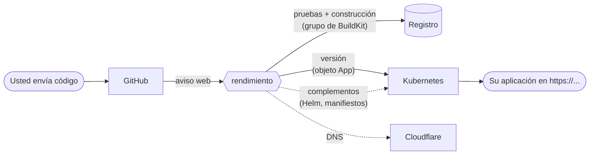

---
hide:
  - navigation
---

# El libro de rendimiento

**rendimiento** es una plataforma de despliegue para un clúster de Kubernetes. Usted conecta un repositorio de GitHub, rendimiento descubre cómo construirlo, y cada envío se convierte en una imagen probada y en una aplicación en ejecución, actualizada, con una dirección HTTPS pública. Lo que antes requería Jenkins, ArgoCD, manifiestos escritos a mano, registros DNS y una docena de pasos manuales por aplicación ahora es un solo botón.

Funciona en un pequeño laboratorio casero, pero está hecho como un producto: un solo programa en Go, una interfaz en React, una base de datos Postgres y recursos personalizados de Kubernetes, con pruebas, una arquitectura clara y espacio para crecer.

Este libro lo explica **todo**: qué hace cada parte y por qué se construyó así, cómo se despliega en este entorno, cómo cambiarlo con seguridad y cómo puede convertirse en un proyecto de código abierto listo para producción.

## Cómo leerlo

-   :material-compass-outline: **¿Es nuevo aquí?**

    Empiece por [Por qué existe rendimiento](start/vision.md), luego [Conceptos](start/concepts.md) y el [recorrido por la interfaz](start/tour.md). En cuarenta minutos sabrá qué es cada cosa.

-   :material-server-network: **¿Lo administra?**

    [Su entorno](environment/index.md) describe cómo se despliega la plataforma misma. La descripción de un clúster en particular y sus procedimientos de operación se guardan en un repositorio privado.

-   :material-graph-outline: **¿Quiere entenderlo?**

    [Arquitectura](architecture/index.md) recorre cada subsistema con diagramas: integración continua, BuildKit, los controladores, los complementos, los datos y la seguridad.

-   :material-code-braces: **¿Va a cambiarlo?**

    [Desarrollo](develop/index.md) cubre Go para este código, el ciclo de construcción y pruebas, recetas para cambios comunes y los patrones de diseño que se usan.

-   :material-rocket-launch-outline: **¿Quiere hacerlo crecer?**

    [Crecimiento](future/index.md) cubre cómo escalar, la hoja de ruta y lo que hace falta para convertirse en un proyecto de código abierto al que otros contribuyan.

-   :material-book-open-variant: **¿Busca algo en particular?**

    La [referencia](reference/index.md) enumera cada ajuste, ruta de la API y campo de los recursos personalizados y, generado a partir del código, cada archivo y función en el [mapa del código](reference/code-map.md).

## Lo que hace, en una página

| Usted quiere… | rendimiento… | Lea |
|---|---|---|
| Desplegar un repositorio | detecta las tecnologías, propone un `rendimiento.yaml`, abre una solicitud de incorporación, construye, despliega, y crea el registro DNS y el certificado | [Aplicaciones](guide/apps.md) |
| Publicar un cambio | construye solo lo que cambió, ejecuta las pruebas, marca la confirmación en GitHub y despliega sin interrupciones | [Construcciones](guide/builds.md) |
| Deshacer una versión | revierte a cualquier versión anterior (las imágenes quedan fijadas por su huella) | [Aplicaciones](guide/apps.md#rollback) |
| Usar una base de datos | `needs: [postgres]` ejecuta una para la aplicación e inyecta `DATABASE_URL` | [Necesidades](guide/needs.md) |
| Llamar a otro servicio | la [pestaña Servicios](guide/needs.md#the-services-catalog) muestra cada servicio, su dirección y un fragmento listo para pegar | [Necesidades](guide/needs.md) |
| Instalar programas en el clúster | la pestaña Complementos instala paquetes de Helm o manifiestos desde git, muestra cada cambio antes de aplicarlo y puede asumir el control de lo que ya está en ejecución | [Complementos](guide/addons.md) |
| Mantener las dependencias al día | el complemento Renovate abre solicitudes de actualización que rendimiento construye y comprueba | [Renovate](guide/renovate.md) |
| Saber si el clúster está sano | la pestaña Entorno comprueba cada dependencia y cada nodo | [Recorrido](start/tour.md#environment) |

!!! note "Este libro es parte del código"
    Vive en [`docs/`](https://github.com/p0dxD/rendimiento.ai/tree/main/docs) del repositorio y lo despliega rendimiento mismo, a partir de su propio `rendimiento.yaml`, en la red doméstica (su dirección está en la página Servicios). Si cambia el código, cambie el libro en la misma solicitud de incorporación. El [mapa del código](reference/code-map.md) se vuelve a generar a partir del código en cada construcción, así que nunca está desactualizado.
