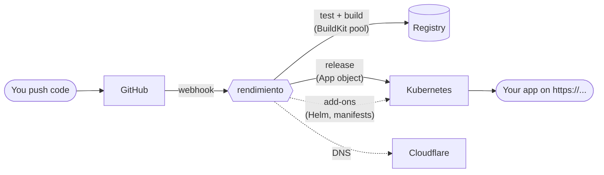

---
hide:
  - navigation
---

# The rendimiento book

**rendimiento** is a deployment platform for a Kubernetes cluster. You connect a GitHub repository, it works out how to build it, and every push becomes a tested image and a running, updated application with a public HTTPS address. What used to take Jenkins, ArgoCD, hand-written manifests, DNS records and a dozen manual steps per app is now one button.

It runs on a home lab of Raspberry Pis and a Jetson, but it is built like a product: one Go binary, a React UI, a Postgres database and Kubernetes custom resources, with tests, a clear architecture and room to grow.

This book explains **all of it**: what every part does and why it was built that way, how it is deployed in this environment, how to change it safely, and how it can become a production-grade, open-source project.

## How to read it

-   :material-compass-outline: **New here?**

    Start with [Why rendimiento exists](start/vision.md), then [Concepts](start/concepts.md) and the [UI tour](start/tour.md). Forty minutes and you know what everything is.

-   :material-server-network: **Running it?**

    [Your environment](environment/index.md) describes how the platform itself is deployed. The description of one particular cluster and its runbooks are kept in a private repository.

-   :material-graph-outline: **Understanding it?**

    [Architecture](architecture/index.md) walks through every subsystem with diagrams: CI, BuildKit, the controllers, add-ons, data and security.

-   :material-code-braces: **Changing it?**

    [Developing it](develop/index.md) covers Go for this codebase, the build and test loop, recipes for common changes, and the design patterns in use.

-   :material-rocket-launch-outline: **Growing it?**

    [Growing it](future/index.md) covers scaling, the roadmap and what it takes to become an open-source project others contribute to.

-   :material-book-open-variant: **Looking something up?**

    The [reference](reference/index.md) lists every setting, API route, custom resource field and, generated from the source, every file and function in the [code map](reference/code-map.md).

## What it does, in one page

| You want to… | rendimiento… | Read |
|---|---|---|
| Deploy a repo | detects the stack, proposes a `rendimiento.yaml`, opens a PR, builds, deploys, creates DNS and a certificate | [Apps](guide/apps.md) |
| Ship a change | builds only what changed, runs tests, checks the commit on GitHub, rolls out with zero downtime | [Builds](guide/builds.md) |
| Undo a release | rolls back to any earlier release (images are pinned by digest) | [Apps](guide/apps.md#rollback) |
| Use a database | `needs: [postgres]` runs one for the app and injects `DATABASE_URL` | [Needs](guide/needs.md) |
| Call another service | the [Services tab](guide/needs.md#the-services-catalog) shows every service, its address and a snippet to paste | [Needs](guide/needs.md) |
| Install cluster software | the Add-ons tab installs Helm charts or manifests from git, previews every change, and can adopt what is already running | [Add-ons](guide/addons.md) |
| Keep dependencies fresh | the Renovate add-on opens update PRs that rendimiento builds and checks | [Renovate](guide/renovate.md) |
| Know if the cluster is healthy | the Environment tab checks every dependency and node | [Tour](start/tour.md#environment) |

!!! note "This book is part of the code"
    It lives in [`docs/`](https://github.com/p0dxD/rendimiento.ai/tree/main/docs) of the repository and is deployed by rendimiento itself, from its own `rendimiento.yaml`, on the home network (its address is in the Services page). Change the code, change the book in the same pull request. The [code map](reference/code-map.md) is regenerated from the source on every build, so it is never out of date.
