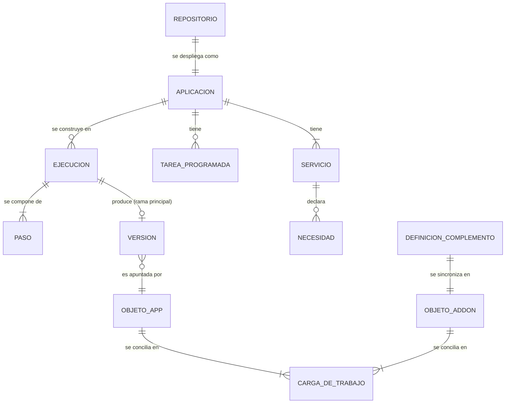

# Conceptos y vocabulario

rendimiento tiene un vocabulario pequeño. Una vez claras estas palabras, cualquier otro capítulo se lee con facilidad.

## Las aplicaciones y de qué están hechas {#apps-and-what-they-are-made-of}

**Aplicación**
:   Una aplicación desplegada, creada al incorporar un repositorio de GitHub. Tiene un nombre (que también es su espacio de nombres en Kubernetes), un repositorio, la instalación de la aplicación de GitHub que puede leerlo y una rama principal. Una aplicación existe en dos lugares: una fila en la base de datos de la plataforma (historial, ejecuciones, versiones) y un objeto `App` en Kubernetes (lo que debería estar en ejecución). Vea [Datos y estado](../architecture/data.md).

**`rendimiento.yaml`**
:   El único archivo que necesita el repositorio de una aplicación. Enumera los **servicios** de la aplicación (y, si quiere, sus **tareas programadas**) y cómo ejecutarlos. El asistente lo genera; usted lo edita como cualquier otro código, y los cambios se despliegan al integrarlos. Su tipo en Go es `spec.Spec`. [Referencia completa](../guide/spec.md).

**Servicio**
:   Una parte desplegable de una aplicación: se construye a partir de una carpeta del repositorio (o de una imagen lista para usar, como `postgres:17-alpine`), se ejecuta como un Deployment de Kubernetes con su Service y, si quiere, recibe un **dominio** público (con DNS y certificado), **rutas**, un **volumen**, **secretos**, una **comprobación de estado**, una **GPU**, una dirección en la **red local** y **necesidades**.

**Tarea programada**
:   Una tarea que se ejecuta según un horario (una CronJob de Kubernetes), por ejemplo una extracción de datos cada noche. Usa la imagen de un servicio, su propia carpeta o una imagen lista para usar.

**Necesidad**
:   Algo de lo que depende un servicio y que rendimiento provee y conecta: `postgres` (una base de datos para la aplicación, `DATABASE_URL`), `redis` (una caché, `REDIS_URL`) o `{service: espacio/nombre}` (la dirección de otro servicio). [Necesidades](../guide/needs.md).

## De un envío a código en ejecución {#from-a-push-to-running-code}

**Ejecución**
:   Una ejecución de integración continua para una confirmación de una aplicación. Un envío a la rama principal produce una ejecución de *despliegue*; un envío a otra rama produce una ejecución que solo construye y reporta una comprobación en GitHub. Una ejecución se compone de pasos.

**Paso**
:   Una unidad de trabajo de integración continua, ejecutada como un pod: un paso de **pruebas** (un comando en un contenedor, por ejemplo `pytest`) o un paso de **construcción** (una imagen construida por BuildKit y enviada al registro). Los pasos de distintos servicios corren en paralelo; la construcción de un servicio espera a sus pruebas.

**Detección de cambios** y **reutilización**
:   En un envío a la rama principal, los servicios cuyas carpetas no cambiaron conservan la imagen de la última versión; sus pasos aparecen como *reutilizados*.

**Versión**
:   El resultado de una ejecución de despliegue correcta: para cada servicio, la imagen **por su huella** (`registro/app-web@sha256:…`), más la especificación de esa confirmación. Las versiones se numeran por aplicación. Una **reversión** crea una versión nueva con las imágenes y la especificación de una versión anterior.

**Objeto `App`**
:   El recurso personalizado de Kubernetes (`apps.rendimiento.ai`) que guarda lo que debería ejecutarse: los servicios, las tareas programadas y las imágenes publicadas. La plataforma lo escribe; el **controlador de aplicaciones** lo lee.

**Conciliar**
:   Lo que hace un controlador una y otra vez: comparar lo que *debería* existir con lo que *existe*, y hacer que la diferencia desaparezca. Por eso vuelve un Deployment borrado, y así es como una versión se convierte en pods. [El controlador de aplicaciones](../architecture/controller.md).

**Adoptar** (asumir el control)
:   Poner bajo la administración de rendimiento, en su lugar, algo que ya está en ejecución (desplegado con ArgoCD, Helm o `kubectl`), sin volver a crearlo ni cortar el tráfico. **Espacio de nombres compartido** significa que rendimiento ejecuta sus servicios en un espacio de nombres que pertenece a otra cosa, sin crear, etiquetar ni borrar nunca ese espacio de nombres.

**Desconectar**
:   Dejar de administrar una aplicación sin detener nada de lo que está en ejecución. **Eliminar** la quita junto con todo lo que ejecuta.

## Alrededor de las aplicaciones {#around-the-apps}

**Instalación**
:   La aplicación de GitHub instalada en una cuenta. Le da a rendimiento avisos web de cada repositorio y tokens de corta vida para leerlos, abrir solicitudes de incorporación y reportar comprobaciones.

**Comprobación**
:   El estado que rendimiento reporta en cada confirmación y solicitud de incorporación en GitHub (la ✓ o la ✗ junto a una confirmación).

**Complemento**
:   Programas que rendimiento instala y mantiene sincronizados para el clúster. Los **complementos instalados** son paquetes de Helm o carpetas de manifiestos (Longhorn, umami, el grupo de BuildKit…), cada uno definido por un archivo en `p0dxD/gitops/addons/` y representado en Kubernetes por un objeto `Addon` (`kubectl get radd`). Los **complementos integrados** son funciones de la propia plataforma; hoy es Renovate. [Complementos](../guide/addons.md).

**Vista previa**
:   Antes de que un complemento cambie algo, cada objeto se prueba en seco contra el clúster y se compara: qué se crearía, qué se actualizaría y qué se eliminaría.

**Sincronización manual**
:   Un modo de complemento en el que los cambios esperan a que usted revise la vista previa y presione Sincronizar (se usa con Longhorn).

**Gancho de Helm**
:   Una tarea que un paquete ejecuta en un momento de su vida (antes de una actualización, antes de eliminarse…). rendimiento los ejecuta igual que Helm.

**Catálogo de servicios**
:   Cada Service del clúster, agrupado por lo que hace (bases de datos, inteligencia artificial, almacenamiento…), con su origen, lo que expone, cómo conectarse y quién ya lo llama. [Necesidades y el catálogo](../guide/needs.md#the-services-catalog).

**Entorno**
:   La salud de todo aquello de lo que depende rendimiento (clúster, entrada, certificados, almacenamiento, BuildKit, registro, DNS, GitHub), con soluciones para lo que falte.

## Dónde se ejecuta cada cosa {#where-things-run}

**Grupo de BuildKit**
:   Los constructores de imágenes: un demonio de BuildKit por cada nodo trabajador. Cada imagen siempre se construye en el mismo demonio, así su caché se mantiene caliente. [Construir imágenes](../architecture/builds.md).

**Railpack**
:   El constructor para los servicios sin Dockerfile: detecta el lenguaje y construye directamente desde el código fuente.

**El espacio de nombres de construcción** (`rendimiento-builds`)
:   Donde corren los pods de integración continua: sin credenciales de Kubernetes, sin acceso al clúster ni a la red local, solo a internet (para las dependencias) y a BuildKit.

**El espacio de nombres de la plataforma** (`rendimiento-system`)
:   Donde se ejecutan rendimiento y su Postgres.
