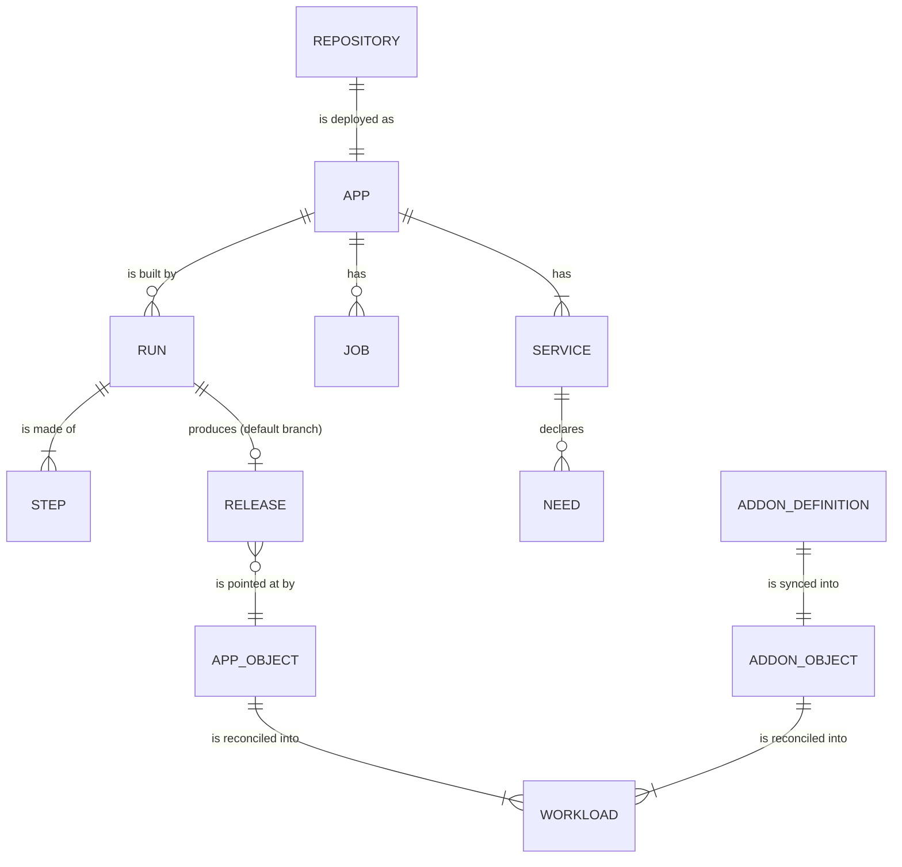

# Concepts and vocabulary

rendimiento has a small vocabulary. Once these words are clear, every other chapter reads easily.

## Apps and what they are made of

**App**
:   One deployed application, created by onboarding a GitHub repository. It has a name (also its Kubernetes namespace), a repository, the GitHub App installation that can read it, and a default branch. An app exists in two places: a row in the platform database (history, runs, releases) and an `App` object in Kubernetes (what should be running). See [Data and state](../architecture/data.md).

**`rendimiento.yaml`**
:   The only file an app's repository needs. It lists the app's **services** (and optionally **jobs**) and how to run them. The wizard generates it; you edit it like any other code, and changes deploy on merge. Its Go type is `spec.Spec`. [Full reference](../guide/spec.md).

**Service**
:   One deployable part of an app: built from a folder of the repository (or a ready-made image such as `postgres:17-alpine`), run as a Kubernetes Deployment with a Service, and optionally given a public **domain** (with DNS and a certificate), **routes**, a **volume**, **secrets**, a **health** check, a **GPU**, a **LAN** address, and **needs**.

**Job**
:   A scheduled task (a Kubernetes CronJob), for example a nightly scraper. It uses a service's image, its own folder, or a ready-made image.

**Need**
:   Something a service depends on, which rendimiento provides and wires in: `postgres` (a database for the app, `DATABASE_URL`), `redis` (a cache, `REDIS_URL`) or `{service: namespace/name}` (another service's address). [Needs](../guide/needs.md).

## From a push to running code

**Run**
:   One CI execution for one commit of an app. A push to the default branch makes a *deploy* run; a push to another branch makes a run that only builds and reports a check on GitHub. A run is made of steps.

**Step**
:   One unit of CI work, run as a pod: a **test** step (a command in a container, e.g. `pytest`) or a **build** step (an image built by BuildKit and pushed to the registry). Steps of different services run in parallel; a service's build waits for its test.

**Change detection** and **reuse**
:   On a push to the default branch, services whose folders did not change keep the image from the last release; their steps show as *reused*.

**Release**
:   The result of a successful deploy run: for every service, the image **by digest** (`registry/app-web@sha256:…`), plus the spec at that commit. Releases are numbered per app. A **rollback** creates a new release with an earlier release's images and spec.

**`App` object**
:   The Kubernetes custom resource (`apps.rendimiento.ai`) holding what should run: the services, jobs and the released images. The platform writes it; the **app controller** reads it.

**Reconcile**
:   What a controller does, over and over: compare what *should* exist with what *does*, and make the difference go away. It is why a deleted Deployment comes back, and how a release becomes pods. [The app controller](../architecture/controller.md).

**Adopt** (take over)
:   Bring something already running (deployed by ArgoCD, Helm or `kubectl`) under rendimiento's management in place, without recreating it or dropping traffic. **Shared namespace** means rendimiento runs its services in a namespace something else owns, without ever creating, labelling or deleting that namespace.

**Disconnect**
:   Stop managing an app while leaving everything running. **Delete** removes it and what it runs.

## Around the apps

**Installation**
:   The GitHub App installed on an account. It gives rendimiento webhooks for every repository and short-lived tokens to read them, open PRs and report checks.

**Check run**
:   The status rendimiento reports on each commit and pull request in GitHub (the ✓ or ✗ next to a commit).

**Add-on**
:   Software rendimiento installs and keeps in sync for the cluster. **Installed add-ons** are Helm charts or folders of manifests (Longhorn, umami, the BuildKit pool…), each defined by a file in `p0dxD/gitops/addons/` and represented in Kubernetes by an `Addon` object (`kubectl get radd`). **Built-in add-ons** are features of the platform itself; today that is Renovate. [Add-ons](../guide/addons.md).

**Preview**
:   Before an add-on changes anything, every object is dry-run against the cluster and diffed: what would be created, updated or deleted.

**Manual sync**
:   An add-on mode where changes wait until you review the preview and press Sync (used for Longhorn).

**Helm hook**
:   A job a chart runs at a moment of its life (before an upgrade, before deletion…). rendimiento runs them the way Helm does.

**Services catalog**
:   Every Service in the cluster, grouped by what it does (databases, AI, storage…), with where it comes from, what it exposes, how to connect and who already calls it. [Needs and the catalog](../guide/needs.md#the-services-catalog).

**Environment**
:   The health of everything rendimiento depends on (cluster, ingress, certificates, storage, BuildKit, registry, DNS, GitHub), with fixes for what is missing.

## Where things run

**BuildKit pool**
:   The image builders: one BuildKit daemon per worker node. Each image always builds on the same daemon, so its cache stays warm. [Building images](../architecture/builds.md).

**Railpack**
:   The builder for services without a Dockerfile: it detects the language and builds straight from source.

**The build namespace** (`rendimiento-builds`)
:   Where CI pods run: no Kubernetes credentials, no access to the cluster or the LAN, only the internet (for dependencies) and BuildKit.

**The platform namespace** (`rendimiento-system`)
:   Where rendimiento itself and its Postgres run.
