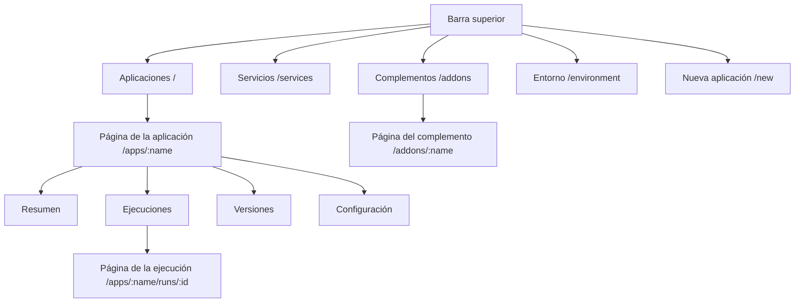

# Un recorrido por la interfaz

El panel está en **https://rendimiento.joserod.space**. Se entra con GitHub; solo las cuentas que aparecen en `ALLOWED_USERS` pueden pasar. La barra superior tiene cinco lugares: **Aplicaciones**, **Servicios**, **Complementos**, **Entorno** y el botón **Nueva aplicación**.

## Aplicaciones {#apps}

La página de inicio enumera cada aplicación con su fase (*Saludable*, *En curso*, *Degradado*, *Esperando la primera construcción*…), su última ejecución y sus direcciones públicas. Las fases se actualizan en vivo.

## Nueva aplicación {#new-app}

Un asistente de tres pasos:

1. **Repositorio**: cada repositorio que la aplicación de GitHub puede ver, con un filtro. Al elegir uno se ejecuta la detección sobre él.
2. **Configurar**: un formulario por cada servicio detectado: URL pública (subdominio más zona), tamaño, instancias, puerto, comprobación de estado, almacenamiento, secretos, pruebas, variables de entorno y **Necesidades** (PostgreSQL, Redis u otro servicio elegido del catálogo; vienen marcadas cuando el código usa una biblioteca cliente para ellas). Si el repositorio no tiene Dockerfile, usted elige entre **construir desde el código fuente** (Railpack, lo recomendado) y **agregar un Dockerfile generado**. Si ya hay algo en ejecución en el espacio de nombres de destino (desplegado con ArgoCD o a mano), un panel de migración ofrece **asumir su control** en su lugar.
3. **Desplegar**: para un repositorio nuevo, rendimiento abre una solicitud de incorporación que agrega `rendimiento.yaml` (y un Dockerfile si eligió uno); la solicitud se construye y se comprueba, e **integrarla despliega**. Para un repositorio que ya tiene `rendimiento.yaml`, la primera construcción empieza de inmediato.

## La página de la aplicación {#the-app-page}

**Resumen**
:   Una tarjeta por servicio: réplicas listas, URL pública, estado del DNS y del certificado, y la imagen en ejecución. **Provisto para esta aplicación** muestra la base de datos y la caché de `needs:`, qué servicios las usan y cómo conectarse desde su computadora. **Actualizaciones de dependencias** es el interruptor de Renovate por aplicación. **Recursos** es un árbol en vivo de los objetos de Kubernetes (Deployments, pods, Services, Ingresses) con su salud.

**Ejecuciones**
:   Cada ejecución de integración continua: confirmación, rama, estado y duración. **Construir ahora** inicia a mano una construcción de la rama principal.

**Página de la ejecución**
:   Los pasos de la ejecución como un grafo (pruebas antes de las construcciones, servicios en paralelo), cada uno con su registro en vivo, su duración y, para las construcciones, la huella de la imagen y el demonio de BuildKit que la construyó. Los pasos reutilizados muestran de qué versión vienen.

**Versiones**
:   Cada versión con su confirmación y sus imágenes; **Revertir** a cualquiera de ellas.

**Configuración**
:   Defina los valores de los secretos que declara la aplicación (nunca van a git), y la **Zona de peligro**: *Desconectar* (dejar de administrarla y dejar todo en ejecución) o *Eliminar* (después de mostrar exactamente qué se quitaría: espacio de nombres, volúmenes, secretos).

## Servicios {#services}

Cada Service del clúster, en tres pestañas:

- **Sus aplicaciones y complementos**: lo que despliega rendimiento;
- **En otras partes del clúster**: desplegado con ArgoCD, Helm o `kubectl`;
- **Interior del clúster**: entrada, certificados, almacenamiento, integración continua.

Dentro de cada pestaña, los servicios se agrupan por lo que hacen: Bases de datos, Cachés y colas, IA, Almacenamiento, Monitoreo y analítica, Web y API, Herramientas de desarrollo, Plataforma. Los filtros y la búsqueda acotan la lista. Abra un servicio para ver **de dónde viene** (aplicación, carpeta del repositorio, imagen, aplicación de ArgoCD o instalación de Helm), **qué expone** (puertos, URL públicas, dirección en la red local, comprobación de estado, rutas), **cómo conectarse** (direcciones y un fragmento de `rendimiento.yaml` para copiar) y **quién lo usa** (encontrado en las variables de entorno de otras cargas de trabajo).

## Complementos {#add-ons}

- Una caja de búsqueda sobre todo lo de abajo.
- **Instalados**: cada complemento instalado con su fase (*Sincronizado*, *Cambios pendientes*, *Requiere revisión*, *Error*, *Suspendido*) y su origen. Al abrir uno se ve lo que cambiaría una sincronización, objeto por objeto con sus diferencias; sus ganchos de Helm y sus ejecuciones recientes; y los botones para **Sincronizar**, **Suspender**, **Editar la definición**, **Dejar de administrar** o **Desinstalar**.
- **Agregar desde el catálogo**: Longhorn, Hajimari, Uptime Kuma, CloudNativePG, *cualquier paquete de Helm* o *manifiestos desde una carpeta de git*, cada uno con un formulario corto y una caja de YAML para sobrescribir cualquier valor del paquete. Instalar confirma un archivo en el repositorio de gitops.
- **Integrados**: Renovate, con su programación, sus repositorios, su configuración y su historial de ejecuciones.

## Entorno {#environment}

Todo aquello de lo que depende rendimiento, comprobado en vivo:

- **Proveedores**: clúster, DNS (con el estado del DNS dinámico y un botón *Actualizar ahora*), código fuente (GitHub) y registro, cada uno con el proveedor en uso.
- **Requisitos**: comprobaciones agrupadas (clúster, red, TLS, construcción, integraciones), cada una *Correcto*, *Atención*, *Ausente* o *Error*, con detalles y una **solución** cuando algo está mal. Por ejemplo: el controlador de entrada, cert-manager y su emisor, las clases de almacenamiento, el grupo de BuildKit (cuántos demonios están listos), el registro, el aislamiento del espacio de nombres de construcción y la aplicación de GitHub.
- **Nodos**: uso de CPU y memoria frente a su capacidad, condiciones y roles.
- **Problemas en el clúster**: pods y certificados con fallas en cualquier parte.

## Configuración inicial {#setup}

La primerísima visita, antes de que exista una aplicación de GitHub, muestra la configuración en un clic: rendimiento le envía a GitHub el *manifiesto* de una aplicación, GitHub crea la aplicación y regresa con sus credenciales, que se guardan en un secreto de Kubernetes. Vea [Cómo se despliega la plataforma](../environment/deploy.md#the-github-app).
