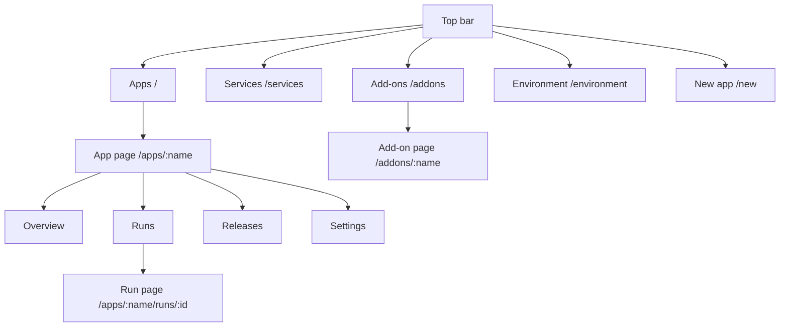

# A tour of the UI

The dashboard is at **https://rendimiento.joserod.space**. You sign in with GitHub; only accounts listed in `ALLOWED_USERS` get in. The top bar has five places: **Apps**, **Services**, **Add-ons**, **Environment**, and the **New app** button.

## Apps

The home page lists every app with its phase (*Healthy*, *Progressing*, *Degraded*, *Waiting for first build*…), its latest run and its public addresses. Phases update live.

## New app

A three-step wizard:

1. **Repository**: every repository the GitHub App can see, with a filter. Picking one runs detection on it.
2. **Configure**: one form per detected service: public URL (subdomain plus zone), size, instances, port, health check, storage, secrets, tests, environment variables and **Needs** (PostgreSQL, Redis, or another service picked from the catalog; pre-ticked when the code uses a client library for them). If the repository has no Dockerfile, you choose between **building from source** (Railpack, recommended) and **adding a generated Dockerfile**. If something is already running in the target namespace (deployed by ArgoCD or by hand), a migration panel offers to **take it over** in place.
3. **Deploy**: for a new repository, rendimiento opens a pull request adding `rendimiento.yaml` (and a Dockerfile if you chose one); the PR is built and checked, and **merging it deploys**. For a repository that already has `rendimiento.yaml`, the first build starts immediately.

## The app page

**Overview**
:   One card per service: ready replicas, public URL, DNS and certificate status, the running image. **Provided for this app** shows the database and cache from `needs:`, which services use them and how to connect from your machine. **Dependency updates** is the per-app Renovate switch. **Resources** is a live tree of the Kubernetes objects (Deployments, pods, Services, Ingresses) with their health.

**Runs**
:   Every CI run: commit, branch, status, duration. **Run** starts a build of the default branch by hand.

**Run page**
:   The run's steps as a graph (tests before builds, services in parallel), each with its live log, its duration and, for builds, the image digest and the BuildKit daemon that built it. Reused steps show which release they came from.

**Releases**
:   Every release with its commit and images; **Roll back** to any of them.

**Settings**
:   Set the values of the secrets the app declares (they never go to git), and the **Danger zone**: *Disconnect* (stop managing, leave everything running) or *Delete* (after showing exactly what would be removed: namespace, volumes, secrets).

## Services

Every Service in the cluster, in three tabs:

- **Your apps & add-ons**: what rendimiento deploys;
- **Elsewhere in the cluster**: deployed by ArgoCD, Helm or `kubectl`;
- **Cluster internals**: ingress, certificates, storage, CI.

Within each tab, services are grouped by what they do: Databases, Caches & queues, AI, Storage, Monitoring & analytics, Web & APIs, Developer tools, Platform. Filter chips and search narrow it down. Open a service to see **where it comes from** (app, repository folder, image, ArgoCD app or Helm release), **what it exposes** (ports, public URLs, LAN address, health check, endpoints), **how to connect** (addresses and a `rendimiento.yaml` snippet to copy) and **who uses it** (found from other workloads' environment variables).

## Add-ons

- A search box across everything below.
- **Installed**: each installed add-on with its phase (*In sync*, *Changes waiting*, *Review needed*, *Error*, *Suspended*) and source. Opening one shows what a sync would change, object by object with diffs; its Helm hooks and their recent runs; and buttons to **Sync**, **Suspend**, **Edit definition**, **Stop managing** or **Uninstall**.
- **Add from the catalog**: Longhorn, Hajimari, Uptime Kuma, CloudNativePG, *any Helm chart* or *manifests from a git folder*, each with a short form and a YAML box to override any chart value. Installing commits a file to the gitops repository.
- **Built in**: Renovate, with its schedule, repositories, configuration and run history.

## Environment

Everything rendimiento depends on, checked live:

- **Providers**: cluster, DNS (with the dynamic-DNS status and an *Update now* button), source (GitHub) and registry, each with the provider in use.
- **Requirements**: grouped checks (cluster, networking, TLS, build, integrations), each OK, *Attention*, *Missing* or *Error* with details and a **fix** when something is wrong. For example: the ingress controller, cert-manager and its issuer, storage classes, the BuildKit pool (how many daemons are ready), the registry, the build namespace's isolation, the GitHub App.
- **Nodes**: CPU and memory use against capacity, conditions, roles.
- **Problems in the cluster**: failing pods and certificates anywhere.

## Setup

The very first visit, before a GitHub App exists, shows the one-click setup: rendimiento sends GitHub an App *manifest*, GitHub creates the App and redirects back with its credentials, which are stored in a Kubernetes secret. See [How the platform is deployed](../environment/deploy.md#the-github-app).
